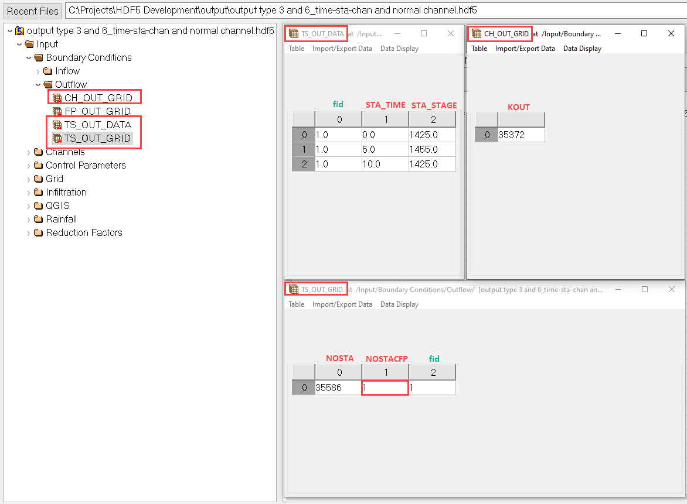
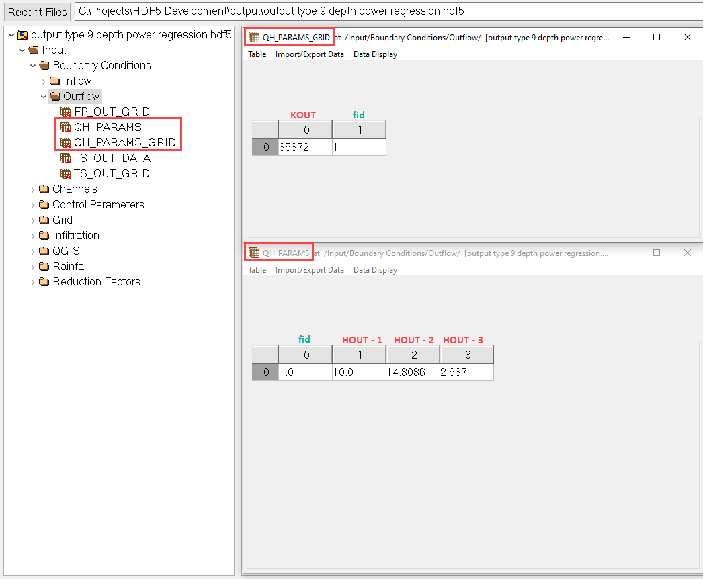
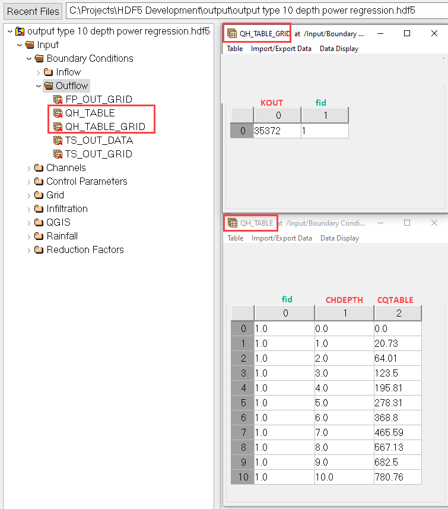
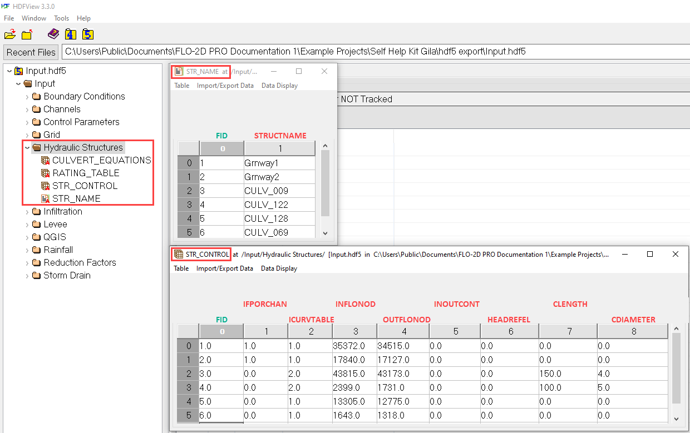
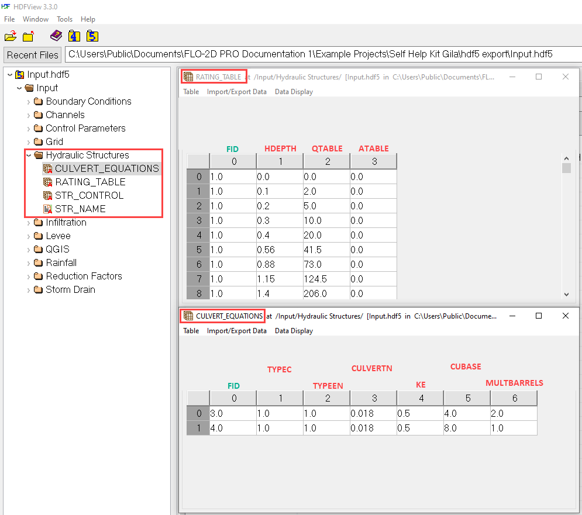
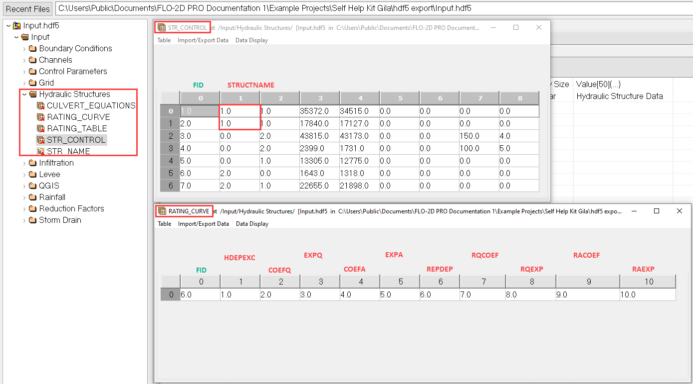
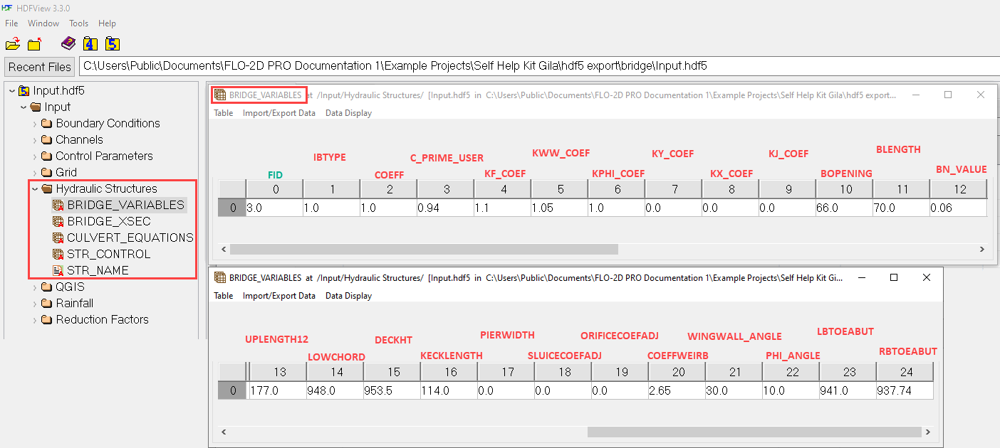
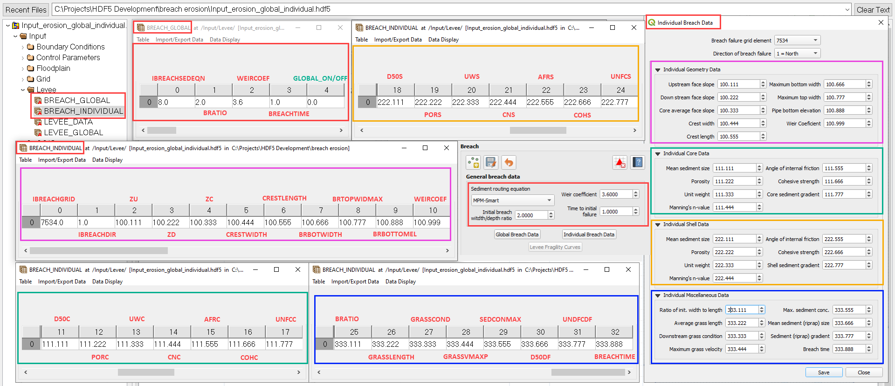
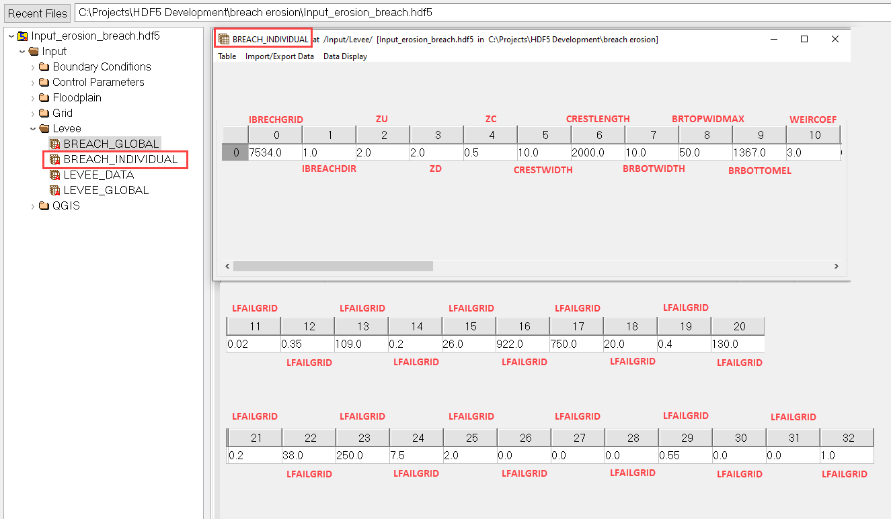
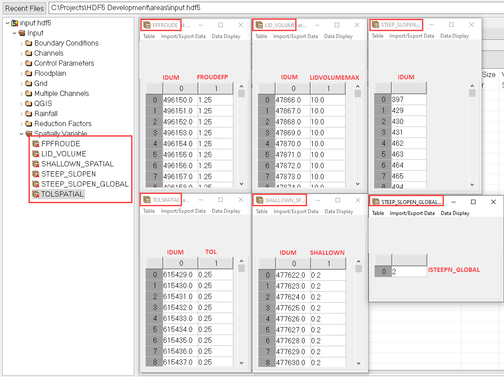

Appendix C: FLO-2D HDF5 Data Structure
======================================

Use this reference as a structural map of the `input.hdf5` file. Variables shown in **red** correspond to entries in the Data Input 
Manual, while those in **green** are internal cross-reference or ID fields used by the HDF5 structure.

Boundary Conditions
-------------------

Inflow
~~~~~~
Defines the location and time series for inflow hydrographs.

*Corresponds to:* `INFLOW.DAT`

.. image:: ./img/flo-2d-plugin-technical-reference-manual/FLO060.png

Reservoirs
~~~~~~~~~~
Specifies the reservoir nodes, elevations and a manning's n value corrector.

*Corresponds to:* `INFLOW.DAT`

.. image:: ./img/flo-2d-plugin-technical-reference-manual/FLO060A.png

Outflow
~~~~~~~

**Floodplain Normal Depth**

*Corresponds to:* `OUTFLOW.DAT`

Defines rating curve or normal depth outflow control for floodplain cells.

.. image:: ./img/flo-2d-plugin-technical-reference-manual/FLO085.png

**Channel Normal Depth**

Normal depth outflow control for channels.

.. image:: ./img/flo-2d-plugin-technical-reference-manual/FLO086.png

**Floodplain Time Stage**

Time-series stage boundary for floodplain grid cells.

.. image:: ./img/flo-2d-plugin-technical-reference-manual/FLO087.png

**Floodplain and Channel Time Stage**

Combined time-stage outflow control affecting both domains.

.. image:: ./img/flo-2d-plugin-technical-reference-manual/FLO088.png

**Channel Time Stage**

Time-stage boundary applied to channel outflows.

.. image:: ./img/flo-2d-plugin-technical-reference-manual/FLO089.png

**Floodplain and Channel Time Stage and Free**

Free outflow combined with a time-stage control.

.. image:: ./img/flo-2d-plugin-technical-reference-manual/FLO090.png

**Channel Time Stage and Normal**

Combines stage-based control with a normal depth fallback.

**Channel Depth-Discharge Power Regression**

Defines outflow using regression coefficients.

**Channel Depth-Discharge Table**

Tabulated depth-discharge pairs for outflow control.

Channels
--------

Global
~~~~~~

Channel control and bank data.

*Corresponds to:* `CHAN.DAT`, `CHANBANK.DAT`

.. image:: ./img/flo-2d-plugin-technical-reference-manual/FLO063.png

Channel Natural
~~~~~~~~~~~~~~~
Channel and cross section station elevation data.

*Corresponds to:* `CHAN.DAT`, `XSEC.DAT`

.. image:: ./img/flo-2d-plugin-technical-reference-manual/FLO065.png

Channel Trapezoidal
~~~~~~~~~~~~~~~~~~~
Defines trapezoidal cross sections using base width, depth, and side slope.

*Corresponds to:* `CHAN.DAT`

.. image:: ./img/flo-2d-plugin-technical-reference-manual/FLO083.png

Channel Rectangular
~~~~~~~~~~~~~~~~~~~
Defines simple rectangular cross sections using base width and depth.

*Corresponds to:* `CHAN.DAT`

.. image:: ./img/flo-2d-plugin-technical-reference-manual/FLO084.png

NoExchange / Confluence
~~~~~~~~~~~~~~~~~~~~~~~~
Reserved for special conditions like confluence or split flow.

*Corresponds to:* `CHAN.DAT`

[missing image]

Control Parameters
------------------

Contains global control data and switches and numerical tolerances.

*Corresponds to:* `CONT.DAT`, `TOLER.DAT`

.. image:: ./img/flo-2d-plugin-technical-reference-manual/FLO067.png

Grid
----

Defines spatial layout and surface properties.

*Corresponds to:* `TOPO.DAT`, `MANNINGS_N.DAT`, `CADPTS.DAT`, `FPLAIN.DAT`, `NEIGHBORS.DAT`

.. image:: ./img/flo-2d-plugin-technical-reference-manual/FLO068.png

Floodplain Cross Section
-------------------------

Specifies cross section grid elements that are reported to cross section output files.

*Corresponds to:* `FPXSEC.DAT`

.. image:: ./img/flo-2d-plugin-technical-reference-manual/FLO073.png

Gutter
------

Describes gutter system routing. [Add reference when applicable.]

*Corresponds to:* `GUTTER.DAT`

Hydraulic Structures
--------------------

[Awaiting description. Placeholder.]

*Corresponds to:* `HYSTRUC.DAT`

Control tables and name tables.

Depth Discharge Tables and Culvert Equation Tables

Rating curve and replacement curve tables.

Bridge tables.

Infiltration
------------

*Corresponds to:* `INFIL.DAT`

Method
~~~~~~
Defines the selected infiltration method: Green-Ampt, SCS, or Horton.

Green Ampt
~~~~~~~~~~

.. image:: ./img/flo-2d-plugin-technical-reference-manual/FLO076.png

.. _scs_hdf:

SCS Curve Number
~~~~~~~~~~~~~~~~
Defines curve number by grid or globally.

.. image:: ./img/flo-2d-plugin-technical-reference-manual/FLO077.png

.. _horton_hdf:

Horton
~~~~~~
Horton infiltration parameters spatially or globally defined.

.. image:: ./img/flo-2d-plugin-technical-reference-manual/FLO078.png

Levee
-----

*Corresponds to:* `LEVEE.DAT`

.. image:: ./img/flo-2d-plugin-technical-reference-manual/FLO071.png

Levee Failure Prescribed
~~~~~~~~~~~~~~~~~~~~~~~~
Time-based breach with user-defined data.

.. image:: ./img/flo-2d-plugin-technical-reference-manual/FLO096.png

Levee Failure Breach Erosion
~~~~~~~~~~~~~~~~~~~~~~~~~~~~
Dynamic breach using Fread BREACH method.

*Corresponds to:* `BREACH.DAT`

Levee Failure Curve
~~~~~~~~~~~~~~~~~~~
User-defined breach progression using curve data.

Rainfall
--------

Uniform Rainfall
~~~~~~~~~~~~~~~~
Applies rainfall uniformly across all grid cells.

*Corresponds to:* `RAIN.DAT`

.. image:: ./img/flo-2d-plugin-technical-reference-manual/FLO079.png

Spatial Rainfall
~~~~~~~~~~~~~~~~
Applies rainfall using spatial rainfall depth distribution.

*Corresponds to:* `RAIN.DAT`

.. image:: ./img/flo-2d-plugin-technical-reference-manual/FLO080.png

Realtime Rainfall
~~~~~~~~~~~~~~~~~
Uses real-time precipitation from gridded time series.

*Corresponds to:* `RAIN.DAT`, `RAINCELL.DAT`

Note: IRAINDUM table is organized by grid columns x time rows.

.. image:: ./img/flo-2d-plugin-technical-reference-manual/FLO081.png

Storm Drain
----------------

The storm drain data for HDF5 can be cross referenced to the storm drain files in the Data Input Manual.   All other data is saved to the SWMM.INP and
SWMM.INI files.  The storm drain data is saved to the HDF5 file in the following tables:

*Corresponds to:* `SWMMFLO.DAT`, `SWMMOUTF.DAT`, `SWMMRT.DAT`, `SWMMFLODROPBOX.DAT`, `SDCLOGGING.DAT`

.. image:: ./img/flo-2d-plugin-technical-reference-manual/FLO101.png

SWMMFLO.DAT

.. image:: ./img/flo-2d-plugin-technical-reference-manual/FLO100.png

.. image:: ./img/flo-2d-plugin-technical-reference-manual/FLO102.png

.. image:: ./img/flo-2d-plugin-technical-reference-manual/FLO104.png

.. image:: ./img/flo-2d-plugin-technical-reference-manual/FLO103.png

Multiple Channel
----------------

*Corresponds to:* `MULT.DAT`, `SIMPLE_MULT.DAT`

.. image:: ./img/flo-2d-plugin-technical-reference-manual/FLO074.png

Reduction Factors
-----------------

Defines areal and watershed reduction factors.

*Corresponds to:* `ARF.DAT`

.. image:: ./img/flo-2d-plugin-technical-reference-manual/FLO075.png

QGIS
----

Data related to plugin-based preprocessing or export functions.

.. image:: ./img/flo-2d-plugin-technical-reference-manual/FLO082.png

Tailings
--------

Used for advanced mud/debris flow simulations.

**TAILINGS**  
*Corresponds to:* `TAILINGS.DAT`

**TAILINGS_CV**  
*Corresponds to:* `TAILINGS_CV.DAT`

**TAILINGS_STACK_DEPTH**  
*Corresponds to:* `TAILINGS_STACK_DEPTH.DAT`

.. image:: ./img/flo-2d-plugin-technical-reference-manual/FLO095.png

Spatially Variable
-------------------

The 2D attributes for FLO-2D are stored in the Spatially Variable tables. The table name can be cross referenced to the corresponding \*.DAT file in the Data Input Manual.

**FPFROUDE**  
*Corresponds to:* `FPFROUDE.DAT`

**LID_VOLUME**  
*Corresponds to:* `LID_VOLUME.DAT`

**SHALLOWN_SPATIAL**  
*Corresponds to:* `SHALLOWN_SPATIAL.DAT`

**STEEPSLOPEN**  
*Corresponds to:* `STEEP_SLOPEN.DAT`

**TOLSPATIAL**  
*Corresponds to:* `TOLSPATIAL.DAT`

