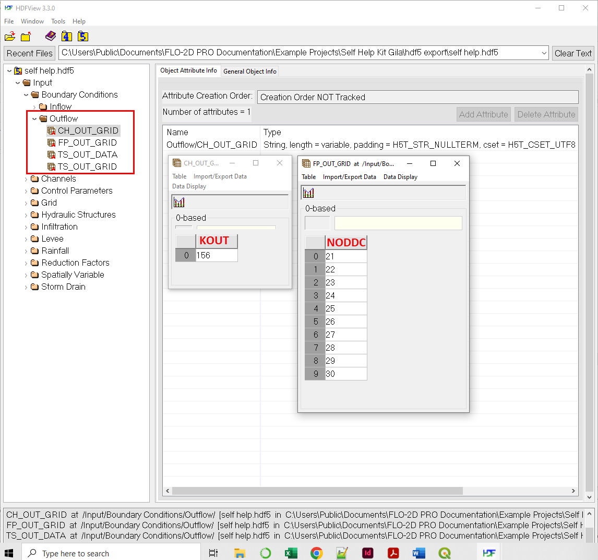
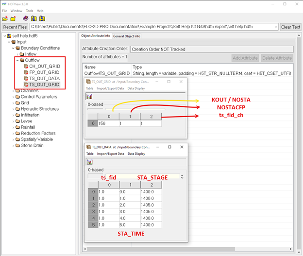
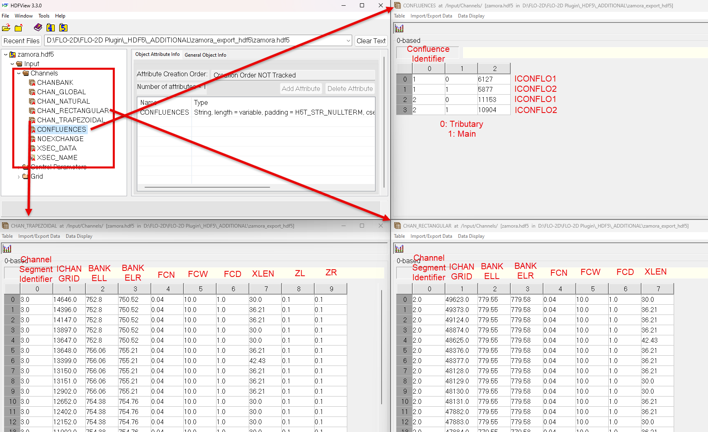

Appendix C FLO-2D HDF5 Data Structure
=====================================

Boundary Conditions
-------------------

Inflow
~~~~~~

.. image:: ./img/flo-2d-plugin-technical-reference-manual/FLO060.png

Outflow Grid ID
~~~~~~~~~~~~~~~

Outflow Time Series
~~~~~~~~~~~~~~~~~~~

Channels
--------

Global
~~~~~~

Global parameters and banks

.. image:: ./img/flo-2d-plugin-technical-reference-manual/FLO063.png

.. image:: ./img/flo-2d-plugin-technical-reference-manual/FLO064.png

Channel Natural
~~~~~~~~~~~~~~~

.. image:: ./img/flo-2d-plugin-technical-reference-manual/FLO065.png

Channel Trapezoidal Rectangular
~~~~~~~~~~~~~~~~~~~~~~~~~~~~~~~

NoExchange
~~~~~~~~~~

Control Parameters
------------------

cont.dat parameters and toler.dat parameters.

.. image:: ./img/flo-2d-plugin-technical-reference-manual/FLO067.png

Grid
----

X coordinate, y coordinate, elevation, mannings n, and neighbors tables 

TOPO.DAT
MANNINGS_N.DAT
CADPTS.DAT
FPLAIN.DAT
NEIGHBORS.DAT

.. image:: ./img/flo-2d-plugin-technical-reference-manual/FLO068.png

Floodplain Cross Section
-------------------------

.. image:: ./img/flo-2d-plugin-technical-reference-manual/FLO073.png

Gutter
------

Hydraulic Structures
--------------------

Infiltration
------------

Method
~~~~~~

Green Ampt
~~~~~~~~~~

.. image:: ./img/flo-2d-plugin-technical-reference-manual/FLO076.png

.. _scs_hdf:

SCS Curve Number
~~~~~~~~~~~~~~~~

**Global**

**Spatial**

.. image:: ./img/flo-2d-plugin-technical-reference-manual/FLO077.png

.. _horton_hdf:

Horton
~~~~~~

**Global**

**Spatial**

.. image:: ./img/flo-2d-plugin-technical-reference-manual/FLO078.png

Levee
-----

LEVEE.DAT

.. image:: ./img/flo-2d-plugin-technical-reference-manual/FLO071.png

Levee Failure Prescribed
~~~~~~~~~~~~~~~~~~~~~~~~~

Levee Failure Breach
~~~~~~~~~~~~~~~~~~~~~~~~~

Levee Failure Curve
~~~~~~~~~~~~~~~~~~~~~~

Rainfall
--------

.. _global-1:

Global
~~~~~~

.. image:: ./img/flo-2d-plugin-technical-reference-manual/FLO079.png
Spatial
~~~~~~~

.. image:: ./img/flo-2d-plugin-technical-reference-manual/FLO080.png

Storm Drain
---------------

Multiple Channel
-----------------

~~~~~~~~~~~~

.. image:: ./img/flo-2d-plugin-technical-reference-manual/FLO074.png

Blocked Cells
------------------

ARF / WRF

.. image:: ./img/flo-2d-plugin-technical-reference-manual/FLO075.png

