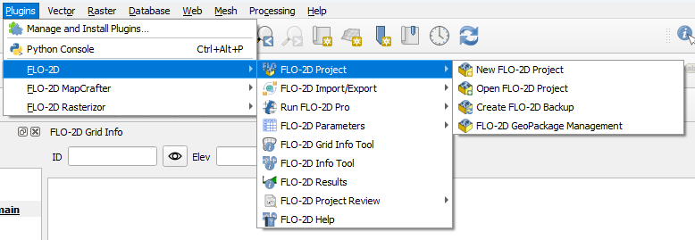

Plugin Features
================

Plugin Menu
-----------

The FLO-2D Plugin menu is in the Plugins drop down menu, Plugin > FLO-2D.
If the Plugin is not listed, follow the :ref:`Install Instructions <flo2d_plugin_step>` to install it.

List of Additional Plugins
--------------------------

Other helpful Plugins include:

- FLO-2D Rasterizor
- FLO-2D MapCrafter
- Profile tool
- Quick Map Services
- Curve Number Generator

.. note:: For QuickMapService, it is necessary to install and add maps.
          Click on the QuickMapServices button > Settings > More Services > Get Contributed Pack > Save.

.. toctree::
   :hidden:
   :maxdepth: 2
   :caption: FLO-2D General QGIS and FLO-2D Plugin Information

   Data Storage
   View Options