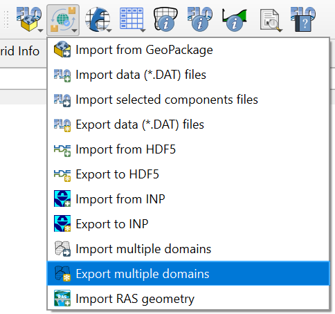
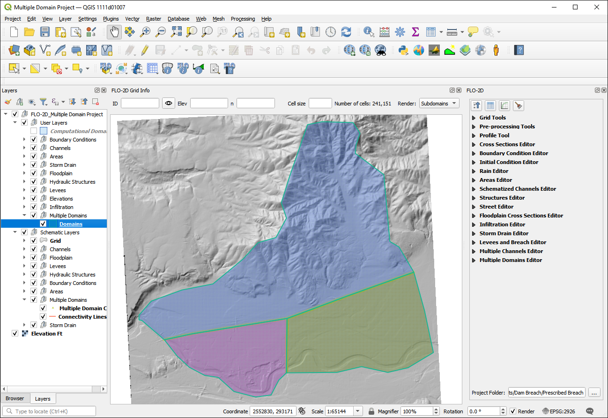
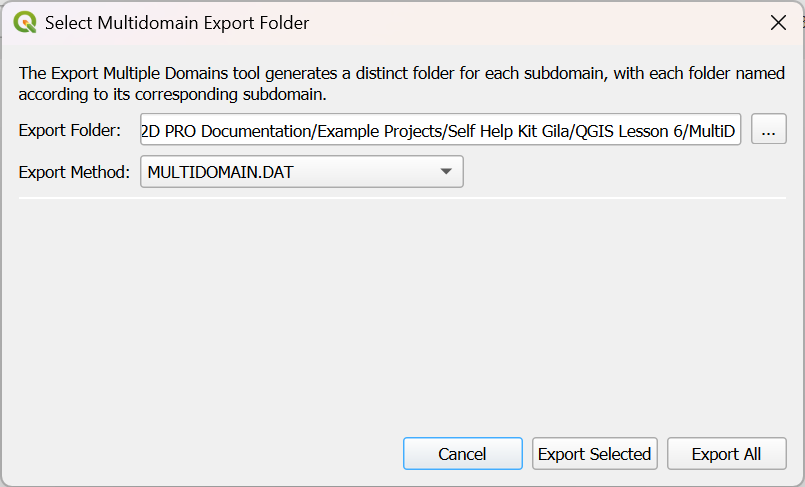

.. _export_multiple_domains:

Export Multiple Domains
========================

This tool will export the *.DAT files for subdomains. Once the multiple domains have been created and schematized use this button to export the domains.

The export process has multiple methods that are outlined below.

Method 1 - Export using MULTDOMAIN.DAT
-------------------------------------------

1. Click the
Export multiple domains button and select the MULTDOMAIN.DAT method.

2. Select the folder to export the domains.

Method 2 - Export using ONLY MULTDOMAIN.DAT
---------------------------------------------

1. Click the
   Export multiple domains button

2. Select the folder to export the domains.

Method 3 - Export using CADPTS.DAT
---------------------------------------------

1. Click the
   Export multiple domains button

2. Select the folder to export the domains.

Method 4 - Export using ONLY CADPTS.DAT
---------------------------------------------

1. Click the
   Export multiple domains button

2. Select the folder to export the domains.

Method 5 - Export using No Connectivity
---------------------------------------------

1. Click the
   Export multiple domains button

2. Select the folder to export the domains.

