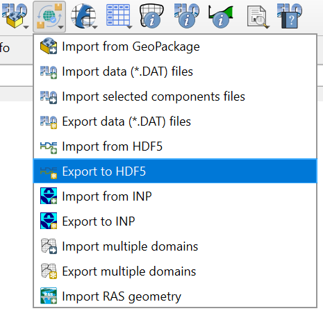

.. _export_hdf5:

Export to HDF5
=================

.. warning:: This tool is under construction and will not function for all data types.

This tool exports FLO-2D files into an HDF5 file.

Export the FLO-2D files into a HDF5 file
-----------------------------------------

.. note:: Set the Control Variables switches before running the Export tool.
          See `Set Control Parameters (CONT.DAT) <../flo-2d-parameters/Control%20Variables.html>`__.

1. Click the
   Export to HDF5.

2. Navigate to
   the export folder, set the file name, and click Save.

3. The Export to HDF5 dialog will appear.
   Select the data you want to export and click OK. A progress bar will appear while the export is in progress.

4. A message at the QGIS toolbar will show that the file was correctly exported.

HDF5 Data Structure
-----------------------------------------

The program HDFView can be used to view the HDF5 file structure. The HDF5 file contains groups of datasets that 
flopro.exe reads to run the FLO-2D model. The datasets are organized in a way that is simpler than the original FLO-2D files, but still contains all the necessary information.

The HDF5 file will expand as more tables are added.  The follwoing image shows the structure of an HDF5 with a grid and control data.

The tables are relatively simple as you can see in the coordinates table below. The coordinates table contains the x and y coordinates of the grid nodes.

.. raw:: html

   <a href="https://www.hdfgroup.org/downloads/hdfview/" target="_blank">HDF View can be downloaded from the HDF Group website.</a>

.. note:: The HDF5 file format is a binary format, so it cannot be opened in a text editor. It must be opened with a program that can read HDF5 files, such as HDFView.