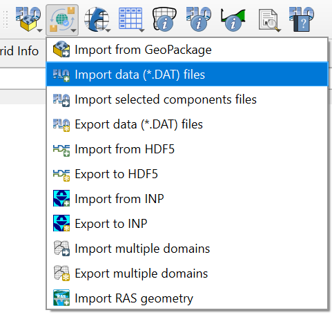
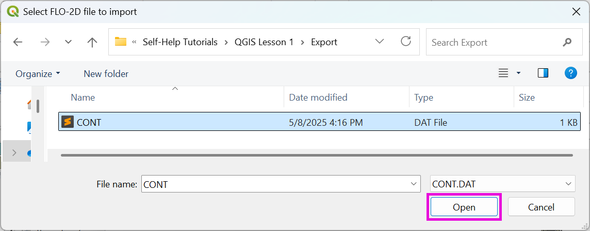
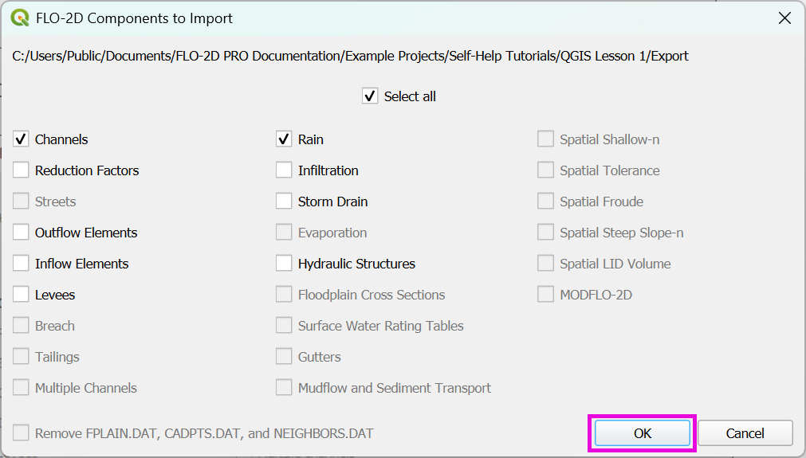
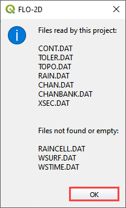

.. _import_data_files:

Import data (\*.DAT) files
===========================

This tool imports existing FLO-2D \*.DAT files into the FLO-2D GeoPackage.

Import the FLO-2D \*.DAT files into the Project
-------------------------------------------------

.. important:: Before performing this task, set up a :ref:`New FLO-2D Project <new_flo2d_project>`.

1. Click the
   Import data (\*.DAT) files.

2. Navigate to
   the FLO-2D \*.DAT files

3. Select CONT.DAT
   and click Open.

4. All FLO-2D files are
   imported to the Plugin with this option.

5. Choose the \*.DAT files
   to import and click OK.

6. Once the project import is complete,
   this message will appear. Click OK to
   close the message.

7. The final step is to convert
   the new layers to User Layers. This process should be automatic. It uses this tool:
   :ref:`Convert Schematic Layers to User Layers <convert_schematic_layers_to_user_layers>`.
   If the conversion does not happen automatically, you can manually convert the layers by clicking on the
   Convert Schematic Layers to User Layers button.
