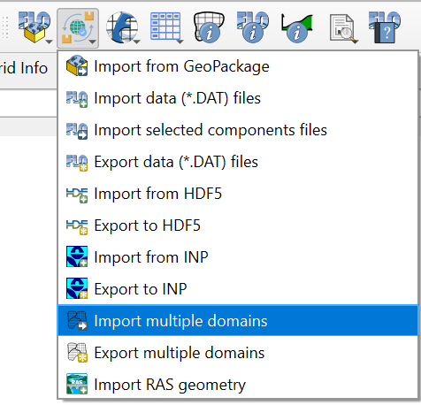
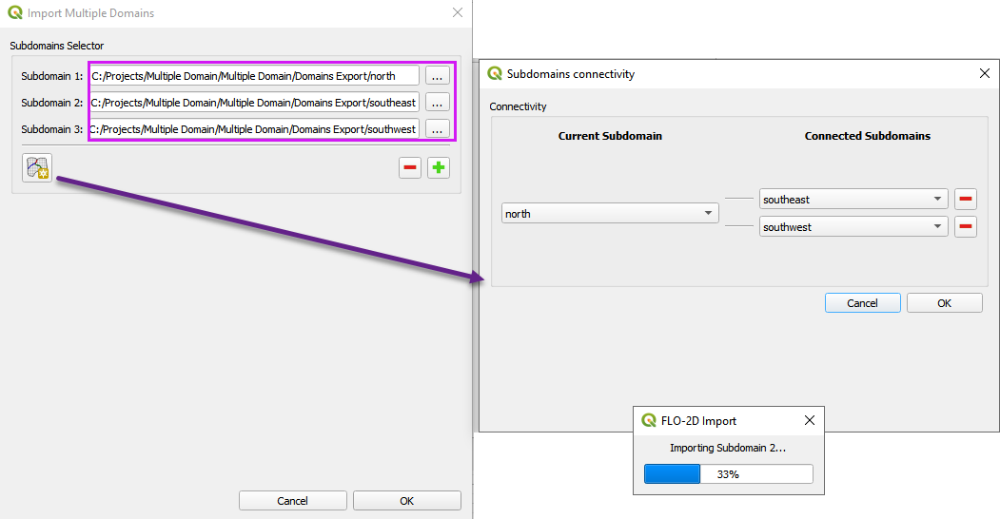

.. _import_mult_domains:

Import Multiple Domains
========================

1. Click the
   Import multiple domains button

2. Connect the dialog to the multiple domain folders.
3. Set up the upstream and downstream connections for each domain.
4. While importing, the progress bar will indicate which domain is currently being processed.

