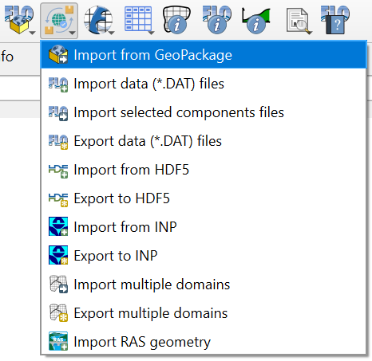
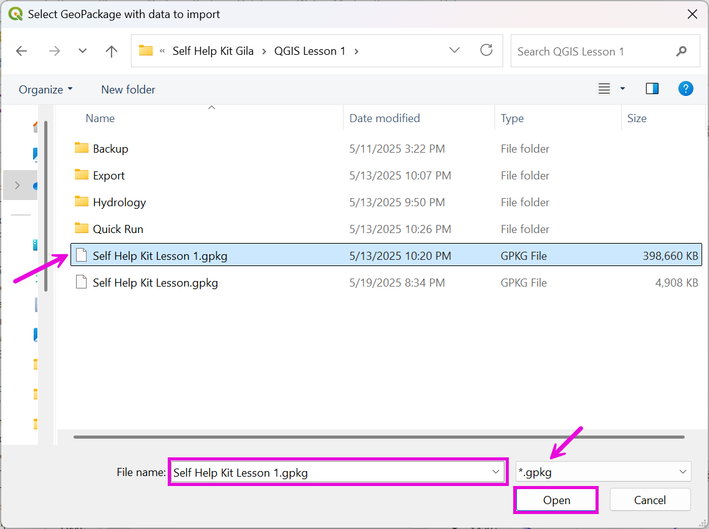
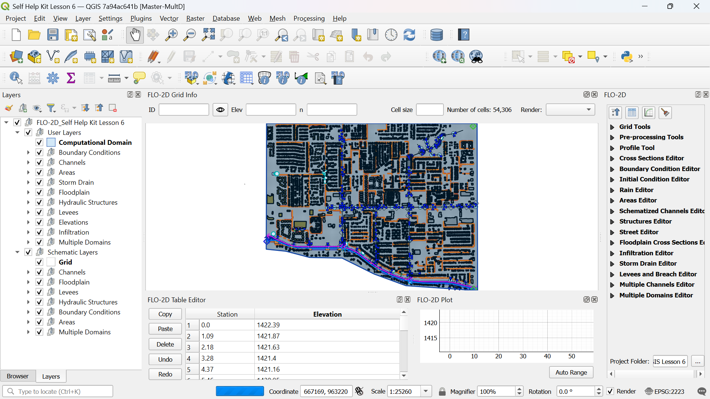

Import from Geopackage
===========================

Use this tool to import an old or alternate FLO-2D project from a GeoPackage file.

.. _import_from_geopackage:

.. important:: Before importing a GeoPackage, use New Project (:ref:`new_flo2d_project`) to build a template to import your current GeoPackage into.
   
1. Click the
   Import from GeoPackage button.

2. Select the geopackage.

3. The file should now be loaded as shown below.

