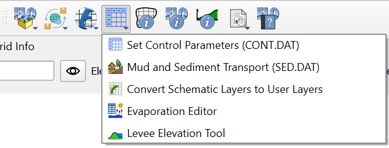

FLO-2D Parameters
===================

The FLO-2D Parameters button serves multiple functions, including setting control parameters on the CONT.DAT file,
managing Mud and Sediment data in the SED.DAT file, converting schematized data to user layers,
and running the Levee Tool.

.. toctree::
   :maxdepth: 1

   Control Variables
   Mud and Sediment Transport Tool
   Schematic to User Converter
   Evaporation Editor
   Levee Tool