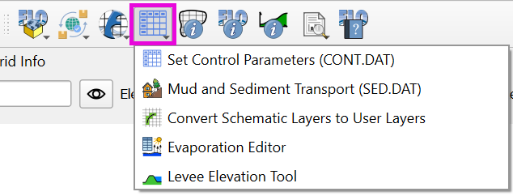

FLO-2D Parameters
===================

The FLO-2D Parameters button is a collection of tools that allow users to manage various aspects of 
the FLO-2D model setup. This includes:

- Setting control parameters on the CONT.DAT and TOLER.DAT files,
- Managing the Evaporation Editor,
- Managing the Mud and Sediment Transport Tool,
- Converting schematized data to user layers,
- Managing the Levee Tool.

.. toctree::
   :maxdepth: 2
   :caption: Contents

   Control Variables
   Mud and Sediment Transport Tool
   Schematic to User Converter
   Evaporation Editor
   Levee Tool