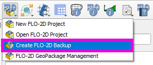
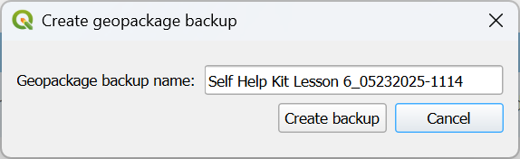

Create FLO-2D Backup
======================

This button will create a backup of the current FLO-2D project by saving the \*.gpkg file.  It should preserve the
current project state and external layers regardless of if the layer is part of the GeoPackage or saved to the
project as an external link.

Create Backup
-----------------------------

1. Click on the
   Create FLO-2D Backup button.

2. Name the backup file and click Save.

.. note:: The default name is the current project name with a plugin version and timestamp appended to it.

