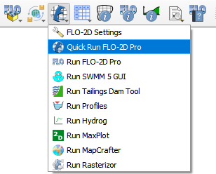
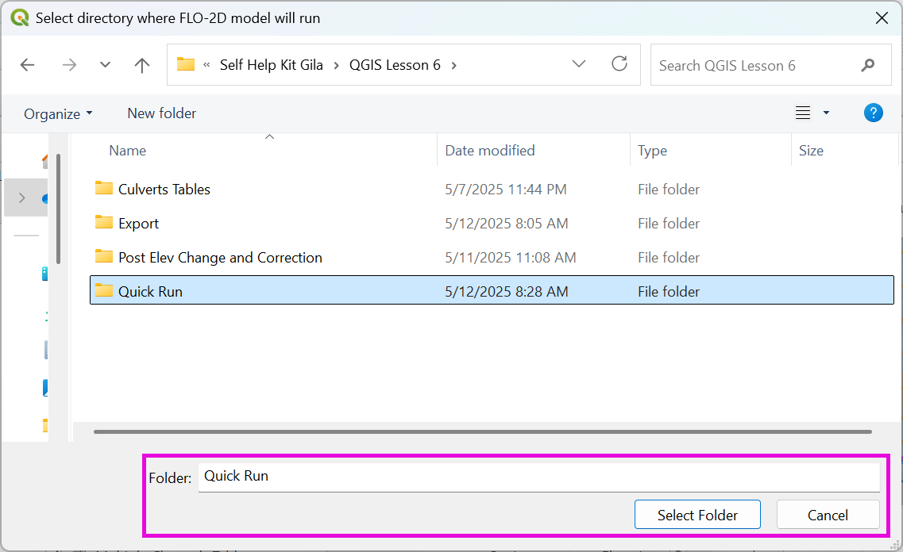
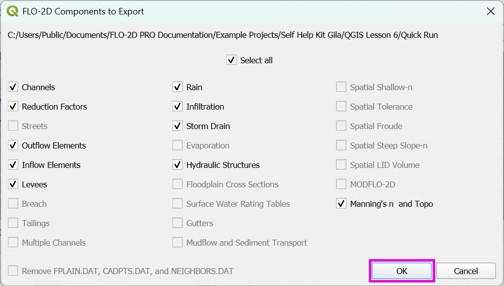
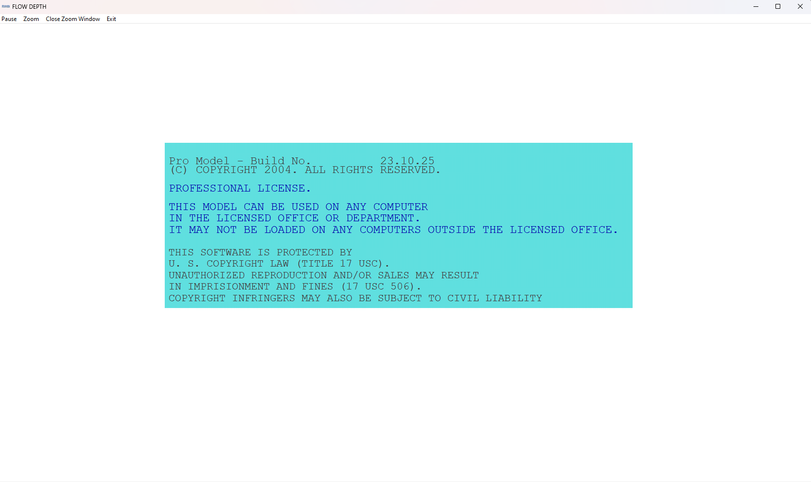
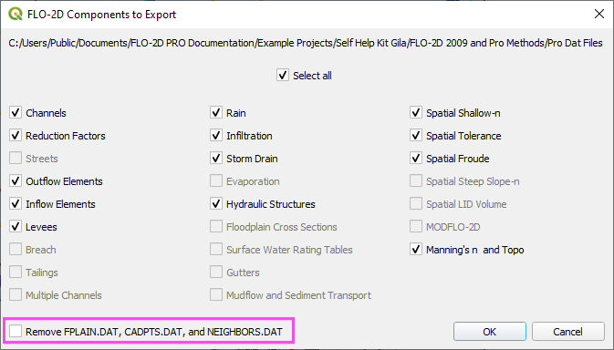

.. _quick_run:

Quick Run FLO-2D Pro
=====================

The Quick Run tool streamlines the export of data and the execution of a FLO-2D run in one go,
eliminating the need for separate export and run steps.

1. Click on the Quick Run FLO-2D Pro button.

2. Select the Export Folder.

3. Select the components and click OK.

4. FLO-2D Pro will start and the simulation will run to completion.

..important::
   If you commonly export to the same folder, you might notice that the Remove FPLAIN.DAT, CADPTS.DAT, 
   and NEIGHBOR.DAT checkbox is active.  It's important to check the box if you made a change to the
   grid shape, size, elevation, or roughness.  FLO-2D engine will read the old files if they exist.

