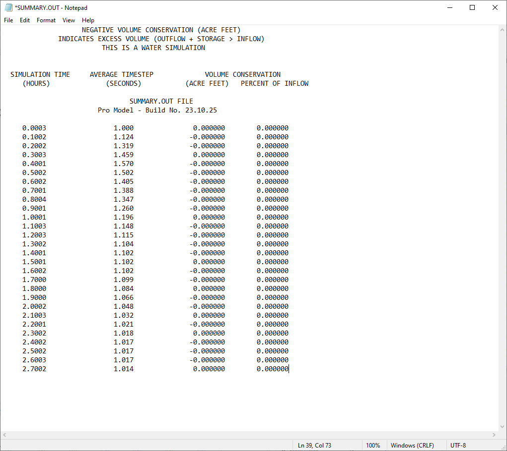

.. _run_flo-2d:

Run FLO-2D
==========

The Run FLO-2D button is used to run FLO-2D.

.. note:: It is necessary to configure the correct paths to Run FLO-2D.
          See `FLO-2D Settings <FLO-2D%20Settings.html>`__

1. Click Run FLO-2D.

2. The FLO-2D Pro will start and the simulation will run to completion.

.. image:: ../../img/Run-Flo2d/run007.png

3. If the display mode was used, the run will be displayed in the FLO-2D Pro window.

.. image:: ../../img/Run-Flo2d/run008.png

4. If text mode was used, the time, timestep, and volume conservation will be displayed in the console.

5. If batch model is used, the model will run silently and the progress is printed to the SUMMARY.OUT file.

6. Once the run is complete, the Simulation Complete message will be displayed in the console.

7. If the activation period has expired, a message may appear indicating that the activation period has expired. 
   and a message will be printed to the error.chk file.

8. If using the DEMO version, only two projects are allowed to run. They are the Self Help Kit and the
   Tailings Dam Training Project. If you try to run any other project.