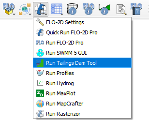
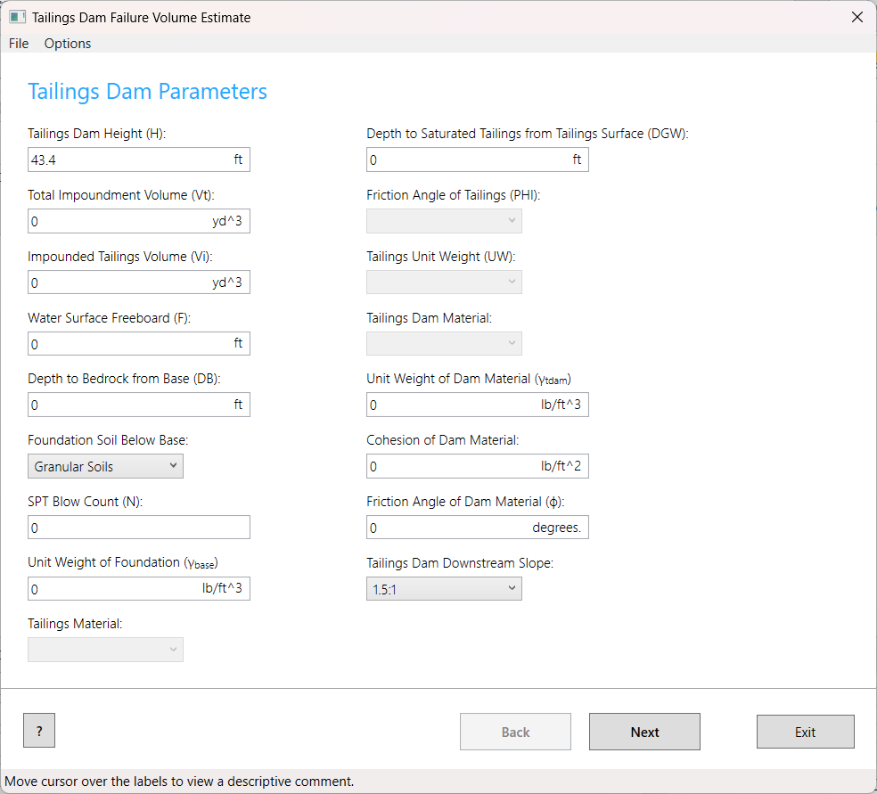

.. _run_tailings_dam_tool:

Run Tailings Dam Tool
======================

The FLO-2D Tailings Dam Tool is designed to estimate the potential release volume of tailings.
Leveraging site-specific and historical data, the tool predicts the likelihood of tailings dam failure
and projects the associated release volume. Users can refine their analysis by selecting a discharge and
sediment concentration hydrograph, providing valuable insights for risk assessment and planning.

The tailings dam tool button will load the tailings dam executable in the Project Folder.

1. Click on the Run Tailings Dam Tool.

2. The Tailings Dam Tool will open.

3. Get a tutorial here |tailings_tutorial|.  |contact_us| to get the data for the tutorial.

.. |tailings_tutorial| raw:: html

    <a href="https://flo-2d.sharefile.com/d-s9c39ab769dd04b9b88481b46431bbe52" target="_blank" rel="noopener">Tailing Dam Tutorial</a>

.. |contact_us| raw:: html

    <a href="https://flo-2d.com/contact/" target="_blank" rel="noopener">Contact us</a>
    