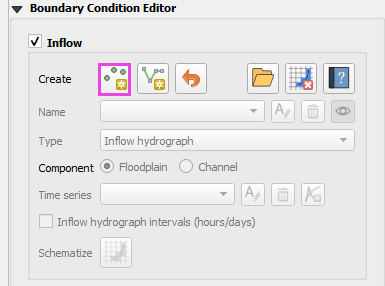
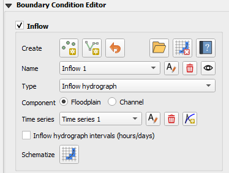
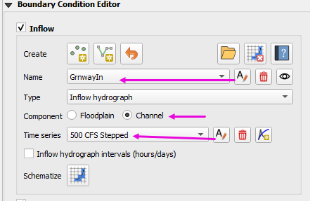
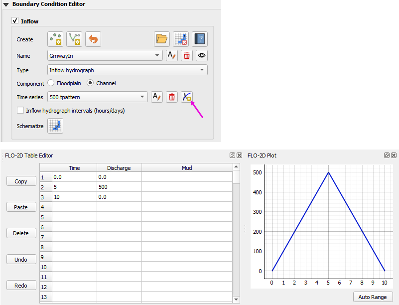

.. _inflow_editor:

Inflow Editor
==================

Any number of inflow hydrographs to the FLO-2D model can be assigned to channel, floodplain or
even the 1-D street component. This represents a flood inflow to the flow domain from an off-site source.

Create Inflow Data - Point
-----------------------------

1. To create a point of inflow, click the Add Point BC button on the Boundary Condition
   Editor widget.

.. image:: ../../img/Boundary-Condition-Editor/newbc004.png

2. Digitize the inflow node by left clicking the location of the inflow node on the map.
   In this example, the inflow node is a channel inflow node.
   It is not necessary to enter the fid.
   Click OK to create the feature.

3. Click the Add Point button again to save the feature and load the data.

4. Click Yes to save the feature and
   to load the data into the editor.

Create Inflow Data - Line
-----------------------------

1. To create a line of inflow, click the Add Line BC button on the Boundary Condition
   Editor widget.

.. image:: ../../img/Boundary-Condition-Editor/newbc004.png

2. Digitize the line by left clicking the start of the line on the map. Continue to left click 
   the line to finish it.  Right click to close the line.

3. Click the Add Line button again to save the feature and load the data.

4. Click Yes to save the feature and
   to load the data into the editor.

Load Inflow Data
-----------------

1. To load an INFLOW.DAT file, click on the Open INFLOW.DAT button.

.. image:: ../../img/Boundary-Condition-Editor/newbc014.png

2. Navigate to the folder containing the INFLOW.DAT file and select it.

.. image:: ../../img/Boundary-Condition-Editor/newbc015.png

3. A message on the QGIS toolbar will appear, indicating that the importing was successful.

.. note:: Loading the INFLOW.DAT file into the project appends data to the Boundary Condition layers/table,
          updating cells if already defined with a Boundary Condition. 
          
          Additionally, all data added using this tool will be included in the Boundary Conditions Points User Layer.

          Delete the schematized data before loading the INFLOW.DAT file to speed up the import process / schematization process.

Assign Conditions to the Inflow Boundary Conditions
----------------------------------------------------

1. Assign the conditions to the inflow node as seen in the following image. This example the
   inflow node will have a steady hydrograph with 100 cfs assigned to Cave Creek inflow node.

2. The time series inflow hydrograph is assigned in the table editor where time is in hours and discharge is cfs or cms.
   This is a clear water inflow hydrograph and no sediment concentration is assigned.

3. Repeat the process to add additional inflow hydrographs.
   Use the Add data series/table for current BC button to create a new hydrograph.

.. note:: Click on the eye button to center the map on the selected inflow feature.

    .. image:: ../../img/Boundary-Condition-Editor/newbc017.png

Delete Selected Inflow Boundary Condition
-----------------------------------------

1. To delete an Inflow Boundary Condition, click on the Delete Inflow Boundary Condition button.

.. image:: ../../img/Boundary-Condition-Editor/newbc018.png

2. Click the Schematize button to update the schematized data.

Schematize the data
---------------------

1. Use the Schematize button to save the data to the Schematic Layers and click Yes to overwrite the layers.

.. image:: ../../img/Boundary-Condition-Editor/newbc013.png

Delete Schematized data
------------------------

1. To delete all schematized Inflow Boundary Conditions, click on the Delete Schematized Inflow Boundary Condition button
   and click Yes to delete all schematized Inflow Boundary Conditions.

.. important:: This button removes all schematized Inflow Boundary Conditions data. It will not delete the time series data.
   Use this button if you import the INFLOW.DAT file.  It will speed up the import and schematization process.

.. image:: ../../img/Boundary-Condition-Editor/newbc019.png

