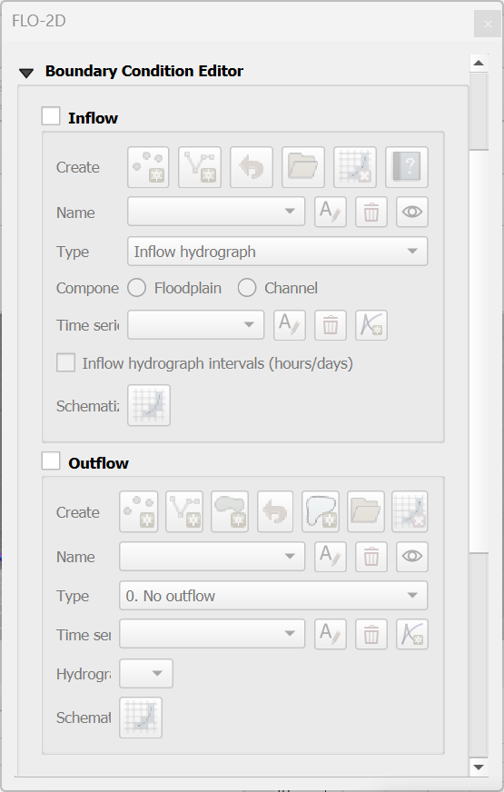
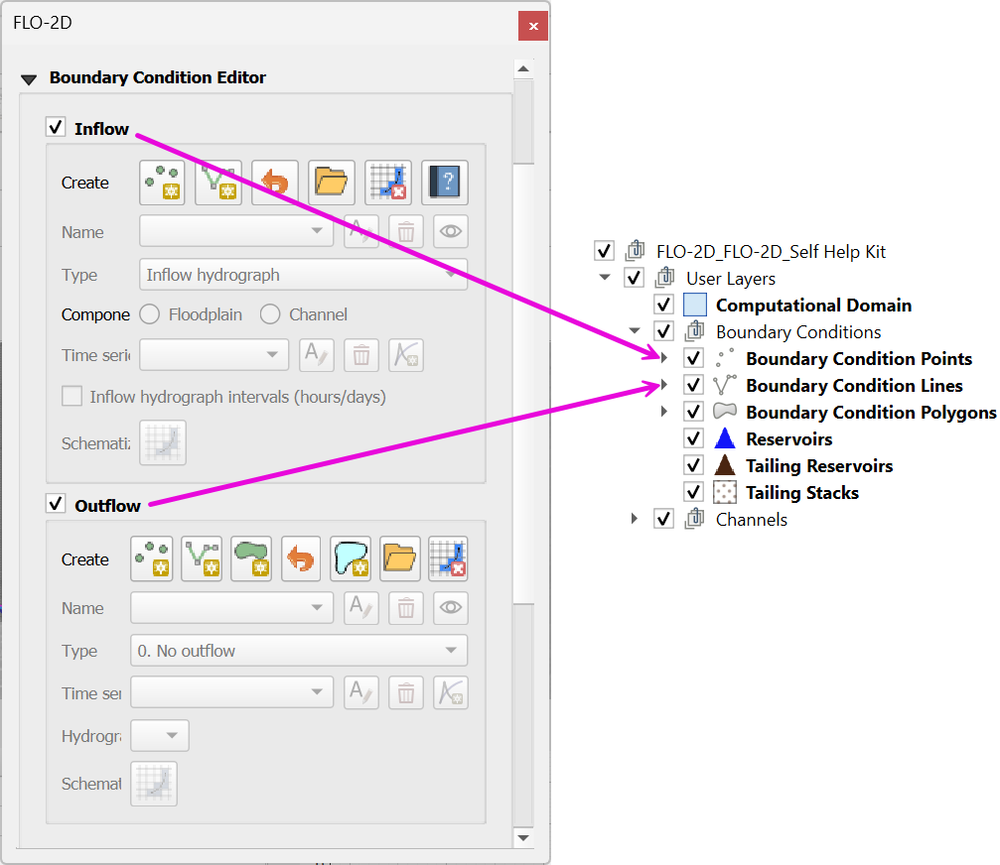

Boundary Condition Editor
=========================

The boundary condition editor is used to define the inflow and outflow boundaries.
The data is written to the INFLOW.DAT and OUTFLOW.DAT files.

The new Boundary Condition Editor introduces several key updates, including:

- Separated the Inflow and Outflow Boundary Conditions into their respective groups.
- Separation of the Inflow and Outflow Boundary Condition schematize buttons.
- Button to delete the schematized data.
- Button to load existing INFLOW.DAT and OUTFLOW.DAT.
- Button to define an outflow for the whole grid boundary.
- Grouped Boundary Condition tables into their respective groups.
- Hide/show Boundary Condition layers.

The Boundary Condition User Layers are only shown on the layer tree when the Inflow or Outflow Boundary Conditions
are checked. See image below.

.. |bctraining| raw:: html

    <a href="https://flo-2d.com/product/boundary-conditions/" target="_blank" rel="noopener">BC Training Package</a>

.. note:: Get a |bctraining| to learn how to correctly define boundaries for FLO-2D projects.

.. toctree::
   :maxdepth: 2
   :caption: Contents

   Inflow
   Outflow
