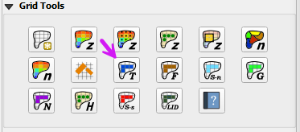

.. _grid_lid:

16. LID Volume Spatial
===================================

This tool allows you to assign Low Impact Development (LID) sink volumes to grid elements using polygons, such as rooftops, bioswales, or basins. 
The volume assigned to each grid element represents a fixed retention amount (in ft³ or m³) that must be filled before overland flow is exchanged.

Use this tool when you want to model LID features that function primarily through volume capture, such as cisterns, planters, or retention cells.

For a full explanation of how FLO-2D handles sink volume routing, see the LID Volume Method section in the FLO-2D Reference Manual.

Assigning Volume in QGIS
----------------------------

1. Use a polygon layer (e.g., rooftop outlines) to select the grid elements.

2. The polygons should represent the areas where water is collected, such as rooftops or bioswales.

.. image:: ../../img/gridtools/lid/lid002.png

3. In this example the LID TOL value set to 1.2 inches of rainfall per roof area so that. This is equivalent to a volume of 10 cubic feet per grid element.

:math:`\text{expression} = 1.2\,\text{in} \times \frac{1\,\text{ft}}{12\,\text{in}} \times 10\,\text{ft} \times 10\,\text{ft} = 10\,\text{ft}^3`

Define the LID Grid Element Volume
-----------------------------------

1. Open the attribute
   table of the Tolerance Areas layer.

4. On the attribute table window, click on the Toggle Editing button, change the field to TOL, add the command to set
   the TOL depth (6.68 / $area) and click Update All.

5. Save and close the editor tool and close the attribute table.
   This process converted the volume of the cistern to a depth over the area of each polygon.

Sample Data
-----------

1. Click
   the Sample Spatial Tolerance Values button.

.. image:: ../../img/gridtools/tol/spatia005.png

2. Once the
   process is complete, Click OK to complete TOL the assignment.

.. image:: ../../img/gridtools/tol/spatia006.png

3. This process
   has converted the volume from the polygon to the grid elements that intersect the polygon.