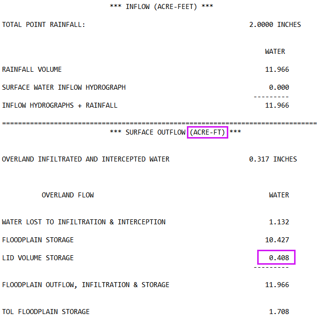
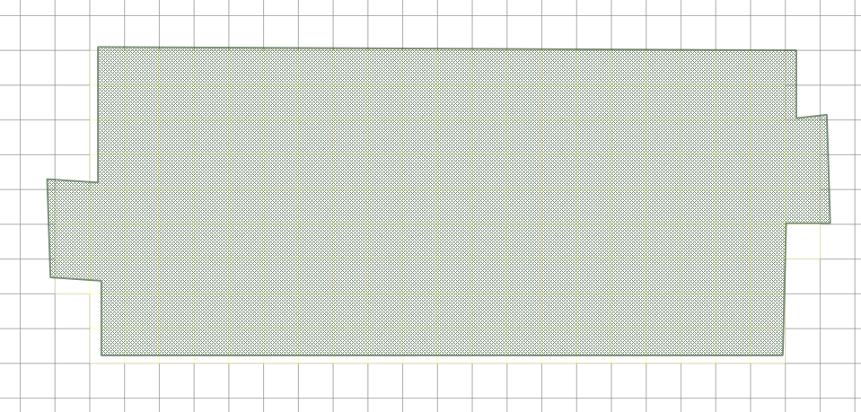

.. _grid_lid:

16. Low Impact Development (LID) Volume Spatial
================================================

.. image:: ../../img/gridtools/lid/lid001.png

This tool allows you to assign Low Impact Development (LID) sink volumes to grid elements using polygons, such as rooftops, bioswales, or basins. 
The volume assigned to each grid element represents a fixed retention amount (in ft³ or m³) that must be filled before overland flow is exchanged.

Use this tool when you want to model LID features that function primarily through volume capture, such as cisterns, planters, or retention cells.

For a full explanation of how FLO-2D handles sink volume routing, see the LID Volume Method section in the FLO-2D Reference Manual.

Assigning Volume in QGIS
----------------------------

1. Use a polygon layer (e.g., rooftop outlines) to select the grid elements.

2. The polygons should represent the areas where water is collected, such as rooftops or bioswales.

3. In this example the LID TOL value set to 1.2 inches of rainfall per roof area so that. This is equivalent to a volume of 10 cubic feet per grid element.

:math:`\text{expression} = 1.2\,\text{in} \times \frac{1\,\text{ft}}{12\,\text{in}} \times 10\,\text{ft} \times 10\,\text{ft} = 10\,\text{ft}^3`

Rainfall Volume for 1.2-Inch Event Over Polygon Areas
--------------------------------------------------------

+-----+-----------+-----------+---------+---------+
| FID | Area (ft²)| Volume ft³| Gallons | Acre-ft |
+=====+===========+===========+=========+=========+
|  1  |   51436   |   5143.6  |  38477  |  0.1181 |
+-----+-----------+-----------+---------+---------+
|  2  |   16056   |   1605.6  |  12011  |  0.0369 |
+-----+-----------+-----------+---------+---------+
|  3  |   15612   |   1561.2  |  11679  |  0.0358 |
+-----+-----------+-----------+---------+---------+
|  4  |   18246   |   1824.6  |  13649  |  0.0419 |
+-----+-----------+-----------+---------+---------+
|  5  |   19324   |   1932.4  |  14455  |  0.0444 |
+-----+-----------+-----------+---------+---------+
|  6  |   57399   |   5740.0  |  42924  |  0.1317 |
+-----+-----------+-----------+---------+---------+
|SUM  |  178073   |  17807.4  | 133195  |  0.4088 |
+-----+-----------+-----------+---------+---------+

Sample Data
--------------

1. Click
   the Sample LID Volume Values button.

.. image:: ../../img/gridtools/lid/lid001.png

2. Once the
   process is complete, Click OK to complete LID the assignment.

3. This process
   has converted the volume from the polygon to the grid elements that intersect the polygon.

Resulting Collected Volume
--------------------------------

The SUMMARY.OUT file will show the total volume collected by the LID features.

The calculated volume was reported as 0.408 acre-ft which is close to the SUM 
from the table above (0.4088 acre-ft). 

The processor uses a centroid point sample of the cells that are within the LID areas.

