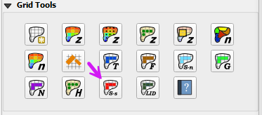
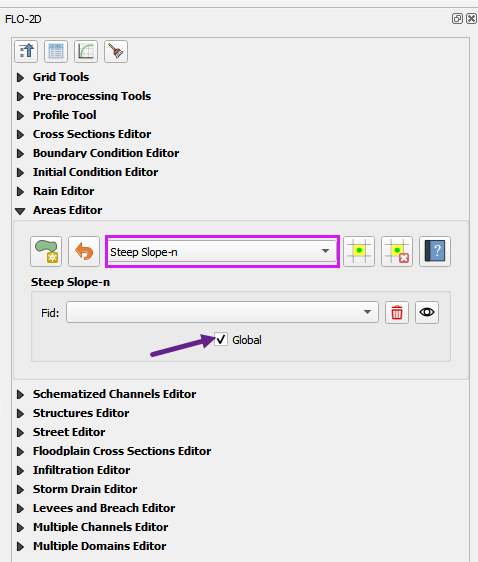
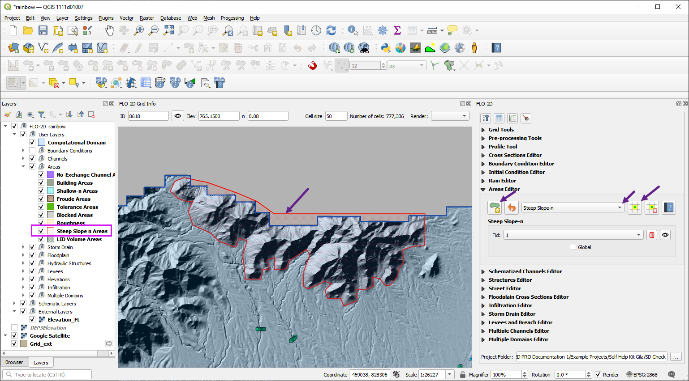

.. _steep_slope:

15. Steep Slope
===================================

The steep slope n-value method provides a way to assign more realistic Manning’s roughness values in steep terrain by applying 
slope-based adjustments the the grid element n-value. This helps improve the accuracy and stability of flood simulations in 
high-gradient watersheds.  the user can apply a global or spatially variable steep slope n-value adjustment to the grid elements.

Global Method
------------------

The global method is the easiest way to apply the steep slope calculator.  Turning on the Global Switch will 
allow the FLO-2D engine to assess grid elements and apply the steep slope calculator to all grid elements that meet the criteria.

1. Open the Areas Editor and select the Steep Slope area type.
2. Click the Global Switch to turn it on.

Spatially Variable Method
-----------------------------

Use the Areas Editor to create a local area for the steep slope calculator.
1. Open the Areas Editor and select the Steep Slope area type.
2. Use the polygon tool to draw a polygon around the steep slope area.
3. Click the polygon tool again to save the edits.
4. Click the Global Switch to turn it off if necessary.
5. Click the Schematize button to apply the steep slope calculator to the selected area.

