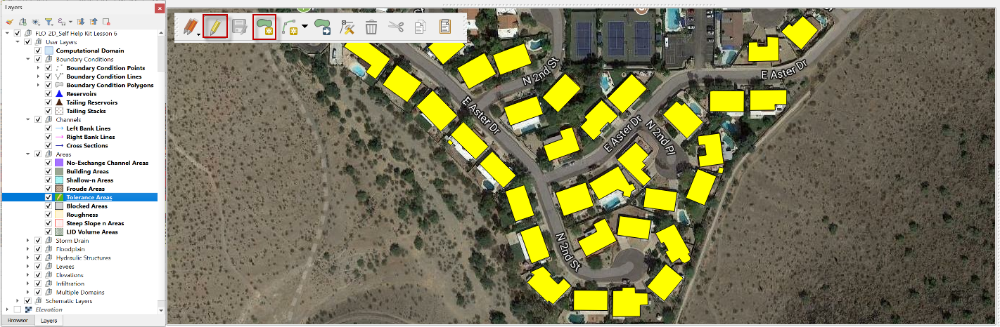

.. _tol_spatial:

9. TOL Spatial Depth
===================================

.. image:: ../../img/gridtools/tol/spatia001.png

TOL Spatial Depth is a grid-based tool used to assign spatially variable surface storage depths to specific areas in the model domain. While it has occasionally been used to simulate LID storage, this is not its intended or recommended use.

The original purpose of TOL Spatial was to prevent unwanted flow evacuation from deep ponded areas or zones prone to numerical instability during the simulation. By assigning a localized surface depression depth, flow is retained on the grid element until it exceeds the specified threshold, helping to maintain realistic water distribution and stabilize dynamic wetting and drying transitions.

.. warning::
   The use of TOL Spatial for LID modeling can produce water surface elevations that alter flow paths. For modeling LID storage, see the :ref:`LID Volume Spatial tool <grid_lid>` for a more accurate and physically consistent method.

Steps to Assign TOL Spatial Depth
---------------------------------

1. Add a polygon to the Tolerance Area layer representing the region where TOL Spatial depth will be applied.

2. In this example, the polygon defines a detention basin. The TOL value is set to 0.1 ft to retain shallow ponded water.

3. Click the Sample TOL Spatial Depth Values button to apply the TOL depth to grid elements whose centroids fall within the polygon.

.. image:: ../../img/gridtools/tol/spatia001.png

4. When the process completes, click OK to close the confirmation dialog.

.. image:: ../../img/gridtools/tol/spatia003.png
