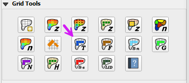

.. _tol_spatial:

9. TOL Spatial
===================================

Troubleshooting
----------------

1. Create the tolerance
   polygons if they are missing from the Tolerance Areas layer.

2. If the Grid layer
   is empty, create a grid and try again.

3. If a Python error appears during the sampling process, the attribute table may be missing.
   Save and reload the project into QGIS and try again.

4. If the Attribute Fields:
   collapse, calc_arf, and calc_wrf are not filled by the user, the calculation cannot be performed.
