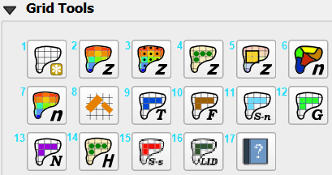

Grid Tools
================

Grid tools are used to sample various data types to the grid.  It employs methods such as vector intersection to the grid
layer and raster warp to the grid layer.  The processes can use External data such as elevation files or data layers
that are part of the geopackage.  Each tool is described in this section.

    
.. toctree::
   :maxdepth: 1
   :caption: Contents

   Create a Grid.rst
   Elevation from Raster.rst
   Elevation GDAL Grid Method.rst
   Elevation from LiDAR xyz.rst
   Elevation Correction Tool.rst
   Roughness from Vector.rst
   Roughness from Raster.rst
   Area and Width Reduction.rst
   TOL Spatial.rst
   Limiting Froude Spatial.rst
   Shallow n Spatial.rst
   Gutters.rst
   No Exchange Channel.rst
   Hazus Layers.rst
   Steep Slope.rst
   Low Impact Development.rst
   Help.rst
