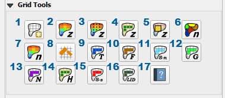

Grid Tools
================

Grid tools are used to sample various datatypes to the grid.  It employs methods such as vector intersection to the grid
layer and raster warp to the grid layer.  The processes can use External data such as elevation files or data layers
that are part of the geopackage.  Each tool is described in this section.

1. Create Grid
2. Grid Elevation from Raster Layer
3. Grid Elevation from GDAL Grid Method
4. Grid Elevation from LiDAR
5. Correct Grid Elevation
6. Grid Roughness from Vector
7. Grid Roughness from Raster
8. Reduction Factors (ARF and WRF)
9. TOL Spatial
10. Limiting Froude Spatial
11. Shallow n Spatial
12. Gutters
13. No-Exchange Channel Cells
14. Water Surface and Depth for HAZUS
15. Steep Slope
16. Low Impact Development
17. Help
    
.. toctree::
   :maxdepth: 2
   :caption: Contents

   Create a Grid.rst
   Elevation from Raster.rst
   Elevation GDAL Grid Method.rst
   Elevation from LiDAR xyz.rst
   Elevation Correction Tool.rst
   Roughness from Vector.rst
   Roughness from Raster.rst
   Area and Width Reduction.rst
   TOL Spatial.rst
   Limiting Froude Spatial.rst
   Shallow n Spatial.rst
   Gutters.rst
   No Exchange Channel.rst
   Hazus Layers.rst
   Steep Slope.rst
   Low Impact Development.rst
   Help.rst
