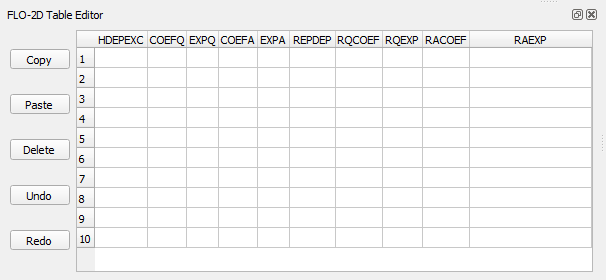
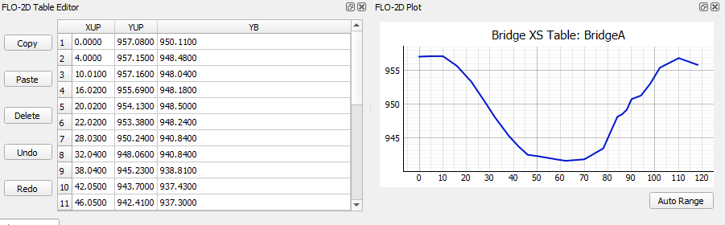
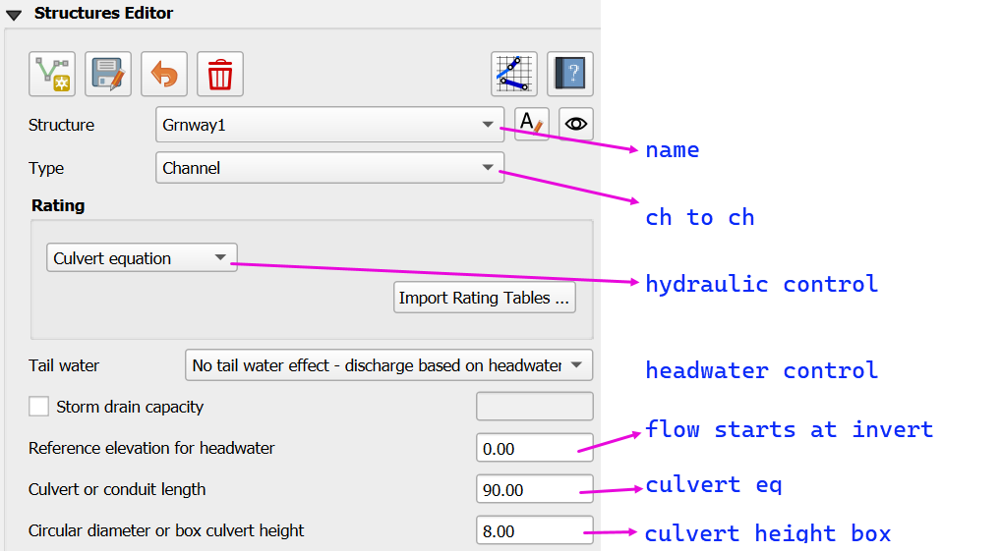
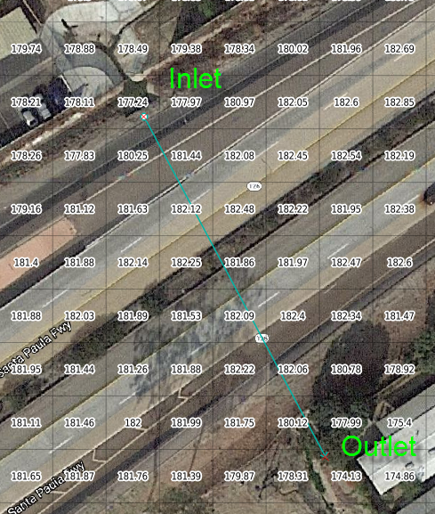
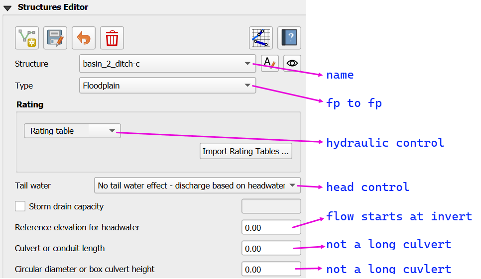
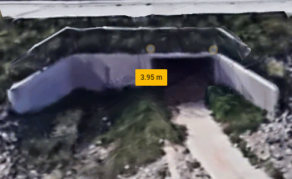
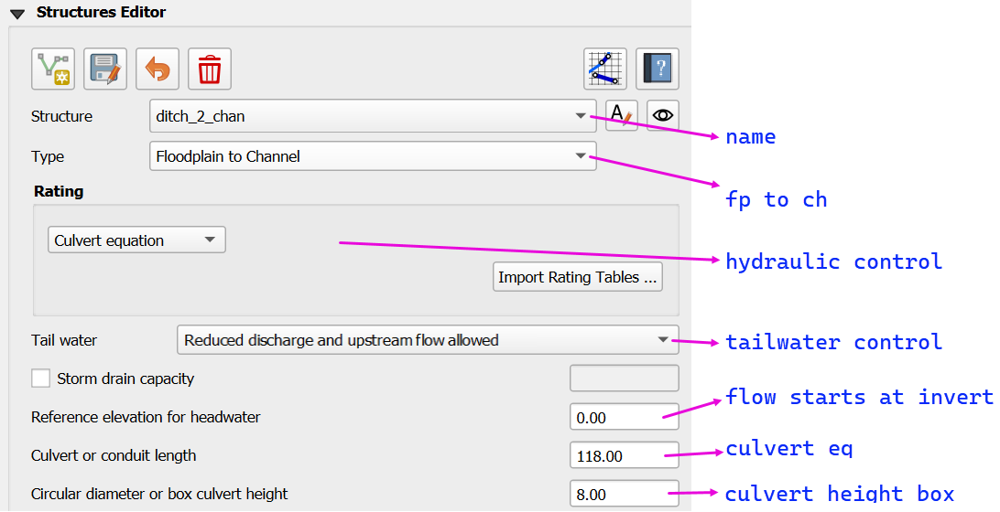

.. _structures_editor:

Structures Editor
==========================

The structures editor is used to set up the data for the HYSTRUCT.DAT file.

.. contents:: Contents
   :local: 
   :depth: 2
   :backlinks: entry

Overview
--------

The Hydraulic Structure Editor provides a graphical user interface for defining and managing hydraulic structures within the FLO-2D Plugin. These structures control the movement of water between grid elements and are essential for simulating culverts, bridges, weirs, storm drains, and pumps in both floodplain and channel systems.

This editor generates the `HYSTRUC.DAT` input file automatically, allowing users to focus on setting realistic structure parameters without manually editing text files. The editor supports all structure types and configurations available in FLO-2D, including:

- Floodplain-to-floodplain culverts using rating curves or culvert equations
- Channel-to-channel hydraulic structures with optional replacement curves
- Floodplain-to-channel and channel-to-floodplain interactions
- Complex bridge hydraulics using detailed coefficient tables
- Pump systems and simplified storm drain configurations

Purpose
~~~~~~~~~

Hydraulic structures simulate the effect of physical features that convey, restrict, or redirect flow between nodes. The purpose of the editor is to simplify the process of:

- Assigning node connections (inlet and outlet)
- Specifying flow control methods (rating curve, culvert routine, bridge routine, etc.)
- Entering reference elevations, coefficients, and geometric dimensions
- Configuring optional features such as tailwater effects, structure blockage, or deck overtopping
- Previewing structure behavior using visual layout and tooltip guidance

By using the editor, users can ensure structure inputs are consistent with FLO-2D model requirements and avoid common mistakes like mismatched node types or incomplete variable assignments. Each structure is validated in the UI before being saved to the `HYSTRUC.DAT` file, improving simulation reliability and workflow efficiency.

.. note:: An advanced tutorial for modeling hydraulic structures and culverts is available on the Gila Self-Help Tutorials.

          |tut|

.. |tut| raw:: html

   <a href ="https://youtu.be/ebIFoGUuQcI?feature=shared" target="_blank">Gila Self-Help Tutorials - Hydraulic Structures</a>

Structure Editor Layout
----------------------------

Structure Editor Control
~~~~~~~~~~~~~~~~~~~~~~~~~~~~~

- **New Structure**  
  Create a new structure. Click the button to add a new polyline to connect the upstream and downstream side of a structure.

- **Save Structure**  
  Save the current structure and load the structure into the editor.

- **Revert Changes**  
  Undo any unsaved edits and revert to the last saved condition.

- **Delete Structure**  
  Permanently remove the selected structure from the project. Use with caution as this action cannot be undone.

- **Schematize**  
  Process and convert the structure into FLO-2D ready data.

- **User Manual**  
  Open the plugin's user manual to view additional help documentation for hydraulic structures.

Structure Parameters I
~~~~~~~~~~~~~~~~~~~~~~~~~~~~

- **Name**  
  Enter or select the name of the structure. This identifies the outflow boundary condition in the project.

- **Type**  
  Choose the type of structure from the dropdown list. Options include:
  
  1. **Floodplain** – Connect a structure between two floodplain grid elements.    
  2. **Channel** – Connect a structure between two left bank channel elements.  
  3. **Floodplain to Channel** – Connect a structure from a floodplain grid element into a left bank channel element.  
  4. **Channel to Floodplain** – Connect a structure from a left bank channel element to a floodplain grid element.

.. note:: 
   Use the **left bank** channel element to connect the inlet or outlet of a structure. This is required 
   to ensure the structure connects to the appropriate channel cross section.

- **Rename**  
  Use this button to rename the selected structure. The name is alpha-numeric with 30 ascii characters and no spaces.

- **Locate**  
  Click the locate (eye) button to zoom and center the map on the selected structure.

Structure Hydraulic Control
~~~~~~~~~~~~~~~~~~~~~~~~~~~~~~~~

Select the hydraulic control method that governs flow through the structure. The options correspond to different modeling approaches in FLO-2D:

1. **Rating curve** – Defines flow using a depth vs. discharge equation.
2. **Rating table** – Defines flow using a depth vs. discharge table.
3. **Culvert equation** – Uses empirical culvert equations to calculate flow based on geometry and headwater conditions.
4. **Bridge routine** – Applies a specialized bridge flow routine based on physical dimensions and flow coefficients.

- **Load Rating Tables**  
  Click the **Import Rating Tables** button to load pre-defined rating data into the model.

Tailwater Control
~~~~~~~~~~~~~~~~~~~~~~~

.. image:: ../../img/Hydraulic-Structure-Editor/hydr006.png

Tailwater control settings determine how downstream water levels affect culvert discharge. These options are used to simulate varying degrees of backwater influence or flow reversal at the culvert outlet:

- **No tail water effect – discharge based on headwater**  
  Assumes free outfall conditions. Discharge is computed solely from upstream headwater elevation. No upstream flow allowed.

- **Reduced discharge and NO upstream flow allowed**  
  Simulates partial submergence. Discharge is reduced based on downstream conditions, but reverse flow from outlet to inlet is not permitted. 
  This condition is similar to a flap gate.

- **Reduced discharge and upstream flow allowed**  
  Allows for backflow into the upstream system under high tailwater conditions. Discharge is still reduced due to submergence.

.. note::  
   Tailwater settings simulate how downstream conditions influence flow through the structure. 
   Use these controls when submergence or flow reversal is expected due to backwater conditions, 
   particularly in urban or complex drainage systems.

Simple Storm Drain
~~~~~~~~~~~~~~~~~~~~~~~~~~

.. warning:: Use this option sparingly. The hierarchy of flow through this system is not applied appropriately for use on more than 2 or 3 inlets.

**Storm Drain Capacity**  

- This tool provides a simplified method for linking multiple inlets to a single outlet using a maximum discharge threshold.
- Only compatible with rating table structures.
- Not intended to model full pipe networks. It is useful when detailed storm drain routing is unavailable or unnecessary.
- The capacity value (cfs or cms) sets the maximum allowable flow. If inflow exceeds this value, excess water will pond at the inlet(s).

Structure Parameters II
~~~~~~~~~~~~~~~~~~~~~~~~~~~~~~~~~

These parameters are used when defining culvert or conduit characteristics for hydraulic rating calculations:

- **Reference Elevation for Headwater**  
  Specifies the minimum upstream water elevation required to initiate flow through the structure. 
  Flow will not occur until the water level reaches this elevation.

- **Culvert or Conduit Length**  

  If the structure does not use a long culvert or culvert equation, enter **0.0** for length and diameter.

  **Culvert Equation**
  
  Defines the total length of the culvert (feet or meters). Apply this length when using the **culvert equation** method.

  **Long Culvert**

   If the structure length exceeds 500 ft (150 m), it is considered a *long culvert*. In this case:

   - A **rating table** must be used.
   - The **flow area** must be defined (using `ATABLE` or related variables).
   - Long culverts simulate **storage** and **travel time**, unlike other structures that convey flow instantaneously.

- **Circular Diameter or Box Culvert Height**  
  Specifies the size of the structure. For circular culverts, enter the internal diameter. For box culverts, enter the internal height. 
  This value is critical for determining capacity and flow behavior.

Table Editor and Plot
-------------------------------

**Rating Curve**

**Replacement Curve**

.. image:: ../../img/Hydraulic-Structure-Editor/hydr012.png

**Rating Table**

**Culvert Equation**

**Bridge Routine**

The table editor is used to define the upstream and downstream cross sections for the bridge routine.

Example Configurations
---------------------------

Channel to Channel Structure
~~~~~~~~~~~~~~~~~~~~~~~~~~~~~

-  Channel to Channel
-  Generalized Culvert Equation

This structure will simulate discharge through a box culvert.
This example has a box culvert that is longer than the grid element.
The channel segments are split up to allow for the width of the roadway.

1. Click the Add
   Structure button.

.. image:: ../../img/Hydraulic-Structure-Editor/Hydrau003.png

2. Digitize a culvert
   by clicking on the two blue left bank elements that represent the beginning and end of the hydraulic structure.

3. Click upstream first and downstream second.
   There are small arrows on the channel that show the flow direction.

4. The structure line
   also has an arrow to show flow direction.

5. Do not use a structure on the magenta right bank lines.
   Culverts are only assigned to the left bank nodes.

6. Click
   Save.

7. Fill the
   widget form.

8. In the generalized
   culvert equation, conduit with is used to represent the culvert height or diameter.

9. Fill the
   table.

10. Click Schematize
    button to write the data to the schematic layers.

.. image:: ../../img/Hydraulic-Structure-Editor/Hydrau007.png

Floodplain to Floodplain Structure
~~~~~~~~~~~~~~~~~~~~~~~~~~~~~~~~~~~~~~~~

-  Floodplain to Floodplain
-  Rating Table

This example will model a culvert system between two floodplain nodes.
The invert elevation of the inlet node is set by the grid element elevation.

.. image:: ../../img/Hydraulic-Structure-Editor/Hydrau008.png

1. Click the Add
   Structure button.

.. image:: ../../img/Hydraulic-Structure-Editor/Hydrau009.png

2. Digitize a culvert
   by clicking on two cells closest to the inlet and outlet on the map.

3. Use the elevation
   values to make sure that the invert elevations are correct.

4. Click Save.

5. Fill in the data on the Structure Editor and the Table Editor.

6. No need for culvert geometry because this culvert uses a rating table.

7. No need for reference
   elevation because this culvert discharge starts when the water enters the upstream grid element.

8. Fill the rating table.

.. image:: ../../img/Hydraulic-Structure-Editor/Hydrau013.png

9. Click Schematize
   to write the data to the schematic layers.

.. image:: ../../img/Hydraulic-Structure-Editor/Hydrau007.png

Floodplain to Channel Structure
~~~~~~~~~~~~~~~~~~~~~~~~~~~~~~~~~~~~~~

-  Floodplain to Channel
-  Culvert equation

This example shows a culvert that connects a basin to a channel.

1. Click the Add
   Structure button.

.. image:: ../../img/Hydraulic-Structure-Editor/Hydrau009.png

2. Digitize a culvert by clicking on two cells closest to the inlet and outlet on the map.
   The outlet should be assigned to a blue channel node.

3. Use the grid
   elevation values and channel invert to make sure that the invert elevations are correct.

4. The culvert is assigned to the channel cross section.
   That is why the feature must be applied to a left bank channel node.

5. Click
   Save.

6. In this case the stage of the water in the channel may cause submergence.
   The tailwater switch should be set to Reduced Discharge and upstream flow allowed.

7. The culvert length is 118ft.

8. This is a pedestrian crossing so the culvert height must be at least 8 ft.

.. image:: ../../img/Hydraulic-Structure-Editor/Hydrau016.png

9.  The width
    of the structure is approximately 12 ft.

10. There are
    30-degree wingwalls.

11. Fill the table form.

12. Fill in
    Rating Table data.

.. image:: ../../img/Hydraulic-Structure-Editor/Hydrau019.png

13. Click Schematize to
    write the data to the schematic layers.

.. image:: ../../img/Hydraulic-Structure-Editor/Hydrau007.png

Channel to Floodplain
~~~~~~~~~~~~~~~~~~~~~~~~~~~~~~~~~~~~~~

-  Channel to Floodplain
-  Culvert equation

Rating Tables
--------------------------

Rating tables are used to define the relationship between stage and discharge for a hydraulic structure.  They can 
represent culverts, bridges, pumps, weirs or drop structures.

1. Click the
   Import Rating Tables button.

2. Select all of the
   rating table files and open them.

3. The files must
   have the same name as the structure.

4. The rating table data is
   Depth (ft or m) and Discharge (cfs or cms).

5. The columns
   can be space or tab delimited.

6. Do not put
   a header in the rating table data file.

.. image:: ../../img/Hydraulic-Structure-Editor/Hydrau022.png

Culvert Equation Data
---------------------------

Culvert equations define flow through a culvert based on geometric and hydraulic properties. This information is entered in the **Structures Editor** and the **FLO-2D Table Editor**, as shown below.

.. image:: ../../img/Hydraulic-Structure-Editor/hydr002.png
   :alt: FLO-2D Culvert Table Editor

Structures Editor Fields
~~~~~~~~~~~~~~~~~~~~~~~~~~~~~~

The following fields are available in the **Structures Editor**:

- **Structure** – Name of the culvert structure (e.g., CULV_122)
- **Type** – Designation of the culvert as *Floodplain* or *Storm Drain*
- **Rating** – Select *Culvert Equation* or import from a rating table
- **Tailwater Control** – Choose how downstream water levels are handled
- **Reference Elevation** – Elevation for the inlet headwater (ft)
- **Culvert Length** – Total length of the culvert barrel (ft)
- **Culvert Diameter or Box Height** – Inside diameter for pipes or height for box culverts (ft)

Culvert Geometry Table
~~~~~~~~~~~~~~~~~~~~~~~~~

The **FLO-2D Table Editor** stores additional culvert equation variables:

+-----------+----------+-----------+--------+--------+-------------+
| TYPEC     | TYPEEN   | CULVERTN  | KE     | CUBASE | MULTBARRELS |
+===========+==========+===========+========+========+=============+
| 1.0       | 1.0      | 0.0180    | 0.4    | 8.0    | 1.0         |
+-----------+----------+-----------+--------+--------+-------------+

**Field Descriptions:**

- **TYPEC** – Culvert shape: `1` = box, `2` = pipe
- **TYPEEN** – Entrance type (see below)
- **CULVERTN** – Manning's n value for the culvert
- **KE** – Entrance loss coefficient
- **CUBASE** – Culvert width (for box) or diameter (for pipe)
- **MULTBARRELS** – Number of barrels (1.0 for single-barrel)

Culvert Type Switch
~~~~~~~~~~~~~~~~~~~~~~~~~~

The culvert shape is defined using the `TYPEC(I)` variable:

- ``1`` = Box culvert
- ``2`` = Pipe culvert

.. note:: Box culverts are defined by height and width. Pipe culverts are defined by circular diameter.

Entrance Type Codes
~~~~~~~~~~~~~~~~~~~~~~~~

**Box Entrance Types (TYPEEN)**

- ``1`` – Wingwall flare 30° to 75°
- ``2`` – Wingwall flare 90° or 15°
- ``3`` – Wingwall flare 0°

**Pipe Entrance Types (TYPEEN)**

- ``1`` – Square edge with headwall
- ``2`` – Socket end with headwall
- ``3`` – Socket end projecting

Entrance Loss Coefficients
~~~~~~~~~~~~~~~~~~~~~~~~~~~~~~~~~

The entrance head loss is calculated using the following equation:

.. math::

   H_e = K_e \left( \frac{v^2}{2g} \right)

Where:
- ``H_e`` is entrance head loss (ft or m)
- ``K_e`` is the entrance loss coefficient
- ``v`` is velocity in the culvert barrel (ft/s or m/s)
- ``g`` is gravitational acceleration (32.2 ft/s² or 9.81 m/s²)

Entrance Loss Coefficient Table (HDS-5)
~~~~~~~~~~~~~~~~~~~~~~~~~~~~~~~~~~~~~~~~~~~~

**Pipe, Concrete**

.. list-table:: Entrance Loss Coefficients (HDS-5 – Third Edition)
   :widths: 67 33
   :header-rows: 1

   * - Type of Structure and Design of Entrance
     - K\ :sub:`e`

   * - Projecting from fill, socket end (groove-end)
     - 0.2

   * - Projecting from fill, square cut end
     - 0.5

   * - Headwall or headwall and wingwalls
     - 0.2

   * - Socket end of pipe (groove-end)
     - 0.2

   * - Square-edge
     - 0.5

   * - Rounded (radius = D/12)
     - 0.2

   * - Mitered to conform to fill slope
     - 0.7

   * - End-section conforming to fill slope
     - 0.5

   * - Beveled edges, 33.7° or 45° bevels
     - 0.2

   * - Side- or slope-tapered inlet
     - 0.2

.. note:: These values are based on the *Hydraulic Design of Highway Culverts – HDS-5 – Third Edition* and used in outlet control flow calculations.

Bridge
----------------

Bridge parameters can be defined for a structure.

.. image:: ../../img/Hydraulic-Structure-Editor/Hydrau020.png

The USGS bridge tables are used to define the flow though a bridge with bridge geometry and discharge coefficients.

.. note:: See `Bridge tutorial and Bridge guidelines <https://documentation.flo-2d.com/Advanced-Lessons/Module%202%20Part%203.html>`__ for a detailed guide.

