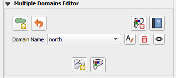
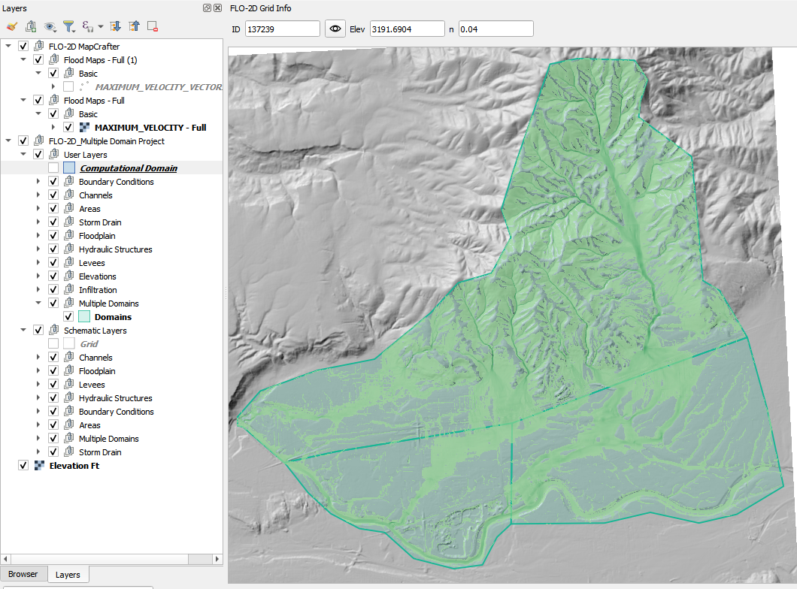
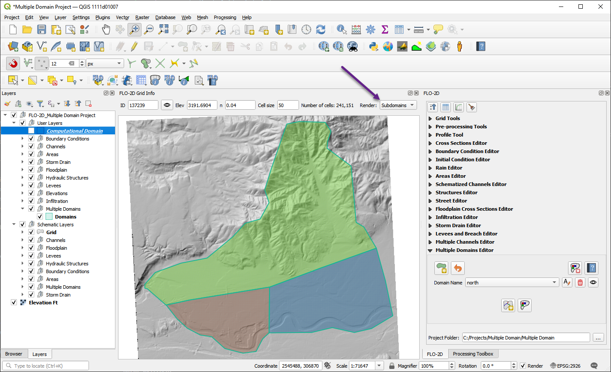
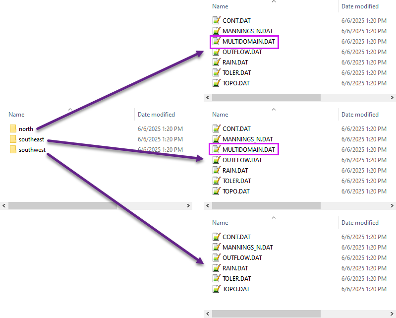

.. _multd_editor:

Multiple Domains Editor
=========================

Overview
--------

Large-scale urban flood modeling projects often require millions of computational cells, especially when working with detailed topography and infrastructure. Once a project exceeds approximately 6 million cells, performance and workflow bottlenecks can become significant.

A multiple domain setup allows engineers to break the full project area into smaller, connected subdomains. This offers several advantages:

- **Parallel Workflows**: While one domain is running a simulation, other domains can be actively developed or reviewed.
- **Improved Efficiency**: Smaller subsets of data are faster to schematize, troubleshoot, and re-run.
- **Simplified Review**: Reviewers and collaborators can focus on a specific subdomain without loading the entire model.
- **Scalable Modeling**: Each subdomain acts as a building block, making it easier to construct complex, full-urban “living models” over time.

By using a modular approach, engineers can speed up development, improve model maintainability, and support collaborative workflows in large urban floodplain studies.

.. important::

   This project is intentionally scaled down for the sake of instruction. In practice, a model of this size would not require a multi-domain setup.

Setting Up Multiple Subdomains
-------------------------------

This section explains how to set up multiple subdomains from a single global domain using the FLO-2D Plugin in QGIS.

Build the Global Domain
---------------------------------
1. Start by building the full computational domain as you would for a standard single-domain project. This domain should cover the entire project area.

2. Use the Computational Domain layer to define the boundary. 

.. note:: This will result in a large grid with several million cells — that's acceptable at this stage.

.. image:: ../../img/multd-editor/multd002.png

Run a Short Global Simulation
---------------------------------------
1. (Optional) Run a short simulation using a simple rainfall event (e.g., 3 inches over 6 hours). This helps to identify inter-domain flow paths and potential boundaries between subdomains.

2. Load the simulation results into QGIS to visualize flow patterns and identify natural separations in the terrain.

Identify Downstream Domains
-------------------------------------
1. Based on engineering judgment and the results of the global simulation, identify downstream areas that should be split into subdomains. 
2. Look for clear flow separations that can be defined as subdomains.

.. important::

   When defining subdomain boundaries, it is critical to avoid placing them directly on or near key 1D hydraulic features such as culverts, channels, or highways. These features often control flow behavior, and splitting them across domain boundaries can lead to incorrect results or failed connectivity between domains.

   Ensure that flow can cross the domain boundary *freely*, without interference from 1D elements. Place boundaries in areas where overland flow is dominant, and where the hydrologic and hydraulic conditions can be clearly defined on both sides.

   .. image:: ../../img/multd-editor/multd004.png

Create Subdomain Polygons
-----------------------------------
1. Digitize polygons for each subdomain. In this example, the `north` domain connects to both the `southeast` and `southwest` domains, and the `southeast` domain also connects to the `southwest` domain.

2. The polygons should be large enough to encompass the entire area of interest for each subdomain, including any necessary buffer zones to ensure connectivity.

Define Subdomain Connectivity
---------------------------------------
1. Use the Multiple Domain Editor to define how subdomains connect to each other. 

2. Ensure that all downstream connections are specified.

Step 6: Schematize Each Domain
--------------------------------
Use the plugin tools to schematize the grid and hydraulic structures for each domain. Each domain will have its own GDS setup but must remain consistent with boundary overlaps.

The schematized domain looks like this:

Step 7: Export Multiple Domains
---------------------------------
Once each domain has been schematized, you can export them using the **Export Multiple Domains** tool.

Click the *Export* dropdown menu from the main toolbar and select **Export multiple domains**.

.. image:: ../../img/multd-editor/multd009.png

In the export dialog that appears:

- Choose an export folder that will contain a separate subfolder for each domain.
- Set the export method to `MULTIDOMAIN.DAT`.
- Click **Export All** to export every defined subdomain at once.

Each domain will be saved in its own subdirectory inside the export folder, using the subdomain name (e.g., `north`, `southeast`, `southwest`).

The exported files will look like this:

