.. _pre_processing_tools:

Pre-Processing Tools
========================

The Pre-Processing Tools are tools designed to modify Digital Elevation Models (DEMs) for various applications.
These tools provide efficient pre-processing solutions for removing artificial barriers such as dams, bridges, and
levees, allowing users to create more realistic and valuable terrain representations.

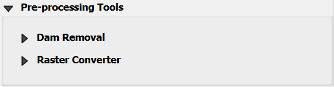

.. note:: To date, the only available tool is the Dam Removal.
          Bridge & Levee removal tools are expected in future updates.

Dam and Reservoir Removal
--------------------------

The Dam Removal Tool is a specialized utility designed to process Digital Elevation Models (DEMs) and remove the
representation of dams or artificial barriers within the elevation data.

1.  Click on Dam area.

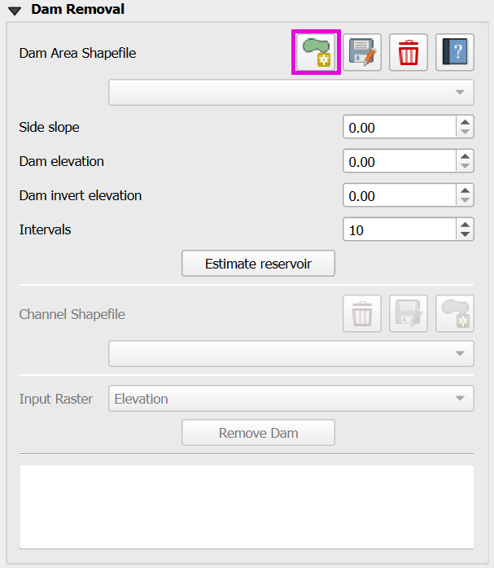

2.  Draw the dam area

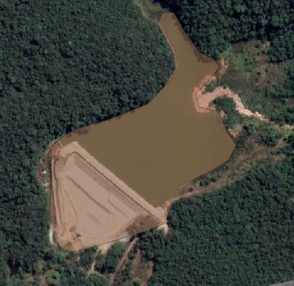

3.  Click on Save dam area to save the shapefile.

.. image:: ../../img/Pre-Processing-Tools/Prepro003.png

4.  Fill the Side slope, Dam elevation, Dam invert elevation, and Intervals.

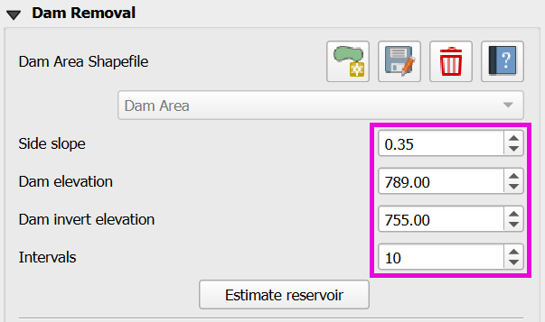

5.  Click on Estimate Reservoir.

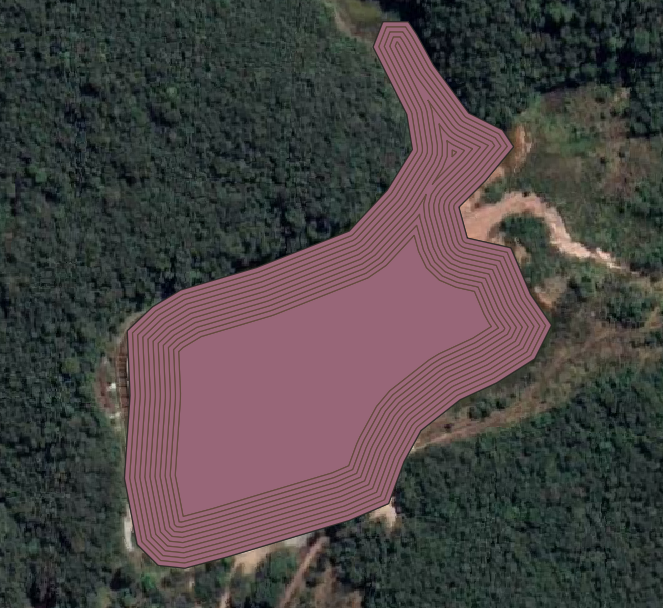

Downstream of Dam
___________________

Open a path for the water to leave the dam on the downstream edge of the dam.  Lower the elevation using the channel
polygon.

6.  Click on Add Channel.

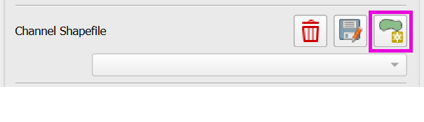

7.  Draw the channel.

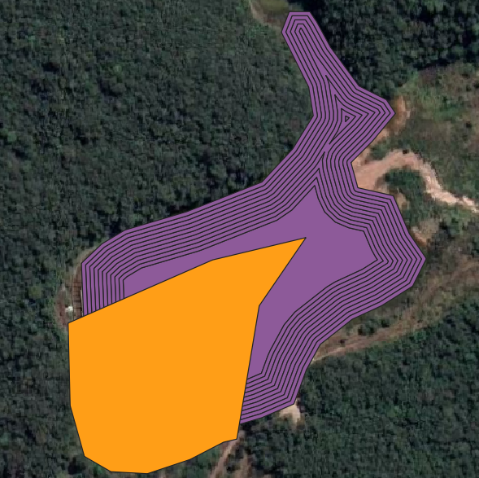

8.  Click on Save channel.

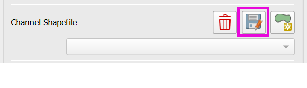

9. Select the Input Raster.

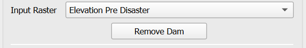

10.  Click on Remove Dam and save or not the intermediate calculation shapefiles (Dam Area & Channel).

.. image:: ../../img/Pre-Processing-Tools/Prepro010.png

11. Check the modified DEM for any bad data and redo the process until the DEM is satisfactory.

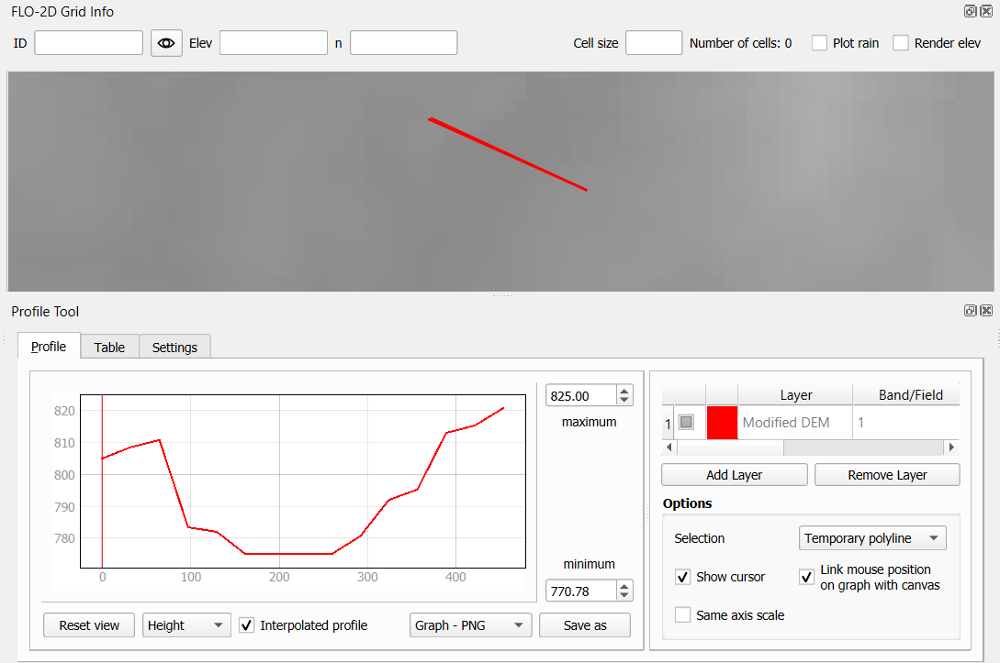

Dam Removal Troubleshooting
_______________________________

Estimate the side slopes based on the dam banks or design data.
The connection between the channel and the reservoir is usually steep, check for potential bad data there.
Check the area and the volume removed from the DEM to match the design volume.
The number of intervals equal 10 is a good estimation, but it can be modified.

Raster Unit Converter
--------------------------

The unit converter was developed to convert the USGS elevation data from meters to ft. Download the USGS DEM data
from a 3DEP layer and convert it to feet using the unit converter.

1.  Click on the Raster Converter editor.
2.  Load the raster file. 
3.  Define the file name and path to save the converted file.
4.  Click the convert button.

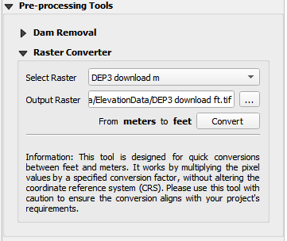

5. The new layer will be added to the map with the converted data.

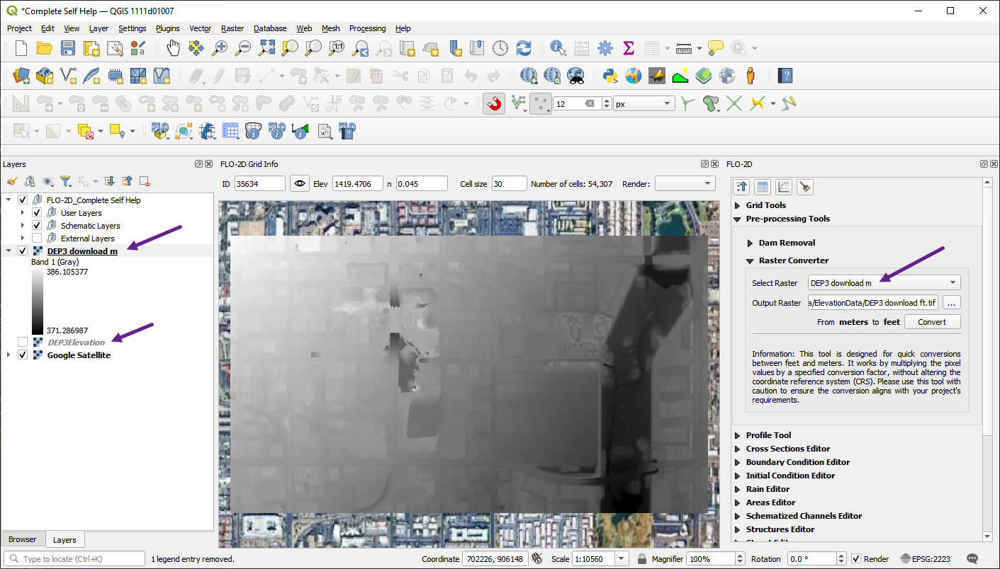

Download 3DEP DEM Data
--------------------------

The 3DEP (3D Elevation Program) provides high-resolution elevation data for the United States.
To download 3DEP DEM data, follow these steps:

1. Open the Data Source Manager.
2. Load the WCS tab.
   

3. Create a new connection to the 3DEP WCS server.
4. Name the Connection.  In this case the name 3DEP is used.
5. Add the URL to the dataset: 
   
`https://elevation.nationalmap.gov/arcgis/services/3DEPElevation/ImageServer/WCSServer`

6. Click connect to connect to the server.
7. Select the first layer in the list.
8. Click the Add button to add the layer to the map.

9.  The downloaded layer may have a broken link.
10.  Right click the layer and click Repair Data Source.

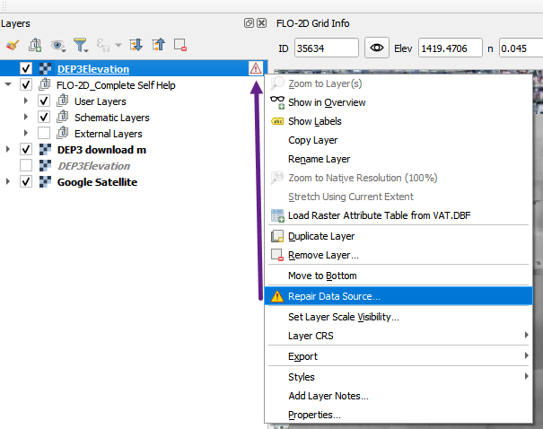

11. Use the dialog to fix the data source as shown below.

12.  Once the layer loads, uncheck it so the data won't load every time the map is refreshed.

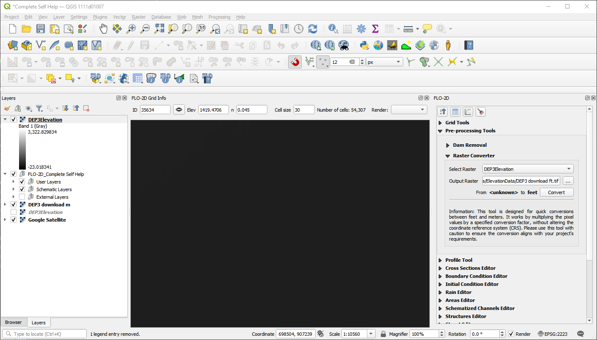

13.  To use the data, download a raster file by Exporting the layer. 

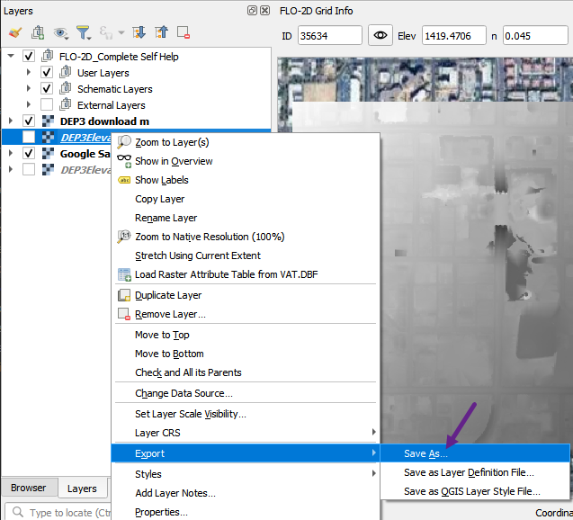

14.  Don't forget to set the layer extent to the area of interest.

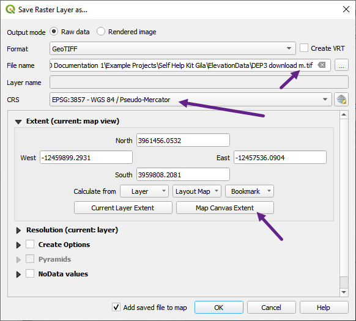

