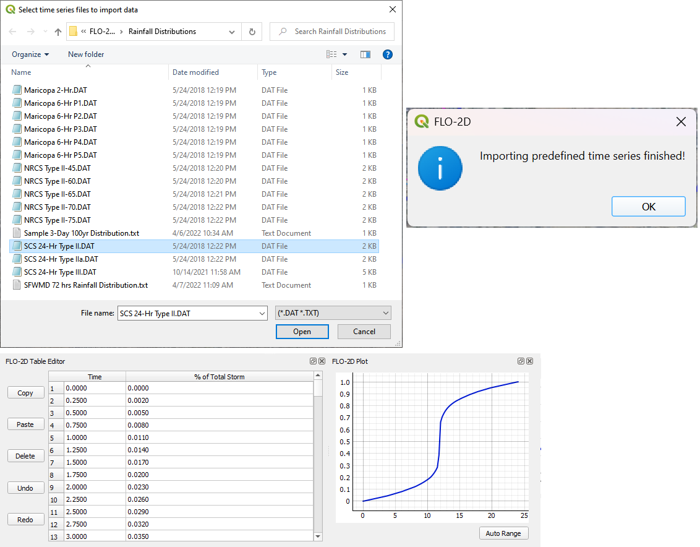
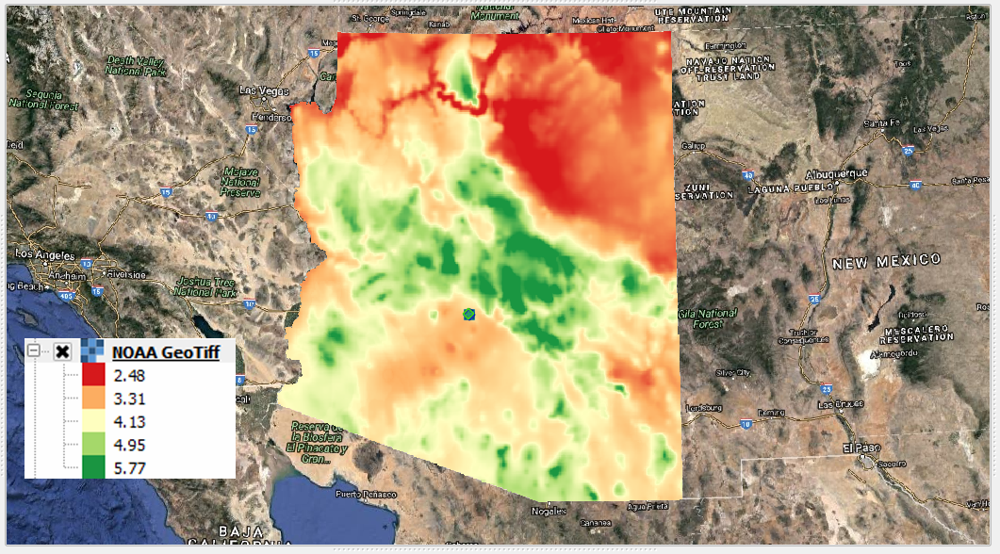

.. _rain_editor:

Rain Editor
===========

The rainfall editor is used to set up the RAINFALL.DAT file and the RAINCELL.DAT file.
This section will describe how to set up uniform rainfall, spatially variable depth area reduction factors, and spatially and time variable rainfall.

.. image:: ../../img/Widgets/rain.png

Uniform Rainfall
----------------

Uniform rainfall requires the total rain in inches or millimeters and a rainfall distribution.
In this example, the total rainfall is 3 inches.
To find Total Storm Rainfall, zoom to Rainfall raster with Computational Domain layer, check Identify Features button, clicks within the Computational
Domain to find highest derived value.
The Building Rain switch is selected so that rain on totally blocked ARF cells will allow rain to run from the blocked areas.
The initial abstraction is default of zero inches.
The rainfall distribution is imported from a data file.

1. Select the rainfall
   distribution using the Folder menu.

2. Import the rainfall distribution file from a set of predefined files.

.. note:: The files are installed in the FLO-2D Documentation folder:
          C:\\Users\\Public\\Documents\\FLO-2D PRO Documentation\\Rainfall Distributions

The rainfall data is imported into the FLO-2D Table Editor.

1. Load the currently selected time series into the editor
   table.

2. Add a new
   rainfall time series to the project.

3. Open a time
   series data file.

4. Delete a time
   series table.

5. Rename a time
   series data set.

Moving Storm
-------------

To simulate a moving storm cell, select a storm direction and speed.
This data must be assigned along with isohyetal contours that represent storm intensity as depth are reductions contours.

.. image:: ../../img/Rain-Editor/rained006.png
   
Spatially Variable Rainfall NOAA Atlas 14
------------------------------------------

Spatially variable rainfall can be modeled using depth-area reduction factors in the RAINFALL.DAT file. This file defines rainfall 
values in either inches or millimeters, where each value represents the depth at a specific point (typically the centroid of a grid element) 
relative to the total rainfall across the computational domain.

Rainfall input data are typically derived from precipitation rasters. In the United States, these rasters are generated from 
isohyetal contour maps provided by the NOAA Atlas series. Each raster corresponds to a specific precipitation frequency and duration 
(e.g., 6-hour, 100-year storm). The example below shows a 100-year, 6-hour precipitation map for Arizona, with the legend indicating 
total rainfall depth in inches.

|noaaatlas|

.. |noaaatlas| raw:: html
   <a href="https://hdsc.nws.noaa.gov/hdsc/pfds/" target="_blank" rel="noopener">NOAA Atlas 14 Precipitation Frequency Data Server</a>

To perform the calculation, use the Area Reduction calculator.

|rained024|\ |rained025|

1. Click the
   Area Reduction button.

2. Fill the
   form and click OK.

The raster pixels are typically 1000 by 1000 ft or larger.
It is not necessary to average the data.

3. Select the maximum value to set the cell value.

.. image:: ../../img/Rain-Editor/rained008.png

Realtime Rainfall NEXRAD
------------------------

.. _real_rain_editor:

Real-time rainfall data can be generated from NEXRAD \*.ASC grid files. In the United States, these files are produced 
using calibrated radar reflectivity data from the National Oceanic and Atmospheric Administration (NOAA), supplemented 
with rainfall gage measurements from local networks. Calibration is typically performed by regional agencies or 
consultants to improve accuracy.

NEXRAD rainfall datasets, along with gage data, are available for download through NOAA’s NEXRAD Archive. These 
datasets can be imported into the modeling environment using the Real-Time Rainfall Calculator, which interpolates 
the rainfall data to the computational grid and generates the necessary input files.

|nexrad|

.. |nexrad| raw:: html
   <a href="https://www.ncei.noaa.gov/products/radar/next-generation-radar-nexrad" target="_blank" rel="noopener">NOAA NEXRAD Data Archive </a>

The calculator produces rainfall data in two formats:

- RAINCELL.DAT (text format for FLO-2D)
- RAINCELL.HDF5 (HDF5 format for large datasets or time series processing)

.. tip:: The RAINCELL.DAT file is a mega data file. It is not recommended to import this file into a QGIS – FLO-2D
               project when importing FLO-2D Data files. It is recommended to use a Skeleton Project with only grid data
               and no other components loaded to perform the RAINCELL.DAT or RAINCELL.HDF5 data files.

Rainfall Catalog
----------------

The project directory must contain all the rainfall \*.asc files and a catalog file \*.rtc.
Both filetypes are text files.
The \*.asc files are rainfall coverage for the project area at a specified time interval.
In this case the time interval is 5 minutes.

.. image:: ../../img/Rain-Editor/rained009.png

The rainfall catalog is a text file that contains specific information about the layout and timing of the data.
The first line of data is a control line that sets up the timing of the storm and the interval.

Line 1: 9/9/2013 04:05 9/9/2013 23:55 5 239

Line 1: Start Time, End Time, Time Interval, \*.asc File Count

.. important:: Line 2 of the \*.rfc isn’t necessary.

               The Rainfall calculator will use all \*.ASC files in the project directory.
               Make sure they are named in ascending order by time.

               Time = 0 is not necessary.
               The engine will start the simulation at time and rainfall = zero.
               The rainfall data will interpolate from time = 0 rainfall = 0 to the first interval.

.. image:: ../../img/Rain-Editor/rained010.png

.. image:: ../../img/Rain-Editor/rained011.png

Setup Import Options
--------------------

The rainfall data does not have a specific coordinate reference system (CRS).

1. Set the import options for QGIS to automatically assign all imported data with no knows CRS to the Project CRS.

2. Click Settings Options

.. image:: ../../img/Rain-Editor/rained012.png

3. Select the following options and click OK.

Import Realtime Rainfall
------------------------

1. To interpolate realtime rainfall data, activate the Realtime Rainfall Editor.

2. Click the Import Real Time Rainfall ASCII files.

.. image:: ../../img/Rain-Editor/rained014.png

The Plugin requests the directory where the NEXRAD data is stored.

3. Navigate to the correct directory and click Select Folder.

  

4. Click OK once the process is complete.

.. image:: ../../img/Rain-Editor/rained016.png

Export the rainfall data
-------------------------

1. Click Export the Realtime Rainfall Data.  There are 3 Options.  The recommended option is hdf5 due to the size
   differences in the data files.

  
2. Name the storm and click Save.

.. Important::  RAINCELL.DAT is an ascii file.  RAINCELL.HDF5 is a compressible database file.  The file size of a
   large project can be many gigabytes of data if store in ascii format.  Even the self help kit results in a file
   that is close to 1 gigabyte.  HDF5 files are orders of magnitude smaller and in general load faster.

   .. image:: ../../img/Rain-Editor/raincell001.png

.. |rained024| image:: ../../img/Rain-Editor/rained024.png

.. |rained025| image:: ../../img/Rain-Editor/rained025.png

