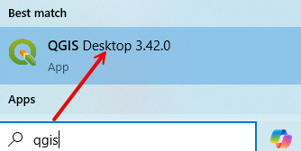
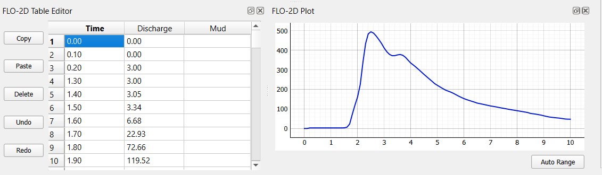
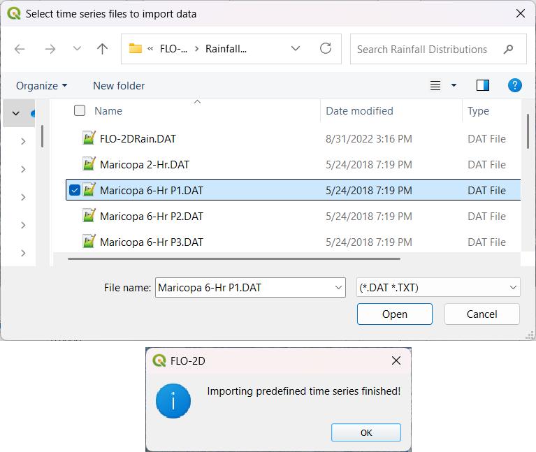
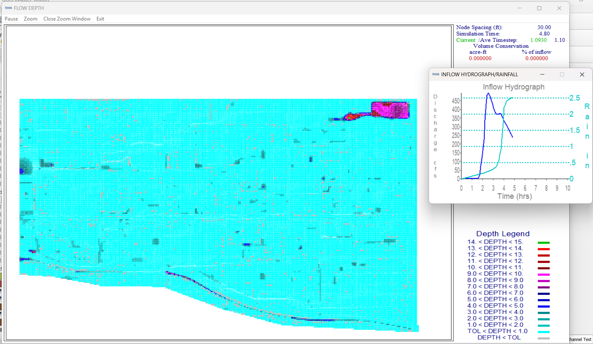

Hydrology
==========

Learn how to set up rainfall and infiltration using QGIS and the FLO-2D Gila Plugin.

.. Note:: It will be easier to view these videos on YouTube.

   Set the video playback speed to 2x to complete the lessons faster.

   The videos are more detailed whereas the text gives the minimum steps needed
   to complete the project.

Load the Project
-----------------

.. raw:: html

   <iframe width="560" height="315" src="https://www.youtube.com/embed/w7iFEWItUyA?si=Fyuii5QSBomqkTWH"
   title="YouTube video player" frameborder="0" allow="accelerometer; autoplay; clipboard-write; encrypted-media;
   gyroscope; picture-in-picture; web-share" referrerpolicy="strict-origin-when-cross-origin" allowfullscreen></iframe>

This lesson shows how to load a FLO-2D project in QGIS, manage paths, and handle GeoPackage data.

Step 1: Launch QGIS
~~~~~~~~~~~~~~~~~~~~
- Open the **QGIS application**.

.. tip::
   To avoid searching for QGIS every time, right-click the QGIS icon and select **"Pin to Start."**

Step 2: Open Your Project
~~~~~~~~~~~~~~~~~~~~~~~~~~~~~~~~~~~~~~~~~~~~~

- If QGIS opens the most recent project, simply click on it in the **Recent Projects** list.

.. image:: ../img/shg/3/shg_hydro002.png

- If the project was moved and no longer loads:

  - Go to **Plugins > FLO-2D > Open FLO-2D Project**.

  - Navigate to the project `.gpkg` file (GeoPackage) and select it.

.. image:: ../img/shg/3/shg_hydro003.png

.. note::
   The GeoPackage contains the entire project, including the `.qgz` file.

Assign an Inflow Node
--------------------------

.. raw:: html

   <iframe width="560" height="315" src="https://www.youtube.com/embed/YoYULnJ-0U0?si=OT2AiswXQdgwaTcF"
   title="YouTube video player" frameborder="0" allow="accelerometer; autoplay; clipboard-write; encrypted-media;
   gyroscope; picture-in-picture; web-share" referrerpolicy="strict-origin-when-cross-origin" allowfullscreen></iframe>

This tutorial shows how to create an **inflow boundary condition** at a project edge where an upstream channel—**Cave Creek**—enters the basin. This is useful when modeling runoff entering the system from offsite.

Step 1: Navigate the Map
~~~~~~~~~~~~~~~~~~~~~~~~
- Use the **mouse scroll wheel** to zoom in and out.
- Click and drag with the **middle mouse button (wheel)** to pan the map view.

Step 2: Add an Inflow Node
~~~~~~~~~~~~~~~~~~~~~~~~~~~

- In **FLO-2D Panel**, click **Collapse All** to clear any open panels.

.. image:: ../img/shg/3/shg_hydro004.png

- Expand **Boundary Condition Editor**.

.. image:: ../img/shg/3/shg_hydro005.png

- Choose the **Inflow Node** option.

.. image:: ../img/shg/3/shg_hydro006.png

- Click **Add Point**, then click on the map at the outlet of the structure (culvert with dissipator and grate).

- Click **OK** to create the inflow point, and then
  click the **Add Point** button again to save it.

.. image:: ../img/shg/3/shg_hydro008.png

Step 3: Rename the Inflow Point
~~~~~~~~~~~~~~~~~~~~~~~~~~~~~~~~~~
- Click **Rename**, and rename to "Grover Basin Inflow"

.. image:: ../img/shg/3/shg_hydro009.png

Step 4: Create a Time Series
~~~~~~~~~~~~~~~~~~~~~~~~~~~~~~
- Go to the **Time Series Editor**.
- Click **Rename**, and rename "Time Series 1" to "GroverIn 100yr 6hr"

.. image:: ../img/shg/3/shg_hydro010.png

- This is a 100-year, 6-hour inflow hydrograph taken from the original larger project.
- Set the **Type** to: `Floodplain`

.. image:: ../img/shg/3/shg_hydro011.png

.. warning::
   Do not select **Channel** unless modeling a **1-D FLO-2D** channel. This is surface runoff entering the basin.

Step 5: Paste Hydrograph Data
~~~~~~~~~~~~~~~~~~~~~~~~~~~~~~
- Open the provided hydrograph data file from **Lesson 1 Data**.
  - Choose the `100yr 6hr` inflow file.

  .. image:: ../img/shg/3/shg_hydro012.png

- Time should be in hours on the **left** and discharge (cfs) on the **right**.
- Select all data with **Ctrl+A**, then copy with **Ctrl+C**.
- Close the file with **Ctrl+W**.
- In the QGIS Time Series Editor, click the first cell and paste using **Ctrl+V**.

.. note::
   FLO-2D uses **cubic feet per second** for discharge unless the metric units switch is on, in which case it uses **cubic meters per second**.

Step 6: Schematize the Data
~~~~~~~~~~~~~~~~~~~~~~~~~~~~
- Click **Schematize** to convert the pasted user input into FLO-2D schema data.

.. image:: ../img/shg/3/shg_hydro014.png

Step 7: Export the Inflow File
~~~~~~~~~~~~~~~~~~~~~~~~~~~~~~~~~
- Right-click the inflow node and choose **Export > Data**.
- Set the export folder and confirm.

.. image:: ../img/shg/3/shg_hydro015.png

- Select only the **Inflow Elements**, not all files.

.. image:: ../img/shg/3/shg_hydro016.png

You will now have a file called `INFLOW.DAT`.

.. image:: ../img/shg/3/shg_hydro017.png

Assign Rainfall
-----------------

.. raw:: html

   <iframe width="560" height="315" src="https://www.youtube.com/embed/IKeZAli-2yA?si=ACNEjxC64o8Ltyq9"
   title="YouTube video player" frameborder="0" allow="accelerometer; autoplay; clipboard-write; encrypted-media;
   gyroscope; picture-in-picture; web-share" referrerpolicy="strict-origin-when-cross-origin" allowfullscreen></iframe>

Step 1: Open the Rain Editor
~~~~~~~~~~~~~~~~~~~~~~~~~~~~~~~~~~~~~~~~~

- In **FLO-2D Panel**, click **Collapse All** to clear any open panels.
- Expand **Rain Editor**.

.. image:: ../img/shg/3/shg_hydro018.png

- Check **Simulate Rainfall**.
- Set the **Total Rainfall Depth** to ``2.65 in`` (this example uses a 6-hour, 100-year event).
- Leave **Rainfall Abstraction** at ``0.0`` for now. This is set elsewhere.
- Check **Apply Building Rain**.

Step 2: Add a Storm Pattern
~~~~~~~~~~~~~~~~~~~~~~~~~~~~~~~~~~~~~~~~~
- Click **Open** next to the storm pattern.

.. image:: ../img/shg/3/shg_hydro020.png

- Navigate to the **FLO-2D documentation folder** and find the **6-hour event distribution**.
  Choose the **first pattern** from the list.

- Confirm the time-percent curve was imported correctly.

.. image:: ../img/shg/3/shg_hydro022.png

.. important::

   The rainfall distribution table has:

   - **Time (hours)** on the left.
   - **Cumulative rainfall (0–1)** on the right.

   The percent values must **start at time = 0 and rainfall = 0**.

Step 3: Understanding Rain on Grid
~~~~~~~~~~~~~~~~~~~~~~~~~~~~~~~~~~~~~~~~~
- Rainfall is applied **uniformly** across all grid elements.
- Every element receives **2.65 inches** following the selected pattern.
- This is called **"rain on grid"**, and it is different from assigning rainfall to subcatchments.

.. tip::
   Rain on grid works well for small projects. For large areas, continue to **Step 4**.

.. dropdown:: Step 4: Sample a Rainfall Raster (Optional)

   **NOAA Atlas 14 rainfall raster** cab be used to apply **spatially variable rainfall** as described in the following steps.

   - Drag the **24-hour rainfall raster** into QGIS.

   - Right-click the layer > **Zoom to Layer**.

   - Check the data: it should be in inches and match the coordinate system in use.

   .. image:: ../img/shg/3/shg_hydro023.png

   To apply the raster:

   - Go to the **Rain Editor**.

   - Check **Sample from Raster**.

   .. image:: ../img/shg/3/shg_hydro024.png

   - Select **NOAA Atlas 14 rainfall** raster file.

   - Leave **"Fill NoData"** unchecked if not needed.

   - Click **OK** and confirm.

   .. image:: ../img/shg/3/shg_hydro025.png

   - QGIS will now **sample rainfall values** from the raster to each grid element based on spatial location.

   .. image:: ../img/shg/3/shg_hydro026.png

   .. note::
      The sampling uses the centroid of each grid element and computes a **point reduction factor**
      based on the maximum raster value. It is **not** a depth-area reduction, but rather a **point-based**
      rainfall adjustment.

Step 5: Export Rainfall Data
~~~~~~~~~~~~~~~~~~~~~~~~~~~~~~~~~~~~~~~~~
Check `Control Parameters`:

- The rainfall switch is turned on automatically when **Simulate Rainfall** is checked. Click **Save**.

- Export **DAT Files**.

- This will generate a ``RAIN.DAT`` file in the export folder.

Infiltration
---------------

.. important::
   FLO-2D uses three infiltration types. Choose one lesson and skip the other two.

.. dropdown:: Infiltration - Assign Green and Ampt

   .. raw:: html

      <iframe width="560" height="315" src="https://www.youtube.com/embed/PE9vvuW7p-A?si=O2bP9jhPCbZUWS10"
      title="YouTube video player" frameborder="0" allow="accelerometer; autoplay; clipboard-write; encrypted-media;
      gyroscope; picture-in-picture; web-share" referrerpolicy="strict-origin-when-cross-origin" allowfullscreen></iframe>

   This lesson walks through the **Green-Ampt infiltration method** in FLO-2D,
   including the 2018 and 2023 Flood Control District methods and the SSURGO/OSM-based method.
   You'll learn how to set global parameters, apply land use and soil data, and export Green-Ampt data files.

   .. container:: h3

      Step 1: Set Global Parameters

   - Open the **Global Infiltration** tool.

   .. image:: ../img/shg/3/shg_hydro030.png

   - Check **Green-Ampt**.

   .. image:: ../img/shg/3/shg_hydro031.png

   - Click **OK**.

   .. container:: h3

      Step 2: Load Land Use and Soil Shapefiles

   - Add land use and soil shapefiles (e.g., 2018 or 2023 Maricopa County).

   .. image:: ../img/shg/3/shg_hydro032.png

   - Inspect attributes such as:
     - ``initial abstraction``, ``impervious``, ``initial saturation``
     - ``hydraulic conductivity (XKsat)``, ``soil depth``
     - ``DTheta dry``, ``DTheta normal``, ``Psif``

   .. dropdown:: Step 3 (Option 1): Use the 2018 Method

      - Run **Green-Ampt Calculator** (2018 version).

     .. image:: ../img/shg/3/shg_hydro033.png

     - Input Fields:

       - Soil Layer: ``XKsat``, ``RockOutcrop``, ``SoilDepth``
       - Land Use: ``Initial Saturation``, ``Initial Abstraction``, ``Impervious``
       - Leave ``Vegetative Cover`` unchecked.

     - Click **OK** to calculate.

     - Review the 2018 Manual Settings:

       - 2018 method derives ``Psif`` and ``DTheta`` from XKsat.
       - Uses area-weighted averages (no log scaling).
       - Global and local infiltration data will be stored in ``INFIL.DAT``.

     - Step 5: Export Infiltration Data

       - Ensure **Infiltration Switch** is ON in **Control Parameters**.

       .. image:: ../img/shg/3/shg_hydro034.png

       - Click **Export DAT Files**.

       .. image:: ../img/shg/3/shg_hydro035.png

       - Export only ``INFILTRATION`` and ``CONT.DAT``.

       .. image:: ../img/shg/3/shg_hydro036.png

   .. dropdown:: Step 3 (Option 2): Use the 2023 Method

     - Switch calculator to use 2023 soil shapefile.

     .. image:: ../img/shg/3/shg_hydro037.png

     - Input Fields:

       - Soil Layer: ``XKsat``, ``RockOutcrop``, ``SoilDepth``, ``DTheta Normal``, ``DTheta Dry``, ``Psif``
       - Land Use: ``Initial Saturation``, ``Initial Abstraction``, ``Impervious``

     - Leave ``Vegetative Cover`` unchecked.
     - 2023 method uses:
     - Log area average for XKsat and Psif
     - Intersected DTheta from land use-soil overlay
     - Maximum impervious value from both layers

   .. dropdown:: Step 3 (Option 3): Use SSURGO and OpenStreetMap Data

      - Use **SSURGO Downloader** to get soil components:

        - Horizon, Fragmentation, Component layers

      .. image:: ../img/shg/3/shg_hydro038.png

      - Use **OSM Downloader** to generate land use polygons:

        - Raster images are vectorized based on color mapping.

      .. image:: ../img/shg/3/shg_hydro039.png

      - Calculator reads attributes:

        - Land Use: ``Initial Saturation``, ``Impervious``, ``Initial Abstraction``
        - Soil: ``XKsat``, ``Soil Depth``, ``DTheta``, ``Psif``

      .. image:: ../img/shg/3/shg_hydro040.png

      .. container:: h3

        Step 8: Verify Infiltration Attributes

      - Enable **Advanced Layers** in **FLO-2D Settings**.

      .. image:: ../img/shg/3/shg_hydro041.png

      - Review attributes in **infiltration_results**:

        - ``Hydraulic Conductivity``
        - ``Soil Suction``
        - ``DTheta``
        - ``Initial Abstraction``
        - ``Impervious``
        - ``Soil Depth``

      .. image:: ../img/shg/3/shg_hydro042.png

      .. note::
         Always **re-sort by FID** before export to avoid misaligned data rows.

.. dropdown:: Infiltration - Assign SCS Curve Number

   .. raw:: html

      <iframe width="560" height="315" src="https://www.youtube.com/embed/thLVZaBdGT0?si=xrzdoZUKB4fLUB7m"
      title="YouTube video player" frameborder="0" allow="accelerometer; autoplay; clipboard-write; encrypted-media;
      gyroscope; picture-in-picture; web-share" referrerpolicy="strict-origin-when-cross-origin" allowfullscreen></iframe>

   .. container:: h3

      Step 1: Generate Curve Number Layer

   - Open the **Curve Number Generator** from the **Toolbox**.

   .. image:: ../img/shg/3/shg_hydro043.png

   - This downloads and intersects:

     - **NLCD** land cover data
     - **SSURGO** soil data

   - Set outputs to **Temporary Layers**, except save the final Curve Number layer.

   .. image:: ../img/shg/3/shg_hydro044.png

   - Click **Run** to create your composite Curve Number layer.

   .. container:: h3

      Step 2: Inspect Generated Layers

   - You’ll see several layers:

     - **Soils layer** (SSURGO)
     - **Impervious surface raster** from NLCD
     - **Land cover classification**
     - **Final Curve Number layer**

   .. image:: ../img/shg/3/shg_hydro045.png

   .. tip::
      Use the **Identify Features** tool to inspect pixel values, such as percent impervious or land class
      (e.g., “Developed, Open Space”).

   .. container:: h3

      Step 3: Edit Curve Number Values

   - Open the **Attribute Table** of the Curve Number layer.
   - Use **field calculator** or manual selection to edit curve numbers.
   - Example: Select polygons with Curve Number < 63 and update to 63.

   .. image:: ../img/shg/3/shg_hydro046.png

   - Save edits and close the attribute table.

   .. container:: h3

      Step 4: Apply Curve Number to Grid

   - Open **Infiltration Editor** > **Global Infiltration**.
   - Choose **Curve Number** as your method.

   .. image:: ../img/shg/3/shg_hydro047.png

   - Click **OK**.
   - Now go to **Calculate Curve Number**:

     - Select the **Curve Number layer**
     - Choose the correct field
     - Apply values to the grid.

   .. image:: ../img/shg/3/shg_hydro048.png

   .. container:: h3

      Step 5: Export Infiltration Data

   - Enable the **Infiltration Switch** in **Control Parameters**.

   .. image:: ../img/shg/3/shg_hydro034.png

   - Save your control settings.
   - Go to **Export DAT Files**.

   .. image:: ../img/shg/3/shg_hydro035.png

   - Select only **Infiltration** and export.

   .. image:: ../img/shg/3/shg_hydro036.png

   .. note::
      ``INFIL.DAT`` will include:
      - Switch = ``2`` for Curve Number method
      - Global values (optional)
      - Local values per grid element

   .. container:: h3

      Step 6: Optional - Rasterize Curve Number

   If your Curve Number polygon layer is too complex or fragmented:

   - Open **Rasterize Vector to Raster** from the **Processing Toolbox**.

   .. image:: ../img/shg/3/shg_hydro049.png

   - Input:

     - Layer: Curve Number shapefile
     - Field: Curve Number
     - Cell size: ``30 x 30``
     - Extent: Match your FLO-2D grid layer
     - No Data value: ``-9999``

   .. image:: ../img/shg/3/shg_hydro050.png

   - Save output raster and click **Run**.

   .. container:: h3

      Step 7: Use Raster Calculator (Alternative Method)

   - Open **Infiltration Editor** > **Curve Number from Raster**.
   - Select your rasterized Curve Number layer.

   .. image:: ../img/shg/3/shg_hydro051.png

   - Click **OK** to apply sampled values.

   .. note::
      Raster sampling uses the **centroid** of each grid element to pull the value and applies a **point-based reduction**.

.. dropdown:: Infiltration - Assign Horton

   .. raw:: html

      <iframe width="560" height="315" src="https://www.youtube.com/embed/SgvLq0CCJFc?si=SnC1Au5xSzV6C_QQ"
      title="YouTube video player" frameborder="0" allow="accelerometer; autoplay; clipboard-write; encrypted-media;
      gyroscope; picture-in-picture; web-share" referrerpolicy="strict-origin-when-cross-origin" allowfullscreen></iframe>

   This lesson walks through the **Horton infiltration method** in FLO-2D.
   You’ll learn how to estimate Horton parameters, join infiltration attributes, and prepare data for export.

   .. container:: h3

      Step 1: Prepare Horton Shapefile

   - If you don't have Horton data, you can estimate it by comparing with SCS Curve Number values.
   - Create a shapefile with estimated Horton parameters.
   - Add this shapefile to QGIS and place it in the **External Layers** group.

   .. image:: ../img/shg/3/shg_hydro052.png

   .. container:: h3

      Step 2: Add Unique Name Field

   - Open the **Attribute Table** and toggle editing.
   - Add a new field named ``name`` (type: String).

   .. image:: ../img/shg/3/shg_hydro053.png

   - Use the **Expression Editor** to generate unique IDs:

     - Use `concat('Horton-', @row_number)` to fill the field.

   .. image:: ../img/shg/3/shg_hydro054.png

   - Click **Update All**, save edits, and stop editing.

   .. image:: ../img/shg/3/shg_hydro055.png

   .. container:: h3

      Step 3: Copy Features to GeoPackage

   - Select all features in the shapefile.
   - Press ``Ctrl+C`` to copy.
   - Edit the **infiltration areas** layer in your GeoPackage.
   - Paste the features and save.

   .. image:: ../img/shg/3/shg_hydro056.png

   .. note::
      Attributes are not copied. You will perform a **table join** next.

   .. container:: h3

      Step 4: Perform Table Join

   - Right-click **infiltration areas** > **Properties** > **Joins**.
   - Add a join to the Horton shapefile using the ``name`` field.
   - Select only required fields: ``initial``, ``final``, ``decay``.
   - Add a prefix like ``Horton_`` for clarity.

   .. image:: ../img/shg/3/shg_hydro057.png

   .. container:: h3

      Step 5: Copy Joined Data

   - Reopen the attribute table for infiltration areas.

   .. image:: ../img/shg/3/shg_hydro058.png

   - Toggle editing and update:

     - Set ``Horton Initial`` = ``Horton_initial``
     - Set ``Horton Final`` = ``Horton_final``
     - Set ``Decay`` = ``Horton_decay``

   - Click **Update All**, save edits, and turn off editing.

   .. image:: ../img/shg/3/shg_hydro059.png

   .. important::
      Joined fields are read-only. You must copy them to editable fields.

   .. container:: h3

      Step 6: Delete the Join

   - Go back to **Layer Properties > Joins**.
   - Remove the join to improve performance.

   .. container:: h3

      Step 7: Global Horton Parameters

   - Open **Infiltration Editor > Global Infiltration**.
   - Check **Horton** and enter generic global values (used only for missing cells).

   .. image:: ../img/shg/3/shg_hydro060.png

   - Click **OK**.

   .. container:: h3

      Step 8: Schematize and Export

   - Click **Schematize** to sample Horton values to the grid.

   .. image:: ../img/shg/3/shg_hydro061.png

   - Enable **Infiltration Switch** in **Control Parameters**.

   .. image:: ../img/shg/3/shg_hydro034.png

   - Save your project.

   Then:

     - Go to **Export DAT Files**.

   .. image:: ../img/shg/3/shg_hydro035.png

   - Select only ``INFILTRATION`` and ``CONT.DAT``.

   - Click **OK** to export.

   .. image:: ../img/shg/3/shg_hydro036.png

   .. container:: h3

      Troubleshooting: Missing Grid Elements

   - If some cells don’t receive infiltration data, verify **complete polygon coverage**.
   - Use the **Vertex Tool** to stretch polygon boundaries over missing cells.
   - Save and re-run **Schematize**.

Save Export and Run
-----------------------

.. raw:: html

   <iframe width="560" height="315" src="https://www.youtube.com/embed/nOPr9G2UmQA?si=BhGrr7CuclE_UC4Q"
   title="YouTube video player" frameborder="0" allow="accelerometer; autoplay; clipboard-write; encrypted-media;
   gyroscope; picture-in-picture; web-share" referrerpolicy="strict-origin-when-cross-origin" allowfullscreen></iframe>

This lesson covers the final steps before running your FLO-2D simulation. You will learn how to save your project, export model data, and run the simulation using the **Quick Run** tool.

Step 1: Save Your Project
~~~~~~~~~~~~~~~~~~~~~~~~~~~~~~~~~~
- Remove unneeded scratch layers:
  - Right-click any temporary layers you no longer need and select **Remove**.
- Click the **Save Project** button.
- When prompted, click **Yes** to save scratch layers into the **GeoPackage**.
  - This ensures they are committed and safely stored with your project file.

.. tip::
   Scratch layers must be saved to preserve your data across sessions.

Step 2: Export Data Using Quick Run
~~~~~~~~~~~~~~~~~~~~~~~~~~~~~~~~~~~~~~~~
- Use **Quick Run** to export and simulate in one step.
- Quick Run is only available **if your project does not include storm drains**.

To use Quick Run:
- Click **Quick Run** from the FLO-2D toolbar.
- Create a new folder (e.g., ``quick_run``) for the export.
- Select this folder when prompted.

.. note::
   The Build 26 FLO-2D engine is capable of running models with \*.DAT or input.hdf5 formats.

The plugin will:
- Export all required `.DAT` files
- Automatically launch the simulation upon successful export

Step 3: Wait for Simulation to Start
~~~~~~~~~~~~~~~~~~~~~~~~~~~~~~~~~~~~~~~~~~~~
- Once data is exported, the model will begin running.

- Watch for early rainfall values in the results window.
  - Rainfall accumulation (e.g., ~0.1 in) will appear first.
  - Ponded water will start appearing on the grid.
  - Water will flow down streets and terrain according to the grid and infiltration settings.

.. note::
   Simulation results should show flow routing from rainfall across your modeled surface and toward low-lying areas.