Channels
=========

This is an advanced channel lesson.  It shows how to create a channel by digitizing left bank, right bank and
cross section data.  It also shows how to add a boundary control and culverts.

.. Note:: It will be easier to view these videos on YouTube.

   Set the video playback speed to 2x to complete the lessons faster.

   The videos are more detailed whereas the text gives the minimum steps needed
   to complete the project.

Backup and Reload
--------------------

.. raw:: html

   <iframe width="560" height="315" src="https://www.youtube.com/embed/XrEn2obremk?si=NEYQSLH6de5jA-rT"
   title="YouTube video player" frameborder="0" allow="accelerometer; autoplay; clipboard-write; encrypted-media;
   gyroscope; picture-in-picture; web-share" referrerpolicy="strict-origin-when-cross-origin" allowfullscreen></iframe>
   
   
This lesson introduces how to begin working with channels in FLO-2D. The first step is creating a project backup and preparing for channel data input.

Build Channel and Schematize
----------------------------------

.. raw:: html

   <iframe width="560" height="315" src="https://www.youtube.com/embed/x1QEP2ggYT0?si=j14aMbvgx_k7jmTq"
   title="YouTube video player" frameborder="0" allow="accelerometer; autoplay; clipboard-write; encrypted-media;
   gyroscope; picture-in-picture; web-share" referrerpolicy="strict-origin-when-cross-origin" allowfullscreen></iframe>

   
This lesson shows how to create channels manually in FLO-2D when you do not have HEC-RAS data. You will digitize channel banks and cross-sections, schematize them, and validate the geometry.

Step 1: Load Guidance Layers
~~~~~~~~~~~~~~~~~~~~~~~~~~~~~~~~~~~
- Import reference layers (left bank, right bank, cross-sections).

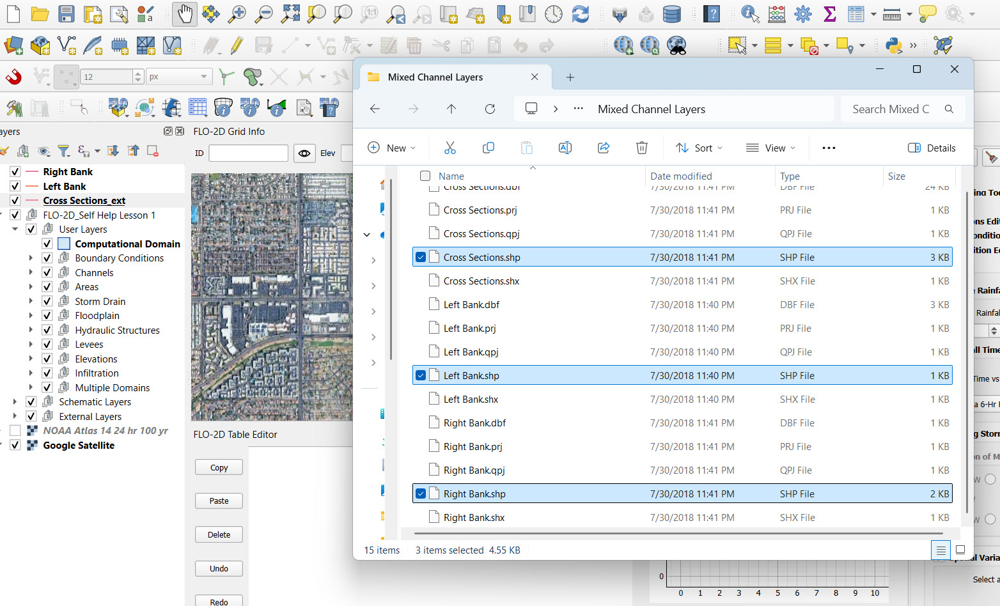

- Use these layers as **visual guides only**.
- Update colors for visibility:
  - Left Bank: Cyan
  - Right Bank: Magenta
  - Cross-Sections: Navy

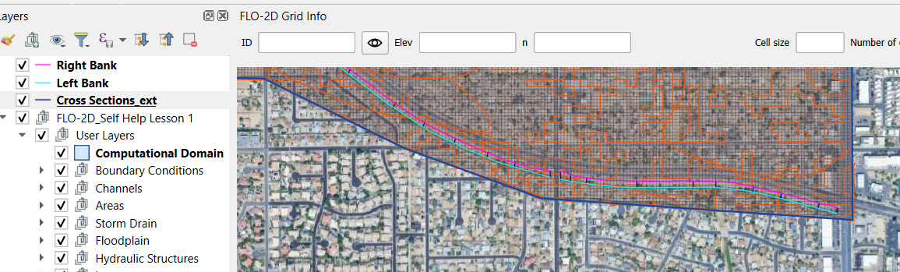

Step 2: Draw Left and Right Banks
~~~~~~~~~~~~~~~~~~~~~~~~~~~~~~~~~~~
- Activate editing on the **channel bank** layer.
- Use **"Add Line Feature"** and set to **Digitize with Segment**.
- Draw each channel segment **Upstream to Downstream**.

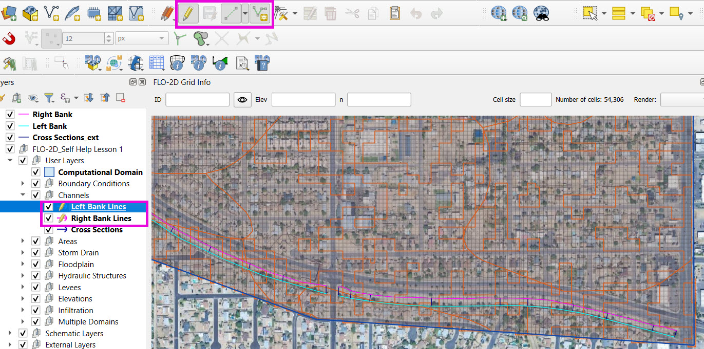

- Typical limiters: ``0.9`` (supercritical), ``0.2`` (width).

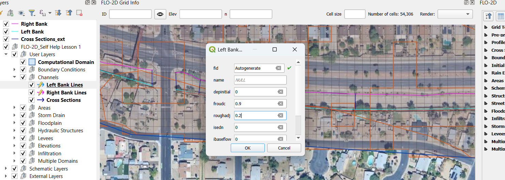

.. tip::
   Use satellite imagery and elevation contours to align your lines.
   Use consistent start and end locations across segments.

Step 3: Save and Review Bank Lines
~~~~~~~~~~~~~~~~~~~~~~~~~~~~~~~~~~~~
- Save frequently during edits.
- Check that both **Left** and **Right** banks are aligned and positioned properly.

Step 4: Add Cross-Sections
~~~~~~~~~~~~~~~~~~~~~~~~~~~~~~~~~~~
- Use the **Cross-Section Editor**.
- Digitize cross-sections from **Left to Right bank**.
- Ensure both ends and the crossing lie within the same grid element.

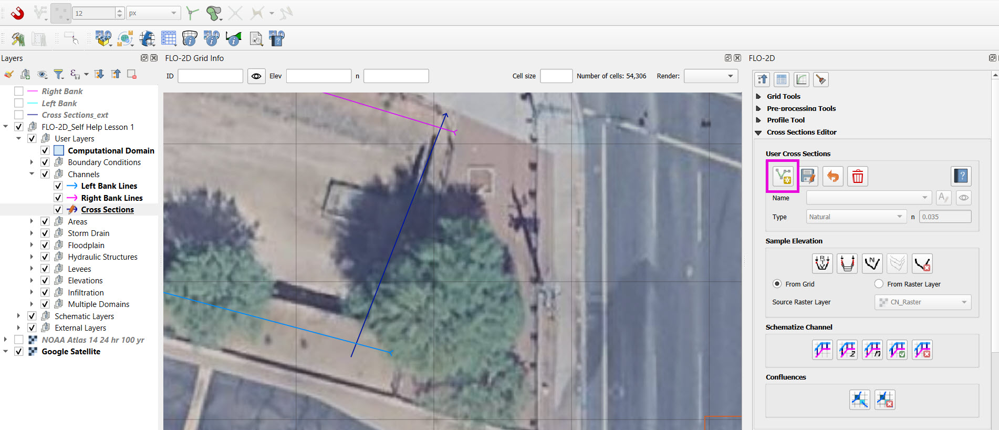

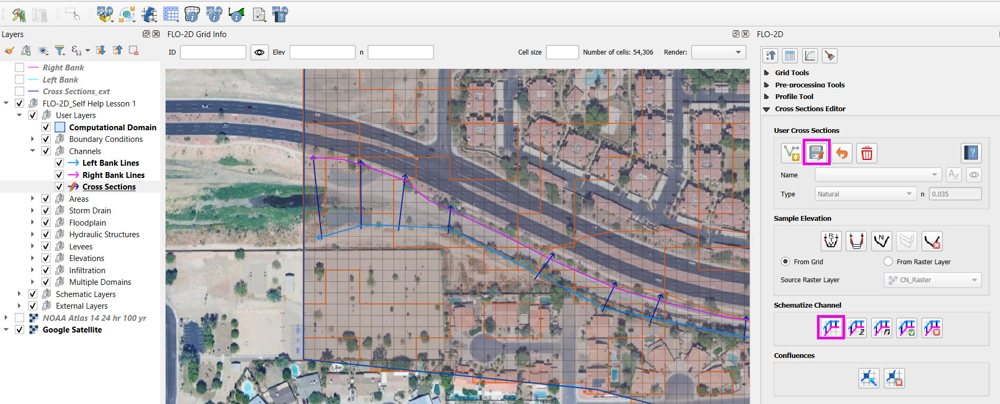

.. note::
   You only need ~6 cross-sections per channel segment in uniform channels.

Step 5: Save and Schematize
~~~~~~~~~~~~~~~~~~~~~~~~~~~~~~~~~~~
- Use the **Cross-Section Save Button** (not the QGIS save button) to trigger correct processing.
- Cross-sections will initially have placeholder elevation data.

Click **Schematize Channel** to validate geometry:
- Errors such as "bank and cross-section not in same grid cell" will be reported.

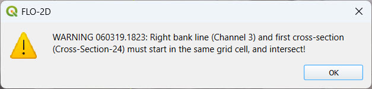

The cross-section that triggered the above error was the one circled below:

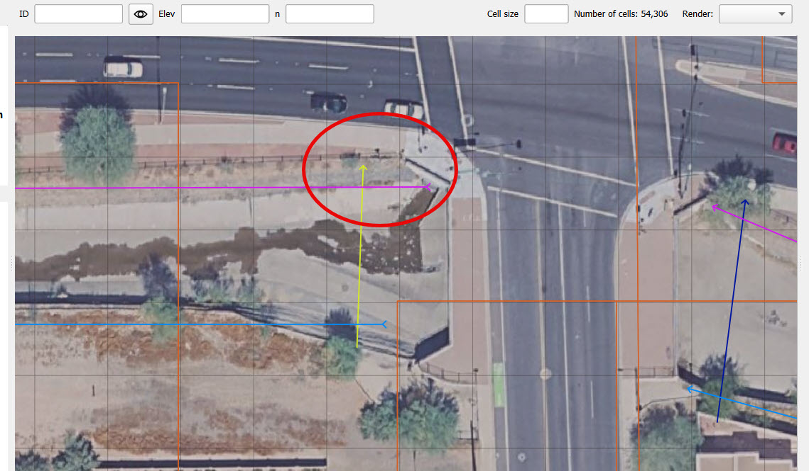

- Adjust vertex positions with the **Vertex Tool** to fix errors.

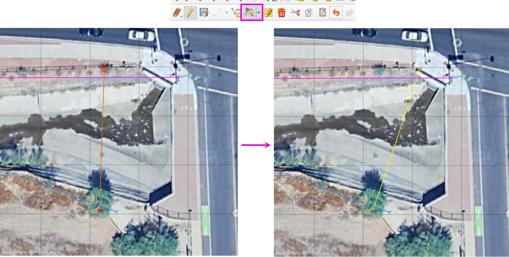

Step 6: Review Schematic Summary
~~~~~~~~~~~~~~~~~~~~~~~~~~~~~~~~~~~
- Open the **Log Messages Panel**.
- You’ll see a count of cross-sections per segment and interpolated ones added.

.. tip::
   Fix spacing and other geometry refinements in the next step.

Sample Elevation and Schematize
-------------------------------------

.. raw:: html

   <iframe width="560" height="315" src="https://www.youtube.com/embed/5zbBC4WX69Y?si=5htZE_KO2zimBE5a"
   title="YouTube video player" frameborder="0" allow="accelerometer; autoplay; clipboard-write; encrypted-media;
   gyroscope; picture-in-picture; web-share" referrerpolicy="strict-origin-when-cross-origin" allowfullscreen></iframe>

   
This lesson walks through how to sample and refine elevation data for your FLO-2D cross-sections after schematizing your channel geometry.

Step 1: Backup Your Channel
~~~~~~~~~~~~~~~~~~~~~~~~~~~~~~~~~~~~~
- Create a backup of your project before making changes.
- Example: ``backup_ready_to_sample_channel_elevation.zip``

Step 2: Rename Cross-Sections by Segment
~~~~~~~~~~~~~~~~~~~~~~~~~~~~~~~~~~~~~~~~~~~~~~~~~~~~
- Open the **Attribute Table** of the cross-section layer.
- Use the **Field Calculator** to concatenate names:
  - Format: ``G1-0``, ``G2-1``, etc.
- Assign each set to a unique segment (G1, G2, G3).

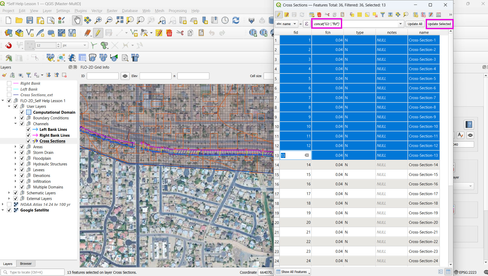

.. note::
   Use the plugin’s **Save** button to commit changes — **not** the QGIS save button.

Step 3: Sample Elevation Data
~~~~~~~~~~~~~~~~~~~~~~~~~~~~~~~~~~~~~
- Open the cross-section editor.
- Select **Sample All** to gather elevation data from the grid DEM.

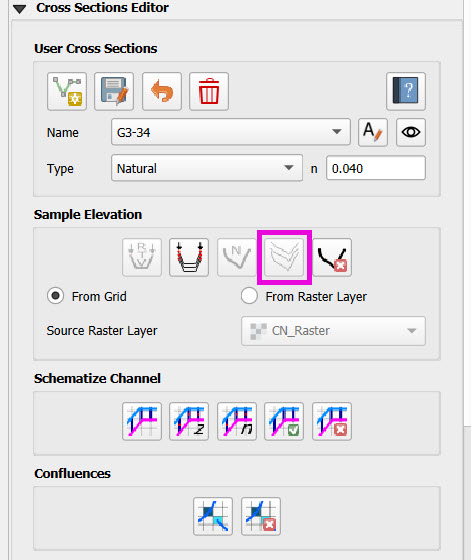

- Elevation is sampled from the **first to last vertex** of each cross-section.

Step 4: Review Cross-Section Profiles
~~~~~~~~~~~~~~~~~~~~~~~~~~~~~~~~~~~~~~~~~~~~
- Use the **scroll wheel** to cycle through each profile.
- Look for elevation anomalies or errors (jagged shapes, false dips).
- Adjust vertices using the **Vertex Tool**:
  - Drag Left/Right bank points slightly to avoid bad samples (e.g., near culverts or transitions).
  - Click **Sample Single** to resample after adjustment.

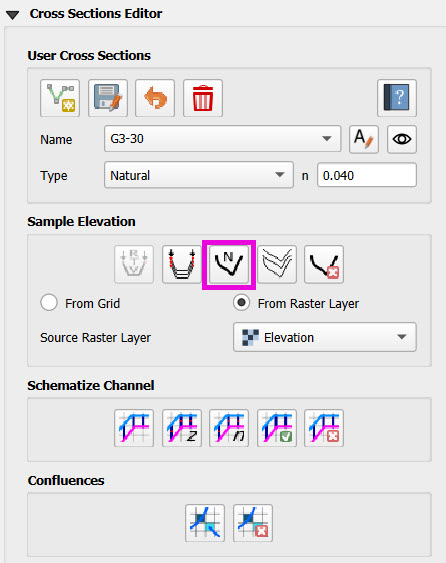

.. tip::
   Use Enter to confirm sampling instead of clicking "Yes" repeatedly.

Step 5: Repair Bad Cross-Sections
~~~~~~~~~~~~~~~~~~~~~~~~~~~~~~~~~~~~~
- If a cross-section samples poor data:
  - Move the vertex away from overlapping features (like inlets or retaining walls).
  - Resample and check again.

- Keep cross-sections **perpendicular** and well-positioned.
- Avoid overlapping nearby features or boundary limits.

Step 6: Add Missing Cross-Sections
~~~~~~~~~~~~~~~~~~~~~~~~~~~~~~~~~~~~~
- If a **transition is missing**, add a cross-section manually:
  - Use the **Cross-Section Tool**
  - Draw a new line and click **Save**
  - Rename it (e.g., “new”) before schematizing
  - Run **Schematize** to properly place it in order

.. note::
   You can delete schema data before re-schematizing if needed.

Bank Align and Interpolate
----------------------------

.. raw:: html

   <iframe width="560" height="315" src="https://www.youtube.com/embed/ManhJIY0_1A?si=pqqV0H79lHIeTHg9"
   title="YouTube video player" frameborder="0" allow="accelerometer; autoplay; clipboard-write; encrypted-media;
   gyroscope; picture-in-picture; web-share" referrerpolicy="strict-origin-when-cross-origin" allowfullscreen></iframe>

In this lesson, you’ll learn how to refine your left and right bank channel alignments and perform a test simulation to validate your model setup.

Step 1: Review Bank Alignment
~~~~~~~~~~~~~~~~~~~~~~~~~~~~~~~~~~~~~~
- Use the **Vertex Tool** to adjust left and right bank lines.
- Goals:
  - Avoid backyards and buildings
  - Ensure the channel spans **at least three grid elements**
  - Maintain **crossing lines** between left and right banks

.. tip::
   Keep banks away from grid edges and channel transitions if possible.

Step 2: Schematize and Interpolate
~~~~~~~~~~~~~~~~~~~~~~~~~~~~~~~~~~~~~~
- Click **Schematize Channel** to commit updated geometry.
- Then use the **Interpolate Channel** tool to regenerate elevation stations between cross-sections.

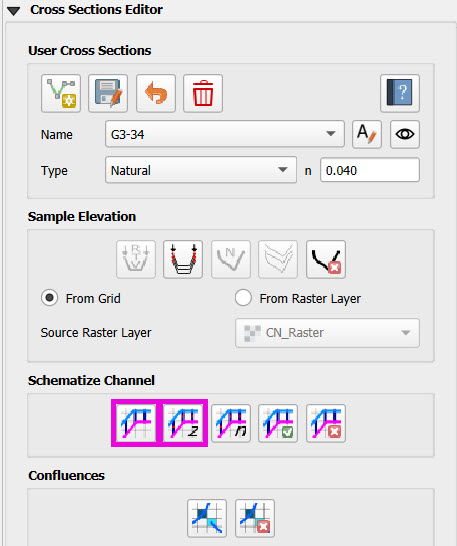

.. note::
   If a cross-section has fewer than 6 stations, an error will appear.

Step 3: Use the Geometry Checker
~~~~~~~~~~~~~~~~~~~~~~~~~~~~~~~~~~~~~~
- After interpolation, click **Check Channel Geometry**:
  - It will verify minimum spacing and floodplain surface area.
  - Click error messages to locate problematic cross-sections or elements.

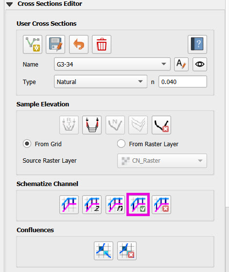

- Adjust vertex positions as needed to resolve errors.
- Re-schematize and interpolate again.

Step 4: Final Save and Verification
~~~~~~~~~~~~~~~~~~~~~~~~~~~~~~~~~~~~~~
- Save both the **bank lines** and **cross-section layers**.
- Verify that your cross-sections still contain elevation data.

Step 5: Export and Run Test Simulation
~~~~~~~~~~~~~~~~~~~~~~~~~~~~~~~~~~~~~~~~~~
- Export DAT files using **Export DAT Files** tool.
- Overwrite the files in your test folder if needed.
- Launch **FLO-2D Pro** to run the simulation.

.. tip::
   You’re only validating **channel geometry**, not full model results.
   A successful run here indicates channel alignment and schematization passed.

Wrap-up
-------
With a successful test run, your channels are now aligned, interpolated, and validated. You’re ready to move on to **boundary conditions** and **culverts** in the next lesson.

Add a Boundary Control
----------------------------

.. raw:: html

   <iframe width="560" height="315" src="https://www.youtube.com/embed/T-GyXsFokIA?si=WUSj7abEMNxjxrkm"
   title="YouTube video player" frameborder="0" allow="accelerometer; autoplay; clipboard-write; encrypted-media;
   gyroscope; picture-in-picture; web-share" referrerpolicy="strict-origin-when-cross-origin" allowfullscreen></iframe>

In this lesson, you’ll assign **inflow and outflow boundary conditions** to your FLO-2D channel model using both steady and time-series hydrographs.

Step 1: Turn Off Unused Layers
~~~~~~~~~~~~~~~~~~~~~~~~~~~~~~~~~~~~~~
- Turn off user layers to reduce visual clutter.
- Focus on your **schematized cross-sections** and channel grid.

Step 2: Create Upstream Inflow Point
~~~~~~~~~~~~~~~~~~~~~~~~~~~~~~~~~~~~~~
- Open the **Boundary Editor** and click **Create**.
- Select the upstream grid element at the head of your channel.
- Click **OK**, then click the new boundary marker again to save.

Step 3: Add Inflow Hydrograph
~~~~~~~~~~~~~~~~~~~~~~~~~~~~~~~~~~~~~~
- Set the boundary type to **Channel**.
- Choose **"Add Inflow Time Series"**.

You have two options:

- **Steady Flow (Stepped) Hydrograph**  
  Create a hydrograph with incremental CFS values (e.g., 100 → 250 → 350 → 550).  
  Sample time steps at 0.5-hr intervals until 10 hours.

- **Imported Hydrograph**  
  Copy a 6-hour inflow from your project folder (e.g., ``lesson2``).  
  Paste values directly into the hydrograph table.

.. tip::
   Swap between hydrographs quickly by selecting a different record and **schematizing**.

Step 4: Create Downstream Outflow Point
~~~~~~~~~~~~~~~~~~~~~~~~~~~~~~~~~~~~~~~~~~~~
- Click the **Boundary Editor** again and select the **last grid element**.
- Click to confirm, then click the marker again to save.

- Name the boundary (e.g., ``Greenway_out``).
- Set type to **Floodplain and Channel Outflow**.
- No hydrograph is required.

Step 5: Schematize and Export
~~~~~~~~~~~~~~~~~~~~~~~~~~~~~~~~~~~~~~
- Click **Schematize** to generate boundary files.
- Use **Export DAT Files** to save your project.

Files updated:
- ``INFLOW.DAT``: now includes the new stepped hydrograph.
- ``CHAN.DAT``, ``CHANBANK.DAT``, ``CHANCOND.DAT``, ``CHANROUGH.DAT``: standard channel outputs.

Step 6: Run a Simulation
~~~~~~~~~~~~~~~~~~~~~~~~~~~~~~~~~~~~~~
- Click **Run FLO-2D** to test the boundary setup.
- If the simulation starts successfully, your boundary conditions are valid.

.. note::
   Water enters the channel from the upstream **cross-section**, not the grid element.  
   If the flow overtops the channel, it will exit via floodplain outflow.

Wrap-up
-------
You’ve now defined channel inflow and outflow conditions. You’re ready to move on to adding hydraulic structures in the next lesson.

Add Culverts
-------------------

.. raw:: html

   <iframe width="560" height="315" src="https://www.youtube.com/embed/Qioj94sbAgA?si=5xyNs9hd0ld66E9x"
   title="YouTube video player" frameborder="0" allow="accelerometer; autoplay; clipboard-write; encrypted-media;
   gyroscope; picture-in-picture; web-share" referrerpolicy="strict-origin-when-cross-origin" allowfullscreen></iframe>

   This lesson covers how to define and integrate culvert structures (CTs) into your FLO-2D channel using rating tables or the generalized culvert equation.

Step 1: Identify Culvert Locations
~~~~~~~~~~~~~~~~~~~~~~~~~~~~~~~~~~~~~~~~~~
- Stop your current simulation if you observe **unexpected overtopping** in channels.
- Switch to the **Structure Editor** and click **Add Structure**.
- Draw each structure from the **left bank** of the upstream channel to the **left bank** of the downstream channel.

.. tip::
   Use left-click, left-click, and right-click to define the start and end.

Step 2: Define Structure Properties
~~~~~~~~~~~~~~~~~~~~~~~~~~~~~~~~~~~~~~~~~~
- Click **Save** after drawing all structures.
- Name each structure (e.g., ``Greenway1``, ``Greenway2``). Avoid spaces.
- Set:
  - Type: **Channel to Channel**
  - Method: **Rating Table**

Step 3: Import Rating Tables
~~~~~~~~~~~~~~~~~~~~~~~~~~~~~~~~~~~~~~~~~~
- Use the **Import Rating Table** tool.
- Ensure filenames match the structure names exactly (e.g., ``Greenway1.txt``).
- Loaded data should now populate the structure’s table.

.. note::
   You can alternatively use the **Generalized CT Equation** and define geometry and length manually.

Step 4: Tailwater Controls
~~~~~~~~~~~~~~~~~~~~~~~~~~~~~~~~~~~~~~~~~~
- Options:
  1. **No Tailwater Control**: Only headwater affects flow (e.g., flap gates).
  2. **Submergence Applied**: Tailwater reduces discharge, but no reverse flow.
  3. **Submergence with Reverse Flow**: Allows flow to reverse under high tailwater.

- Set to **No Tailwater Control** for this basic model (warnings may occur).

Step 5: Optional Parameters
~~~~~~~~~~~~~~~~~~~~~~~~~~~~~~~~~~~~~~~~~~
- Head Reference Elevation: Only used if a weir controls flow onset.
- Length and Diameter: Required only if using **Generalized Equation**, not rating tables.

Step 6: Schematize and Save
~~~~~~~~~~~~~~~~~~~~~~~~~~~~~~~~~~~~~~~~~~
- Click **Schematize** to convert user-drawn structures to **grid-aligned schema features**.
- Schema lines (blue) are snapped to grid centers.
- Enable **Structure Switch** in **Control Parameters**, then **Save**.

Step 7: Export and Review Files
~~~~~~~~~~~~~~~~~~~~~~~~~~~~~~~~~~~~~~~~~~
- Export DAT files.
- Files updated:
  - ``CONT.DAT``: Structure switch activated.
  - ``HYSTRUCT.DAT``: Lists all culvert definitions and rating tables.

.. note::
   - `S` lines = structure metadata
   - `T` lines = rating table values (depth, flow, area)
   - Use line codes 0 = floodplain-to-floodplain, 1 = channel-to-channel, etc.

Step 8: Run a Test Simulation
~~~~~~~~~~~~~~~~~~~~~~~~~~~~~~~~~~~~~~~~~~
- Launch **FLO-2D Pro** to verify structures and inflow integration.
- Rainfall and hydrograph will appear as different colors in the simulation output.
- Use the simulation to evaluate discharge, transitions, and overtopping behavior.

Wrap-up
-------
Your culvert structures are now defined and linked into the grid. Their behavior will control how inflow is conveyed between channel segments. You’re now ready to analyze output and prepare for post-processing.

Channel Summary and Results
-----------------------------
.. raw:: html

   <iframe width="560" height="315" src="https://www.youtube.com/embed/JQNBCUqOKbY?si=_HqHJOdV7lfZCtWP"
   title="YouTube video player" frameborder="0" allow="accelerometer; autoplay; clipboard-write; encrypted-media;
   gyroscope; picture-in-picture; web-share" referrerpolicy="strict-origin-when-cross-origin" allowfullscreen></iframe>

   This lesson shows how to view simulation outputs, map flood depths and elevations, and evaluate hydraulic structure performance in FLO-2D.

Step 1: Prepare the Results Group
~~~~~~~~~~~~~~~~~~~~~~~~~~~~~~~~~~~~~~~~
- Create a new group in QGIS called **Results**.
- Save your project before loading large output files.
- You can load results into the same project or in a new one for post-processing.

Step 2: Use the Rasterizer Tool
~~~~~~~~~~~~~~~~~~~~~~~~~~~~~~~~~~~~~~~~
- Open the **Rasterizer Tool** from the FLO-2D toolbar.
- Select output files (e.g., ``DEPTH.OUT``, ``FINDEPTH.OUT``, ``MAXWSE.OUT``).

Examples:
- `DEPTH.OUT` → **max_depth**
- `FINDEPTH.OUT` → **final_depth**
- `MAXWSE.OUT` → **max_wselv**

.. note::
   Output files must contain:
   - Grid element number
   - X and Y coordinates
   - The data value (e.g., depth or elevation)

Step 3: Visualize Raster Layers
~~~~~~~~~~~~~~~~~~~~~~~~~~~~~~~~~~~~~~~~
- Turn off the grid and open the **Symbology** of the raster layer.
- Apply a minimum display threshold (e.g., 0.1 ft) to improve visibility.
- Identify areas of pooling, drainage issues, or channel performance.

Step 4: Difference Mapping
~~~~~~~~~~~~~~~~~~~~~~~~~~~~~~~~~~~~~~~~
- Compare raster layers:
  - Input: **max_depth** minus **final_depth**
- Output layer shows:
  - **Red** = Max > Final (not fully drained)
  - **Blue** = Max < Final (anomaly)

.. warning::
   Be sure your simulation ran long enough for proper drainage. Short runs may skew results.

Step 5: Profile Tool Analysis
~~~~~~~~~~~~~~~~~~~~~~~~~~~~~~~~~~~~~~~~
- Use the **Profile Tool** to compare elevation and max water surface elevation.
- Set base elevation (black) and max WSE (blue).
- Draw profiles across basins and channels to check for proper drainage and overtopping.

Step 6: Hydraulic Structure Results
~~~~~~~~~~~~~~~~~~~~~~~~~~~~~~~~~~~~~~~~
- Open the **Result Viewer**.
- Turn on FLO-2D results tables.
- Click on hydraulic structures to view:
  - Discharge
  - Depth
  - Velocity
  - Flow area
  - Shear stress
  - Energy slope
  - And more

.. tip::
   Use this to validate rating tables and confirm structure performance against your stepped hydrograph.

Step 7: Interpretation and QA/QC
~~~~~~~~~~~~~~~~~~~~~~~~~~~~~~~~~~~~~~~~
- Confirm the system drained correctly.
- Check for:
  - Trapped water
  - Overtopping
  - Unrealistic velocity or discharge spikes
- Review rating table discharge curves and cross-section data for stability.

Wrap-up
-------
You’ve now visualized your model results and validated flow through the system. Use these tools for QA/QC, communication, and export of final maps for reports or stakeholders.
