Channels
=========

This is an advanced channel lesson.  It shows how to create a channel by digitizing left bank, right bank and
cross section data.  It also shows how to add a boundary control and culverts.

.. Note:: It will be easier to view these videos on YouTube.

   Set the video playback speed to 2x to complete the lessons faster.

   The videos are **more detailed** whereas the text gives the minimum steps needed
   to complete the project.

Backup and Reload
--------------------

.. raw:: html

   <iframe width="560" height="315" src="https://www.youtube.com/embed/XrEn2obremk?si=NEYQSLH6de5jA-rT"
   title="YouTube video player" frameborder="0" allow="accelerometer; autoplay; clipboard-write; encrypted-media;
   gyroscope; picture-in-picture; web-share" referrerpolicy="strict-origin-when-cross-origin" allowfullscreen></iframe>
   
   
This lesson introduces how to begin working with channels in FLO-2D.
The first step is creating a project backup and preparing for channel data input.

Build Channel and Schematize
------------------------------

.. raw:: html

   <iframe width="560" height="315" src="https://www.youtube.com/embed/x1QEP2ggYT0?si=j14aMbvgx_k7jmTq"
   title="YouTube video player" frameborder="0" allow="accelerometer; autoplay; clipboard-write; encrypted-media;
   gyroscope; picture-in-picture; web-share" referrerpolicy="strict-origin-when-cross-origin" allowfullscreen></iframe>

This lesson demonstrates how to create 3 channel segments using QGIS and the FLO-2D Plugin.
The process involves digitizing channel banks and cross sections, followed by schematization and geometry validation.

Step 1: Load Template Layers
~~~~~~~~~~~~~~~~~~~~~~~~~~~~~~~~~~~
- Import template layers (LB Template, RB Template, CS Template).

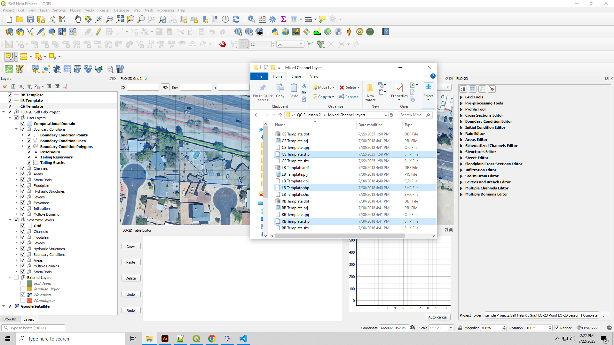

- Use these layers as **visual guides only**.
- Update colors for visibility:

  - LB Template: Lime Green 0.5 width
  - RB Template: Hot Pink 0.5 width
  - CS Template: Purple 0.5 width

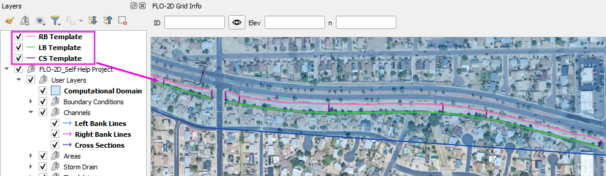

Step 2: Create Left Banks
~~~~~~~~~~~~~~~~~~~~~~~~~~~~~~~~~~~~~~~
- Activate editing on the **left bank lines** layer.
- The left bank is left side of the channel when facing downstream.
- Use **"Add Line Feature"** and set to **Digitize with Segment**.
- Draw each left bank segment **Upstream to Downstream**.
- Use the **LB Template** layer as a guide for alignment.

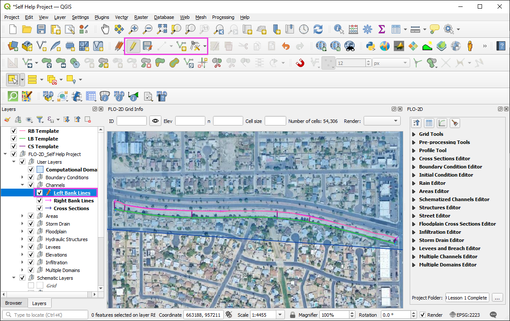

- The following animation shows how to digitize the first left bank segment:

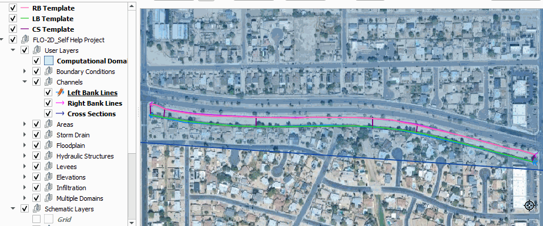

Fill the attributes as shown below or leave them blank and click OK.
If you leave them blank, you can add them later in the **Attribute Table**.

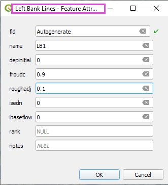

.. tip::
   Use satellite imagery and elevation hillshade to align the banks.
   Use consistent start and end locations across segments.

Step 3: Create Right Banks
~~~~~~~~~~~~~~~~~~~~~~~~~~~~~~~~~~~~~~~
- Activate editing on the **Right Bank Lines** layer.
- The right bank is right side of the channel when facing downstream.
- Use **"Add Line Feature"** and set to **Digitize with Segment**.
- Draw each right bank segment **Upstream to Downstream**.
- Use the **RB Template** as a guide for alignment.

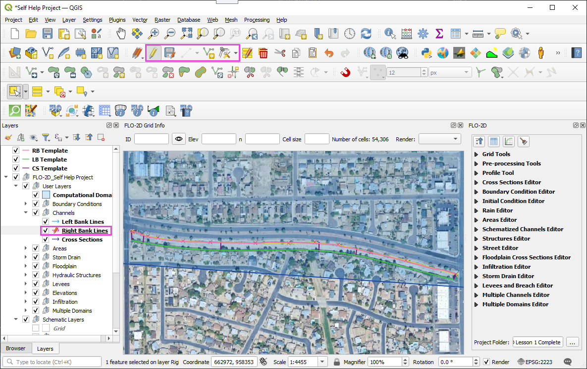

- The following animation shows how to digitize the first right bank segment:

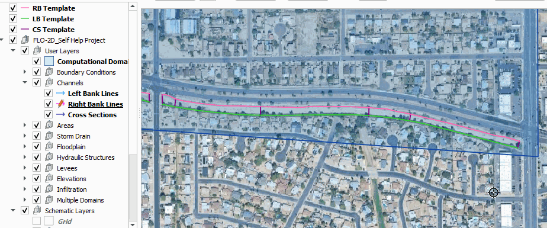

.. tip::
   Use satellite imagery and elevation hillshade to align the banks.
   Use consistent start and end locations across segments.
   
   Keep the right banks close to the fence line but away from the street.
   
Step 4: Save Bank Lines
~~~~~~~~~~~~~~~~~~~~~~~~~~~~~~~~~~~~
- Save the bank line layers and stop editing.

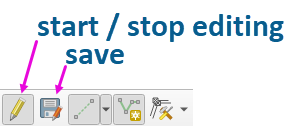

Step 5: Cross Section Rules
~~~~~~~~~~~~~~~~~~~~~~~~~~~~~~~~~~~
- The first cross section in each channel segment must have its end points located within 
  the same grid elements as the corresponding left and right bank lines. The following image
  small circles around the end points and they are located within the same grid elements as the left and right bank lines.

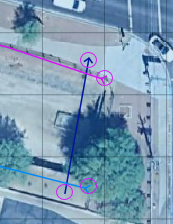

- The cross section must cross the left and right bank lines.

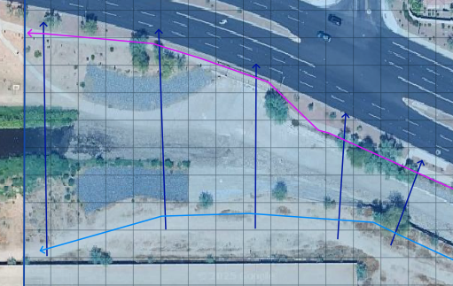

- Digitize the cross sections from upstream to downstream.

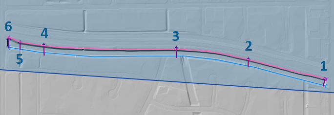

- Place the cross section where the DEM elevation is representative of the channel.
- Try to represent the channel transition up to and away from culverts or other structures.

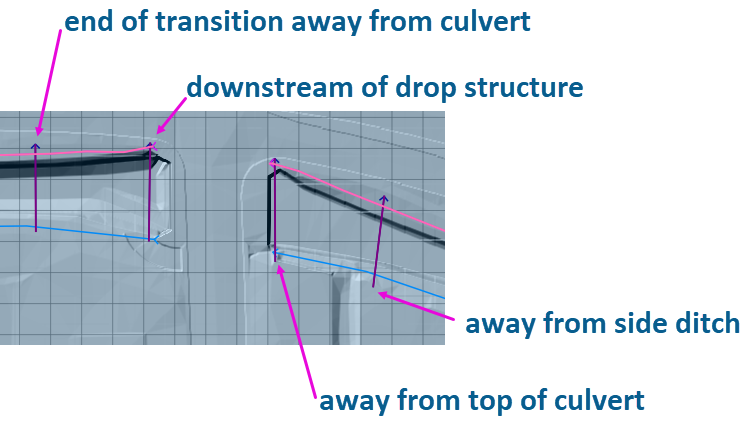

- Do not place two cross sections in a single grid element.

Step 6: Digitize Cross Sections
~~~~~~~~~~~~~~~~~~~~~~~~~~~~~~~~~~~
- Use the **CS Template** as a guide for alignment.
- Use the **Cross Section Editor**.
  
 - Click **Add Line Feature** button.
 - Start digitizing cross sections.
 - When finished, click the **Save** button.
 - Use the enter key or click OK to close the dialog.  It is faster to use the enter key.  It is OK to modify the **n value** and **name** fields.
   but not necessary at this point.
 - Use the arrow keys to quickly pan to the next cross section.
 - **Note that the gif only shows the first 3 cross sections being digitized.**

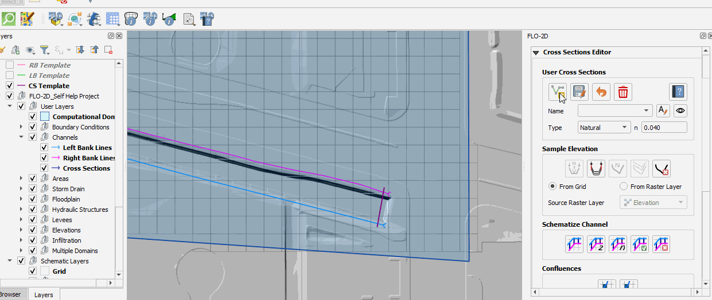

- Natural (“N”) type cross sections are given temporary geometry that will be replaced by sampling elevation.

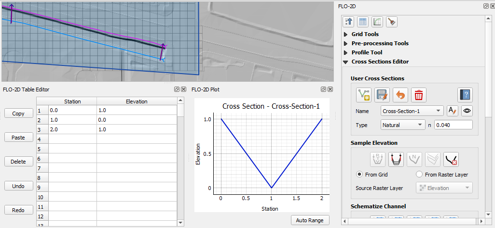

Step 7: Save and Schematize
~~~~~~~~~~~~~~~~~~~~~~~~~~~~~~~~~~~
- Use the **Cross Section Save Button** (not the QGIS save button) to trigger correct processing.
- Cross sections will initially have placeholder elevation data.
- Click **Schematize Channel Button** to create the schema layers and validate the channel placement.

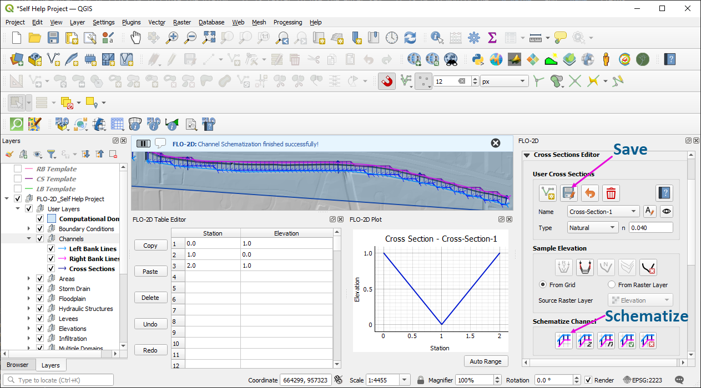

- Errors such as "bank and cross section not in same grid cell" will be reported.

.. note:: This error was intentionally created to show the error message.  Watch the video to see how to fix it.

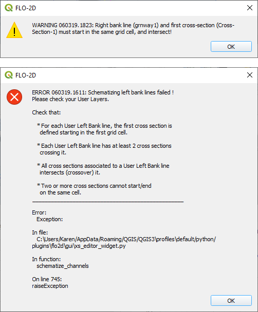

- If errors occur:

  - Adjust the cross section position to ensure it crosses both banks.
  - Ensure the first cross section endpoints are within the same grid elements as the bank lines.
  - Use the **Vertex Editor** to modify cross section alignment.

- After resolving errors, click **Schematize Channel** again to update the schema layers.
- Schematized cross sections are grouped by channel segments.

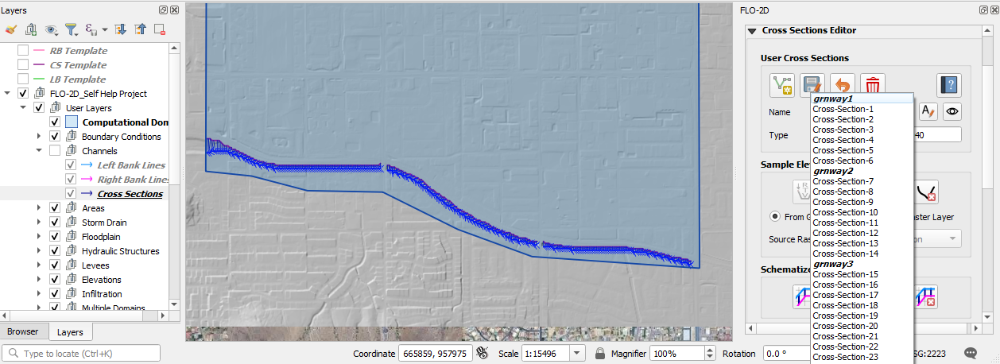

Sample Elevation and Schematize
-------------------------------------

.. raw:: html

   <iframe width="560" height="315" src="https://www.youtube.com/embed/5zbBC4WX69Y?si=5htZE_KO2zimBE5a"
   title="YouTube video player" frameborder="0" allow="accelerometer; autoplay; clipboard-write; encrypted-media;
   gyroscope; picture-in-picture; web-share" referrerpolicy="strict-origin-when-cross-origin" allowfullscreen></iframe>

   
This lesson walks through how to sample and refine elevation data for FLO-2D cross sections after schematizing channel geometry.

Step 1: Sample Elevation Data
~~~~~~~~~~~~~~~~~~~~~~~~~~~~~~~~~~~~~
- Open the cross section editor.
- Select **Sample All** to gather elevation data from the grid DEM.

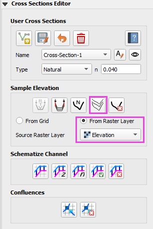

- Elevation is sampled from the point where the cross section crosses the left bank line to the right bank line of each cross section.

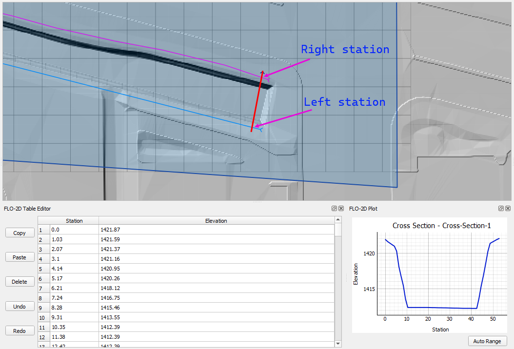

Step 2: Review and Repair Bad Cross Section Profiles
~~~~~~~~~~~~~~~~~~~~~~~~~~~~~~~~~~~~~~~~~~~~~~~~~~~~~
- Use the **scroll wheel** to cycle through each profile.
- Look for elevation anomalies or errors (jagged shapes, incorrect bank elevation, no banks).

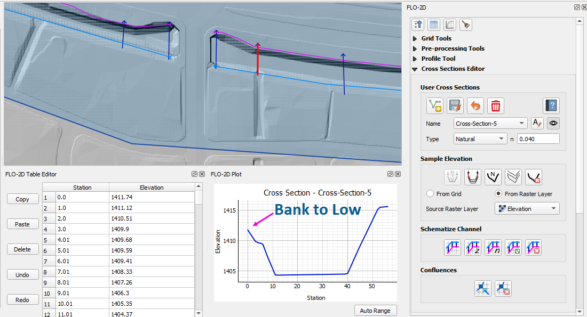

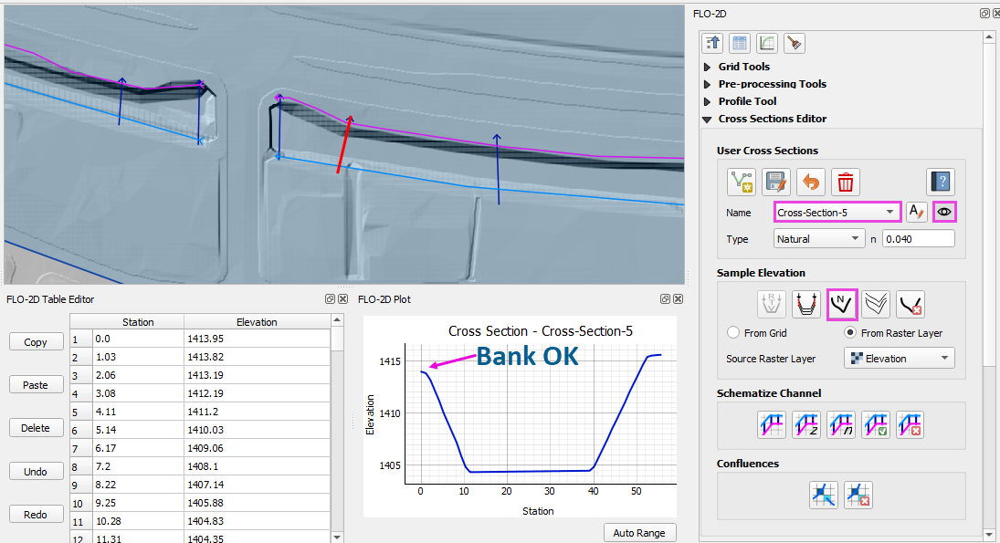

- For bad cross section profiles, try:

  - Adjust the vertices of the cross section, left bank, or right bank layers using the **Vertex Tool**
  - Drag vertex points slightly to avoid bad samples (e.g., near culverts or transitions).
  - Click **Sample Single** to resample after adjustment.

.. note:: For a more detailed example, watch the video.

Bank Align and Interpolate
----------------------------

.. raw:: html

   <iframe width="560" height="315" src="https://www.youtube.com/embed/ManhJIY0_1A?si=pqqV0H79lHIeTHg9"
   title="YouTube video player" frameborder="0" allow="accelerometer; autoplay; clipboard-write; encrypted-media;
   gyroscope; picture-in-picture; web-share" referrerpolicy="strict-origin-when-cross-origin" allowfullscreen></iframe>

Learn how to refine the left and right bank channel alignments and perform a test simulation to validate your model setup.

.. note:: These steps might not follow the video exactly.  These steps are the minimum needed to complete the task.

Step 1: Schematize and Interpolate
~~~~~~~~~~~~~~~~~~~~~~~~~~~~~~~~~~~~~~
- Click **Schematize Channel** to commit updated geometry.
- Click the **Interpolate Channel** tool to interpolate schema cross sections which are between the user cross sections.
- If an interpolation error loads, check the project path using the FLO-2D Settings dialog.

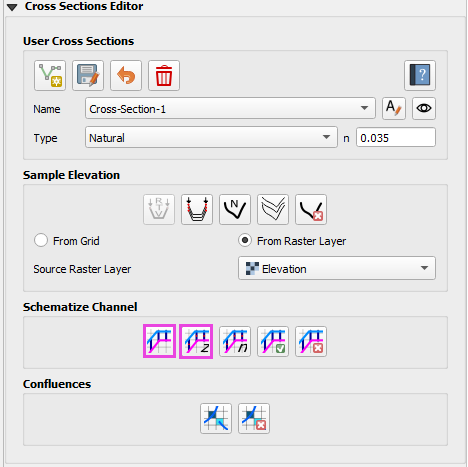

Step 2: Use the Geometry Checker
~~~~~~~~~~~~~~~~~~~~~~~~~~~~~~~~~~~~~~
- After interpolation, click **Check Channel Geometry**:
- It will verify minimum spacing and floodplain surface area.
- Click error messages to locate problematic cross sections or elements.

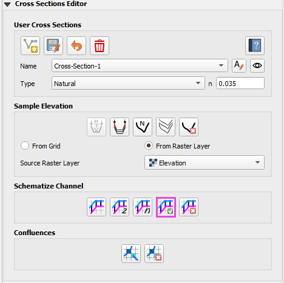

- Adjust vertex positions as needed to resolve errors.
- Re-schematize and interpolate again.

.. note:: See the video for a detailed example.

Step 3: Review Bank Alignment
~~~~~~~~~~~~~~~~~~~~~~~~~~~~~~~~~~~~~~
- Use the **Vertex Tool** to adjust left and right bank lines.

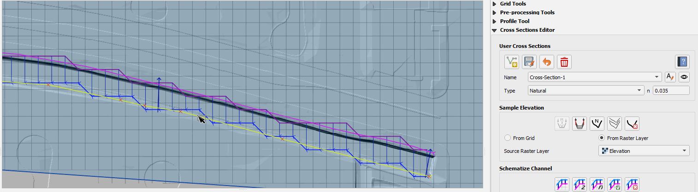

Step 4: Final Save and Verification
~~~~~~~~~~~~~~~~~~~~~~~~~~~~~~~~~~~~~~
- Save both the **bank lines** and **cross section layers**.
- Verify that your cross sections still have good elevation data.
- Perform a final schematize, interpolate, and geometry check.

Add a Boundary Control
----------------------------

.. raw:: html

   <iframe width="560" height="315" src="https://www.youtube.com/embed/T-GyXsFokIA?si=WUSj7abEMNxjxrkm"
   title="YouTube video player" frameborder="0" allow="accelerometer; autoplay; clipboard-write; encrypted-media;
   gyroscope; picture-in-picture; web-share" referrerpolicy="strict-origin-when-cross-origin" allowfullscreen></iframe>

In this lesson, assign **inflow and outflow boundary conditions** to the FLO-2D channel model
using both steady and time-series hydrographs.

Step 1: Create Upstream Inflow Point
~~~~~~~~~~~~~~~~~~~~~~~~~~~~~~~~~~~~~~
- Open the **Boundary Editor** and click **Add Point**.
- Select the upstream grid element at the head of your channel.
- Click **OK**, then click the new boundary marker again to save.

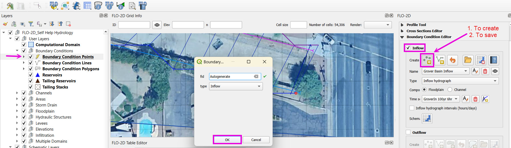

Step 2: Add Inflow Hydrograph
~~~~~~~~~~~~~~~~~~~~~~~~~~~~~~~~~~~~~~
- Set the boundary type to **Channel**.
- Choose **"Add Inflow Time Series"**.

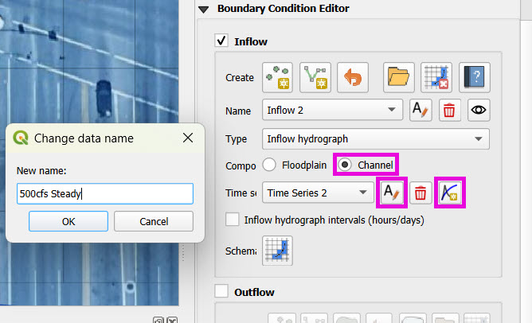

There are several options for hydrographs but here are two examples:

.. dropdown:: Steady Flow or Stepped Hydrograph

   - Create a hydrograph with incremental CFS values (e.g., 100 → 250 → 350 → 550).  
   - Sample time steps at 0.5-hr intervals until 10 hours.

   .. image:: ../img/shg/4/shg_chan019.jpg

.. dropdown:: Imported Hydrograph

   - Copy a 6-hour inflow from your project folder (e.g., ``lesson2``).  
   - Paste values directly into the hydrograph table.

   .. image:: ../img/shg/4/shg_chan020.jpg

   - Rename "Time Series 3" to "GrnwayIn 100yr 6hr"

- Finish the upstream inflow by clicking the schematize button.

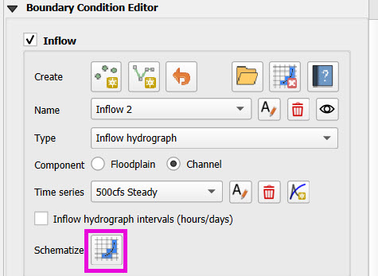

.. tip::
   Swap between hydrographs quickly by selecting a different record and **schematizing**.

Step 3: Create Downstream Outflow Point
~~~~~~~~~~~~~~~~~~~~~~~~~~~~~~~~~~~~~~~~~~~~
- Click the **Boundary Editor** point button on the outflow widget.
- Click the left bank element of the last channel element. 
- This will be the normal outflow condition for the cross section.
- Click to confirm, then click the marker again to save.

- Name the boundary (e.g., ``GrnwayOut``).

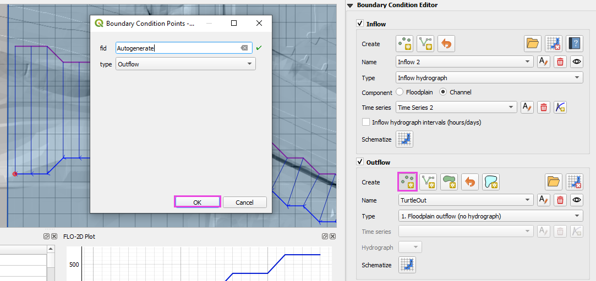

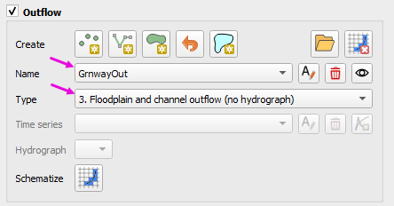

- Set type to **Floodplain and Channel Outflow**.
- No hydrograph is required.

- Click **Schematize** to generate boundary files.

 .. image:: ../img/shg/4/shg_chan024.jpg

Add Culverts
-------------------

.. raw:: html

   <iframe width="560" height="315" src="https://www.youtube.com/embed/Qioj94sbAgA?si=5xyNs9hd0ld66E9x"
   title="YouTube video player" frameborder="0" allow="accelerometer; autoplay; clipboard-write; encrypted-media;
   gyroscope; picture-in-picture; web-share" referrerpolicy="strict-origin-when-cross-origin" allowfullscreen></iframe>

This lesson covers how to define and integrate culvert structures into a FLO-2D channel using
rating tables.

Step 1: Identify Culvert Locations
~~~~~~~~~~~~~~~~~~~~~~~~~~~~~~~~~~~~~~~~~~
- Switch to the **Structure Editor** and click **Add Structure**.

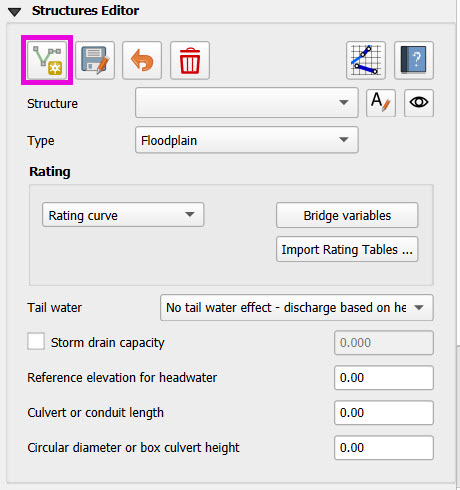

- Draw each structure from the **left bank** of the upstream channel to the **left bank** of the downstream channel.

.. image:: ../img/shg/4/shg_chan059.gif

Step 2: Define Structure Properties
~~~~~~~~~~~~~~~~~~~~~~~~~~~~~~~~~~~~~~~~~~
- Click **Save** after drawing all structures.
- Name each structure (``Grnway1``, ``Grnway2``). 
- Do not use spaces in names.
- Set:

  - Type: **Channel to Channel**
  - Rating: **Rating Table**

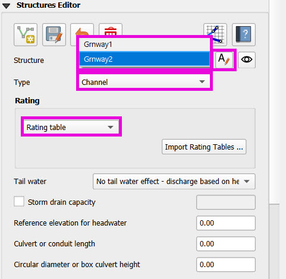

Step 3: Import Rating Tables
~~~~~~~~~~~~~~~~~~~~~~~~~~~~~~~~~~~~~~~~~~
- Use the **Import Rating Table** tool.

.. image:: ../img/shg/4/shg_chan029.jpg

- Ensure filenames match the structure names exactly (e.g., ``Grnway1.txt``).

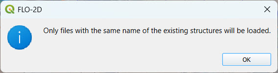

- Loaded data should now populate the structure’s table.

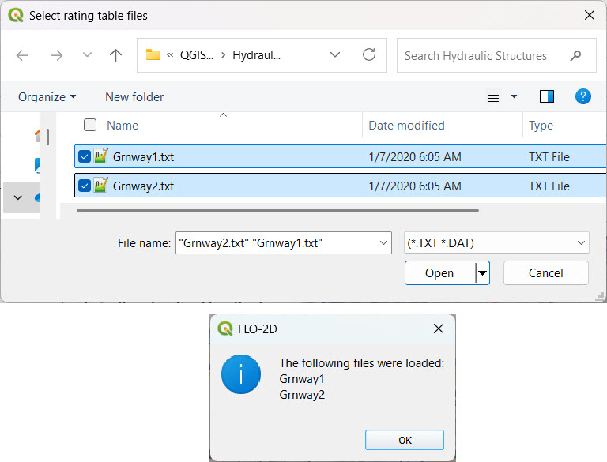

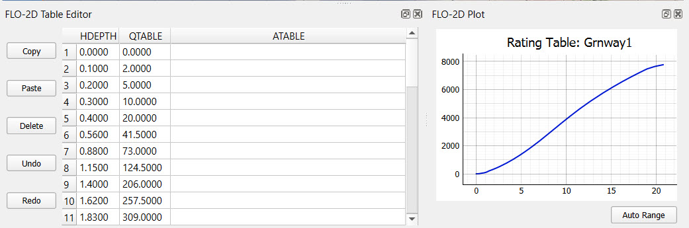

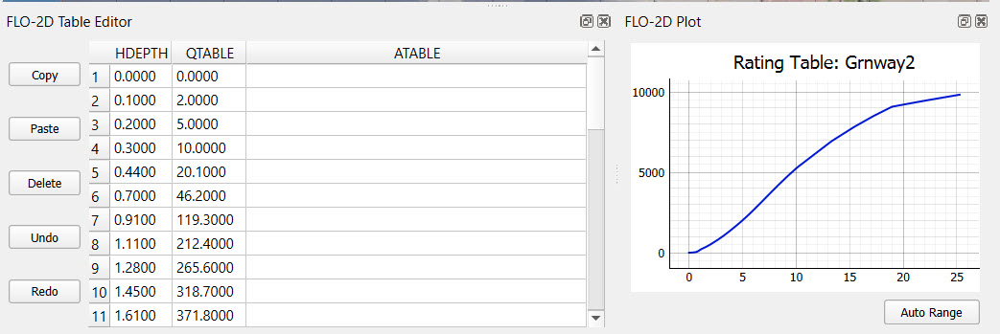

Step 4: Tailwater Controls
~~~~~~~~~~~~~~~~~~~~~~~~~~~~~~~~~~~~~~~~~~
- Options:

  1. **No Tailwater Control**: Only headwater affects flow (e.g., flap gates).
  2. **Submergence Applied**: Tailwater reduces discharge, but no reverse flow.
  3. **Submergence with Reverse Flow**: Allows flow to reverse under high tailwater.

- Set to **No Tailwater Control** for this basic model (warnings may occur).

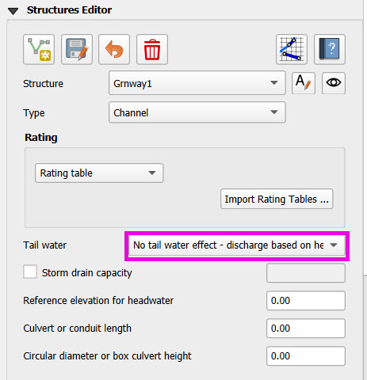

Step 5: Optional Parameters
~~~~~~~~~~~~~~~~~~~~~~~~~~~~~~~~~~~~~~~~~~
- Head Reference Elevation: Only used if a weir controls flow.
- Length and Diameter: Required only if using `Generalized Equation` or `Long Culverts` in excess of 500 ft,

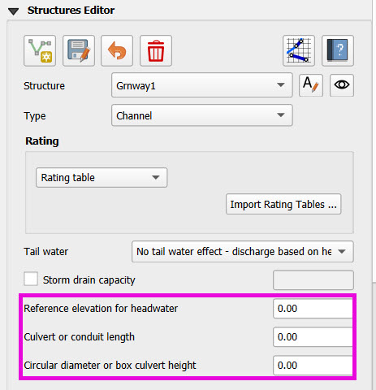

Step 6: Schematize and Save
~~~~~~~~~~~~~~~~~~~~~~~~~~~~~~~~~~~~~~~~~~
- Click **Schematize** to convert user-drawn structures to **FLO-2D grid aligned features**.

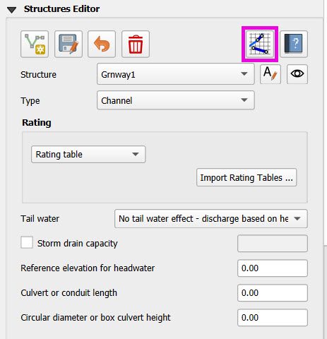

- Schema lines (blue) are snapped to grid centers.

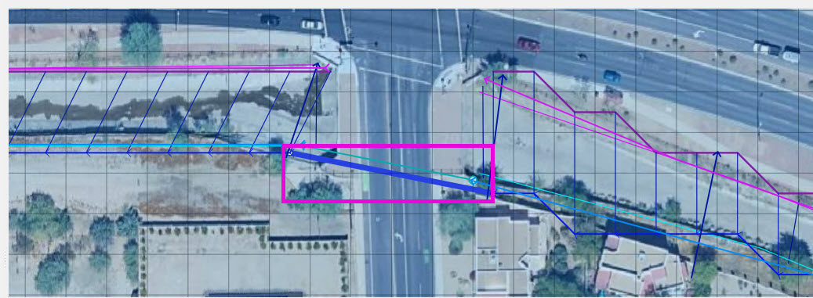

- Enable **Structure Switch** in **Control Parameters**, then **Save**.
- The switch may be automatically enabled when the Schematize button is clicked.

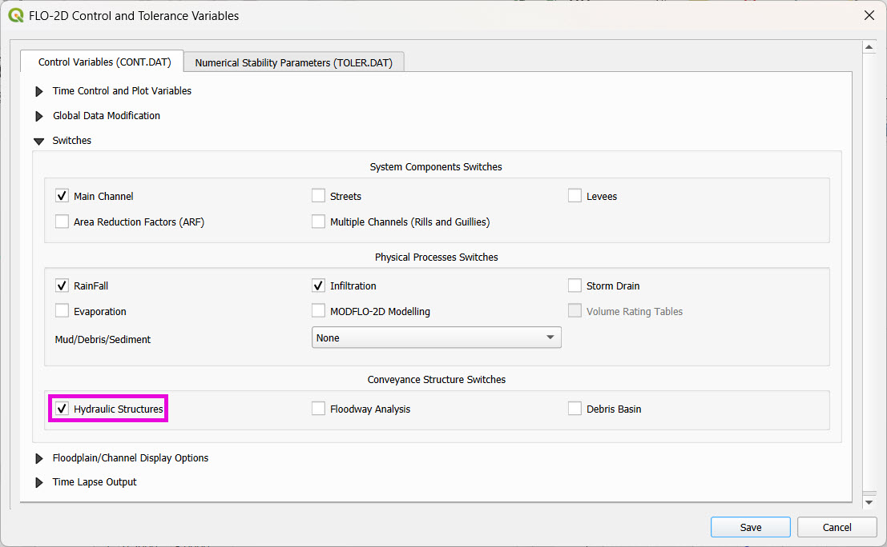

Step 7: Run a Test Simulation
~~~~~~~~~~~~~~~~~~~~~~~~~~~~~~~~~~~~~~~~~~
- Run a Quick Run to verify the channel and structures.

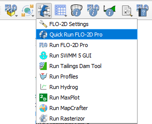

- Create a Run Folder to start export the data files into.

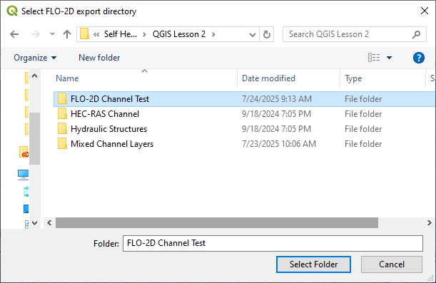

- Click OK twice to start the simulation.

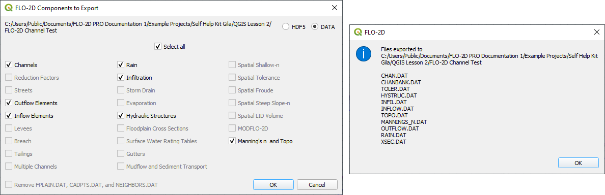

- The run will take a few minutes to complete.

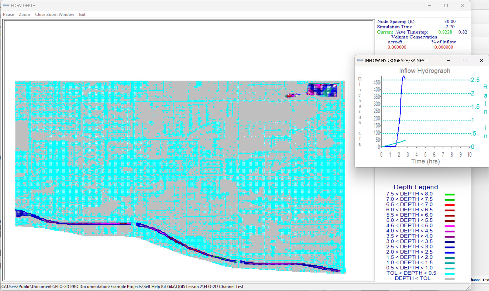

.. note:: If an error occurs, check the ERROR.CHK text file for details.  The videos show more details on how to fix common errors.

Channel Summary and Results
-----------------------------
.. raw:: html

   <iframe width="560" height="315" src="https://www.youtube.com/embed/JQNBCUqOKbY?si=_HqHJOdV7lfZCtWP"
   title="YouTube video player" frameborder="0" allow="accelerometer; autoplay; clipboard-write; encrypted-media;
   gyroscope; picture-in-picture; web-share" referrerpolicy="strict-origin-when-cross-origin" allowfullscreen></iframe>

This video shows how to view simulation outputs, map flood depths and elevations,
and evaluate hydraulic structure performance in FLO-2D.
