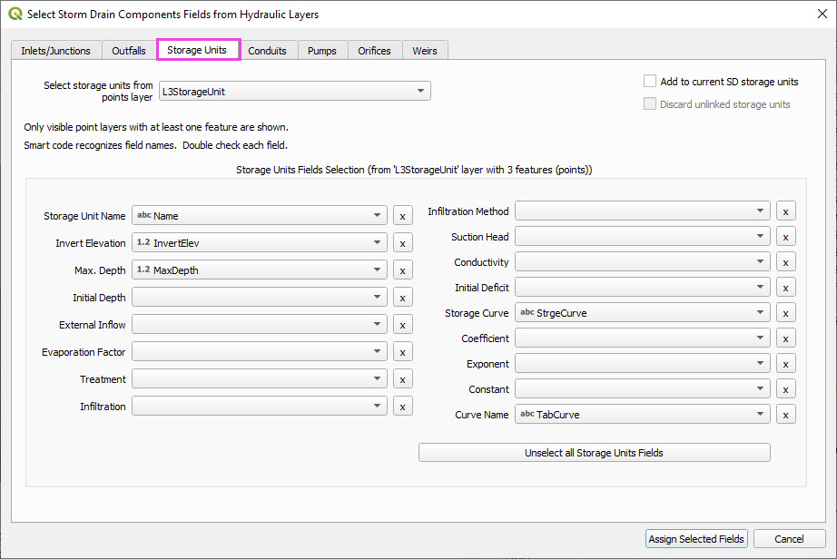
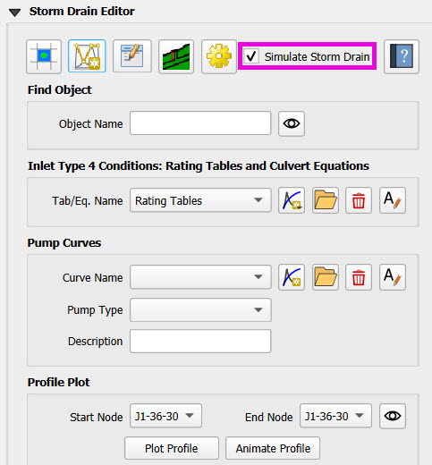
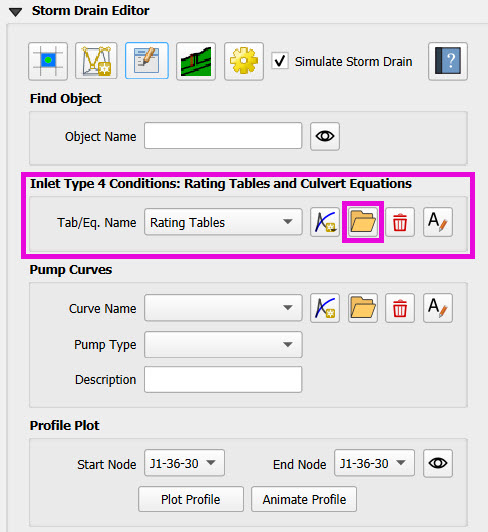

Storm Drain
============

This advanced lesson shows how to create a storm drain from Shapefiles.  Stay tuned for more lessons that will
show how to set up a storm drain from a swmm.inp.

.. Note:: It will be easier to view these videos on YouTube.

   Set the video playback speed to 2x to complete the lessons faster.

   The videos are more detailed whereas the text gives the minimum steps needed
   to complete the project.

Storm drain checklist.

For those of you who love a challenge, it's good practice to do a "Speed Run" of the Self-Help
Kit.  Here is a checklist of tasks that might get skipped during storm drain model building.

- [ ] Adjust outfall location so all outfalls rest on a left bank node.
- [ ] Add a storage unit volume table and assign `Storage1` to all storage units.
- [ ] Ensure conduit length is a minimum of 30 ft, which is the cell size.
- [ ] Add Type 4 rating tables to the Type 4 inlets.
- [ ] Add a pump table and assign it to `P1`.
- [ ] Auto-assign nodes.
- [ ] Carefully inspect shapefile fields.
- [ ] Check storm drain control settings.
- [ ] Schematize the network.
- [ ] Perform a test run.

Data and Resources
--------------------

.. raw:: html

   <iframe width="560" height="315" src="https://www.youtube.com/embed/YGHUA2fgIFA?si=hJIfJgNR7BOciJuL"
   title="YouTube video player" frameborder="0" allow="accelerometer; autoplay; clipboard-write; encrypted-media;
   gyroscope; picture-in-picture; web-share" referrerpolicy="strict-origin-when-cross-origin" allowfullscreen></iframe>

This lesson provides an introduction to importing and understanding the storm drain system in FLO-2D using QGIS.

**Import Storm Drain Shapefiles**

- Load storm drain shapefiles into your project:

  - Sort files by type and select those labeled as **shapefiles**.
  - Drag and drop into a **Storm Drain** group in your QGIS layer panel.

**Understanding FLO-2D Storm Drain Logic**

- FLO-2D handles most drainage through the **surface model**:

  - Channels and detention basins are modeled at the surface.
  - Inlets and outfalls interface with the surface system.

.. note::
   You do **not** need subcatchments, rain gauges, or separate infiltration models like in SWMM.

- Storm drains receive water from:

  - Streets and inlets (inflow)
  - Outfalls discharge to channels or basins (outflow)

**Documentation and Learning Resources**

- FLO-2D provides built-in documentation:

    **Storm Drain Guidelines**
      - Location:

        - `Storm Drain Resources section <https://flo-2dkaren.github.io/FLO-2D-Docs/Build25/flo-2d_plugin/user_manual/widgets/storm-drain-editor/index.html#storm-drain-resources>`_.
        - The installation directory under ``FLO-2D > Manuals`` or
        - Via the **book icon** in the editor.

      - Key Chapters:

        - Chapter 2: Inlet data types
        - Chapter 3: Output file structure
        - Chapter 4: Setup guidelines
        - Chapter 5: Troubleshooting
        - Chapter 6: How to review your storm drain model

    **Advanced Tutorial**

       - Found on YouTube under the *New Self-Help Kit* playlist

    **EPA SWMM GUI**

       - Installed alongside FLO-2D
       - Use for pump setups, advanced SWMM elements, and additional documentation

    **OpenSWMM.org**
       - A knowledge base and community forum with examples, questions, and shared resources.

    **ChatGPT**

       - Use ChatGPT (3.5 or 4.0) to assist with modeling questions or examples
       - For example: "Build a SWMM example with a pump" will generate a valid ``.inp`` file

Contact Support
~~~~~~~~~~~~~~~~~

For technical assistance or troubleshooting, use the official FLO-2D support form available at
the link below:

|Contact-Form|

.. |Contact-Form| raw:: html

   <a href="https://flo-2d.com/contact/" target="_blank">Contact Form</a>

Storm Drain Feature Overview
~~~~~~~~~~~~~~~~~~~~~~~~~~~~~~~~~
- **Point features** (nodes): inlets, junctions, manholes, outfalls, storage units
- **Polyline features** (links): conduits, pumps, orifices

Node Overview - Inlet, Junction
----------------------------------

.. raw:: html

   <iframe width="560" height="315" src="https://www.youtube.com/embed/KzIdcyYZKpQ?si=a3u6R2X0fQH_HiuQ"
   title="YouTube video player" frameborder="0" allow="accelerometer; autoplay; clipboard-write; encrypted-media;
   gyroscope; picture-in-picture; web-share" referrerpolicy="strict-origin-when-cross-origin" allowfullscreen></iframe>

This lesson explains how to review and interpret inlet and junction shapefile data for storm drain modeling in FLO-2D.
Inlet and junction nodes contain attributes that define how they interact with the grid and storm drain network.

**Documentation References**

- Use the **Storm Drain Guidelines** (Chapter 2) to understand inlet types:

  - Type 0: Junction (no interaction with surface)
  - Type 1: Curb opening
  - Type 2: Curb with gutter
  - Type 3: Grate
  - Type 4: Unique (e.g. headwall)
  - Type 5: Manhole

**Reviewing Node Attributes**

Open the shapefile table for inlets and junctions in QGIS.

- **Required attributes** (vary by type):

  - ``Name``: Must start with "I" for inlets
  - ``Type``: Integer (0 to 5)
  - ``Elevation``: Invert elevation
  - ``Max Depth``: From surface to invert
  - ``Length``, ``Width``, ``Perimeter``, ``Area``, ``Height``: As required per type
  - ``Weir Coefficient``
  - ``Feature Switch``: 0 (rim), 1 (invert), or 2 (special conditions)
  - Optional: ``Curb Height``, ``Clog Factor``, ``Clog Time``, ``Dropbox Area``

**Understanding Specific Types**

**Type 0: Junction**

- No surface interaction
- Requires only invert elevation and max depth

**Type 1: Curb Opening**

- Requires: Length, Height, Weir Coefficient
- Does not include sag or width

**Type 2: Curb with Gutter**

- Requires: Length, Width (sag), Height, Weir Coefficient
- Optional: Curb Height, Dropbox Area

**Type 3: Grate**

- Requires: Perimeter, Area, Sag (optional), Weir Coefficient
- Often used in depressed road areas

**Type 4: Unique (Headwall)**

- Requires: Invert Elevation, Max Depth
- ``Feature Switch = 1`` sets grid elevation to invert
- Used for channel interfaces or direct inflow control

**Type 5: Manhole**

- Requires: Invert Elevation, Max Depth, Perimeter, Area, Surcharge Depth, Weir Coefficient
- Acts like a junction until surcharge pops the lid
- Allows bidirectional flow once popped

**Visualization Tips**

- Use **categorized symbology** to color nodes by inlet type
- Use **Zoom to Feature** and satellite imagery to verify node alignment
- Position nodes carefully relative to grid elements for accurate simulation

**Unit Notes**

- All dimensions in **feet**
- Clogging factor is a **percentage (0-1)**
- Clogging time is in **hours**
- For more information on storm drain units, see the **Storm Drain Guidelines** for `Storm Drain Units <https://flo-2dkaren.github.io
  /FLO-2D-Docs/Build25/  flo-2d_plugin/user_manual/widgets/storm-drain-editor/index.html#storm-drain-units>`_.

For more information on inlets/junctions, see the **Storm Drain Guidelines** for `Inlets/Junctions <https://flo-2dkaren.github.io
/FLO-2D-Docs/Build25/flo-2d_plugin/user_manual/widgets/storm-drain-editor/Properties.html#inlets-junctions>`_ .

Node Overview - Outfall, Storage Unit
------------------------------------------

.. raw:: html

   <iframe width="560" height="315" src="https://www.youtube.com/embed/D-tWFxOMdXE?si=DjCLC3GfiyyMzqsu"
   title="YouTube video player" frameborder="0" allow="accelerometer; autoplay; clipboard-write; encrypted-media;
   gyroscope; picture-in-picture; web-share" referrerpolicy="strict-origin-when-cross-origin" allowfullscreen></iframe>

This lesson explains how to review and configure outfalls and storage units in your storm drain shapefiles.

Outfalls
--------

Outfalls are point features representing discharge points from the storm drain network.

To open the outfall data:

- Right-click the **Outfalls** layer and select **Open Attribute Table**.
- Dock the table for convenience.

Key Attributes for Outfalls:

- **Name**: Should begin with "O" (e.g., `O1`, `O2`) for clarity.
- **Invert Elevation**: Elevation where flow exits.
- **Flap Gate**: `True` or `False`. Controls whether backflow is allowed.
- **Allow Q**: `1` = yes, interfaces with FLO-2D; `0` = no interface.
- **Outfall Type**: Options include:

  - `FREE`: Free discharge
  - `NORMAL`: Controlled by downstream conditions
  - `FIXED`: Fixed stage elevation
  - `TIDAL_CURVE`: Elevation changes with time
  - `TIME_SERIES`: Stage varies over time

.. note::
   When connecting an outfall to a channel, always assign it to the **left bank looking downstream**, even if physically placed on the right.

Examples:

- Outfalls located outside the grid should have `Allow Q` set to `0`.
- Tidal or fixed outfalls must define a corresponding elevation, curve, or time series.

For more information on outfalls, see the **Storm Drain Guidelines** for `Outfalls <https://flo-2dkaren.github.io
/FLO-2D-Docs/Build25/flo-2d_plugin/user_manual/widgets/storm-drain-editor/Properties.html#outfalls>`_ .

Use the **EPA SWMM GUI** to understand field definitions.

FLO-2D only uses closed storage systems in the storm drain module.

Storage Units
-------------

Storage units in FLO-2D are used for **closed systems** like tanks or underground vaults.

Open the **Storage Units** layer:

- Right-click and select **Open Attribute Table**
- Dock the table for visibility

Valid Attributes for Storage Units:

- **Name**: Unique identifier
- **Invert Elevation**: Bottom elevation of the storage unit
- **Max Depth**: Maximum storage depth
- **Initial Depth** *(optional)*
- **Storage Curve**: Define a depth-volume relationship (tabular curve only)

Unsupported Features:

- No **infiltration**, **evaporation**, or **ponded area**
- These values must exist in the `.inp` file but can be left blank or zero

.. note::
   FLO-2D does not support surface ponding or infiltration via storage units. Use the grid system for those interactions.

For more information on storage units, see the **Storm Drain Guidelines** for `Storage Units <https://flo-2dkaren.github.io
/FLO-2D-Docs/Build25/flo-2d_plugin/user_manual/widgets/storm-drain-editor/Properties.html#storage-units>`_ .

Use the **EPA SWMM GUI** to understand field definitions.

FLO-2D only uses closed storage systems in the storm drain module.

Link Overview - Conduit
-----------------------------

.. raw:: html

   <iframe width="560" height="315" src="https://www.youtube.com/embed/ZReLFF5yfYQ?si=K1QSmsJcsPRt9Hr-"
   title="YouTube video player" frameborder="0" allow="accelerometer; autoplay; clipboard-write; encrypted-media;
   gyroscope; picture-in-picture; web-share" referrerpolicy="strict-origin-when-cross-origin" allowfullscreen></iframe>

This lesson focuses on configuring **conduits** in the storm drain system. Conduits are polylines that connect nodes (e.g., inlets, junctions, outfalls), and are fully stored in the `.inp` file without an associated FLO-2D file.

**Open and Review the Conduit Attribute Table**

1. In QGIS, right-click on the **Conduits** layer and choose **Open Attribute Table**.
2. Dock the table to work alongside the map.
3. Note that conduits:

   - Do not generate `.dat` files like `SWMMFLOW.DAT` or `SWMMOUTF.DAT`.
   - Are entirely represented in the **SWMM .inp file**.

**Key Fields and Attributes**

The following fields should be configured in the conduit shapefile:

+------------------------+----------------+---------------------------------------------+
| Field Name             | Type           | Description                                 |
+========================+================+=============================================+
| `name`                 | String         | Unique identifier                           |
|                        |                |                                             |
+------------------------+----------------+---------------------------------------------+
| `inletoffset`          | Float          | Offset from upstream node                   |
|                        |                |                                             |
+------------------------+----------------+---------------------------------------------+
| `outletoffset`         | Float          | Offset from downstream node                 |
|                        |                |                                             |
+------------------------+----------------+---------------------------------------------+
| `shape`                | String         | Closed RECTANGLE, CIRCULAR, etc.            |
|                        |                |                                             |
+------------------------+----------------+---------------------------------------------+
| `barrels`              | Integer        | Number of parallel conduits                 |
|                        |                |                                             |
+------------------------+----------------+---------------------------------------------+
| `geom1`                | Float          | Max depth (or diameter)                     |
|                        |                |                                             |
+------------------------+----------------+---------------------------------------------+
| `geom2`                | Float          | Width or other geometry parameter           |
|                        |                |                                             |
+------------------------+----------------+---------------------------------------------+
| `geom3`                | Float          | Side slope 1 (if applicable)                |
|                        |                |                                             |
+------------------------+----------------+---------------------------------------------+
| `geom4`                | Float          | Side slope 2 (if applicable)                |
|                        |                |                                             |
+------------------------+----------------+---------------------------------------------+
| `length`               | Float          | Length in feet or meters                    |
|                        |                |                                             |
+------------------------+----------------+---------------------------------------------+
| `n_manning`            | Float          | Manning’s roughness coefficient             |
|                        |                |                                             |
+------------------------+----------------+---------------------------------------------+
| `initial_flow`         | Float          | Optional initial flow                       |
|                        |                |                                             |
+------------------------+----------------+---------------------------------------------+
| `max_flow`             | Float          | Optional max flow                           |
|                        |                |                                             |
+------------------------+----------------+---------------------------------------------+
| `entrance_loss`        | Float          | Entry loss coefficient                      |
|                        |                |                                             |
+------------------------+----------------+---------------------------------------------+
| `exit_loss`            | Float          | Exit loss coefficient                       |
|                        |                |                                             |
+------------------------+----------------+---------------------------------------------+
| `avg_loss`             | Float          | Average loss coefficient                    |
|                        |                |                                             |
+------------------------+----------------+---------------------------------------------+
| `flapgate`             | Integer        | 0 (no flap) or 1 (with flap)                |
+------------------------+----------------+---------------------------------------------+

.. note::
   Use the **Storm Drain Guidelines** or **SWMM GUI Help** to reference proper field definitions and recommended values.

**Tips on Flow Direction**

- Flow direction is determined by the digitized order of the polyline.
- Use the **Advanced Digitizing Toolbar** in QGIS to flip flow direction with the **Reverse Line** tool.
- Turn on **arrow symbology** to visualize flow direction:

  - Right-click layer > Symbology > Line Symbol > Arrow

.. tip::
   Reversing a line also reverses all internal vertices, keeping topology intact.

**Checking Profiles and Connectivity**

Use the **Profile Tool** to visualize elevation and connectivity:

1. Select a starting node and ending node.
2. Plot the conduit profile.
3. Observe invert elevations and slope direction.
4. Check for backward conduits or improper connections.

**Minimum Length Guidelines**

To maintain model stability:

- The **minimum conduit length** should match or exceed the grid cell size.
- For urban grids (typically 20 to 30 ft), no conduit should be shorter than the grid resolution.

.. code-block:: python

   # Example: Reset all conduits with length < 20 to 20
   length < 20 = update to 20

**Loss Coefficients and Flap Gates**

- Reference **SWMM GUI Help > Losses** for entrance/exit coefficient ranges.
- **Flap Gate** set to 1 prevents backflow.

.. important::
   Entry/exit losses are applied to simulate energy loss at junctions and transitions.

For more information on conduits, see the **Storm Drain Guidelines** for `Conduits <https://flo-2dkaren.github.io
/FLO-2D-Docs/Build25/flo-2d_plugin/user_manual/widgets/storm-drain-editor/Properties.html#conduits>`_ .

Link Overview - Pump, Orifice, Weir
------------------------------------------

.. raw:: html

   <iframe width="560" height="315" src="https://www.youtube.com/embed/FQhkxsgntPY?si=CWEW6rvhRHw51-NA"
   title="YouTube video player" frameborder="0" allow="accelerometer; autoplay; clipboard-write; encrypted-media;
   gyroscope; picture-in-picture; web-share" referrerpolicy="strict-origin-when-cross-origin" allowfullscreen></iframe>

This lesson explains the setup and attributes for **pumps**, **orifices**, and **weirs** in the storm drain system using QGIS and the EPA SWMM interface.

Pumps
-----

To view and configure pump data:

1. Right-click the **Pumps** layer and select **Open Attribute Table**.
2. Dock the table for easier viewing.

Pump fields:

+-------------------+----------+----------------------------------------+
| Field             | Type     | Description                            |
+===================+==========+========================================+
| `name`            | String   | Unique pump name                       |
|                   |          |                                        |
+-------------------+----------+----------------------------------------+
| `init_status`     | String   | "ON" or "OFF"                          |
|                   |          |                                        |
+-------------------+----------+----------------------------------------+
| `start_depth`     | Float    | Starting water depth to activate pump  |
|                   |          |                                        |
+-------------------+----------+----------------------------------------+
| `shutoff_depth`   | Float    | Depth to stop pump                     |
|                   |          |                                        |
+-------------------+----------+----------------------------------------+
| `curve_name`      | String   | Name of the associated pump curve      |
|                   |          |                                        |
+-------------------+----------+----------------------------------------+
| `pump_type`       | String   | Type of pump: IDEAL, TYPE1-4           |
+-------------------+----------+----------------------------------------+

Pump types:

- **IDEAL**: Transfers all flow from inlet to outlet (design only).
- **TYPE 1**: Offline, staged, requires wet well.
- **TYPE 2**: Inline, stepped flow.
- **TYPE 3**: Head/flow differential.
- **TYPE 4**: Flow-depth, continuous.

For more information on pumps, see the **Storm Drain Guidelines** for `Pumps <https://flo-2dkaren.github.io
/FLO-2D-Docs/Build25/flo-2d_plugin/user_manual/widgets/storm-drain-editor/Properties.html#pumps>`_ .

.. note::
   Set up the pump in the storm drain editor first, then assign the curve data in the **Pump Curves** table.

Orifices
--------

Orifices are typically underground restrictions connected to manholes or other subsurface elements.

+-----------------------+----------+------------------------------------------------+
| Field                 | Type     | Description                                    |
+=======================+==========+================================================+
| `name`                | String   | Unique orifice name                            |
|                       |          |                                                |
+-----------------------+----------+------------------------------------------------+
| `type`                | String   | "SIDE" or "BOTTOM"                             |
|                       |          |                                                |
+-----------------------+----------+------------------------------------------------+
| `shape`               | String   | "CIRCULAR" or "RECTANGULAR"                    |
|                       |          |                                                |
+-----------------------+----------+------------------------------------------------+
| `height`              | Float    | Height of orifice opening                      |
|                       |          |                                                |
+-----------------------+----------+------------------------------------------------+
| `width`               | Float    | Width of opening (for RECTANGULAR)             |
|                       |          |                                                |
+-----------------------+----------+------------------------------------------------+
| `inlet_offset`        | Float    | Distance from invert to orifice opening        |
|                       |          |                                                |
+-----------------------+----------+------------------------------------------------+
| `q_coeff`             | Float    | Discharge coefficient                          |
|                       |          |                                                |
+-----------------------+----------+------------------------------------------------+
| `flap_gate`           | Integer  | 0 or 1 (flap gate on/off)                      |
|                       |          |                                                |
+-----------------------+----------+------------------------------------------------+
| `open_close_time`     | Float    | Optional: time to open or close in hours       |
+-----------------------+----------+------------------------------------------------+

For more information on orifices, see the **Storm Drain Guidelines** for `Orifices <https://flo-2dkaren.github.io
/FLO-2D-Docs/Build25/flo-2d_plugin/user_manual/widgets/storm-drain-editor/Properties.html#orifices>`_ .

Weirs
-----

Weirs are usually surface-connected structures (rare underground). Always verify usage.

+-----------------------+----------+------------------------------------------------+
| Field                 | Type     | Description                                    |
+=======================+==========+================================================+
| `name`                | String   | Unique weir name                               |
|                       |          |                                                |
+-----------------------+----------+------------------------------------------------+
| `type`                | String   | TRANSVERSE, SIDEFLOW, V-NOTCH, TRAPEZOIDAL     |
|                       |          |                                                |
+-----------------------+----------+------------------------------------------------+
| `height`              | Float    | Height of opening                              |
|                       |          |                                                |
+-----------------------+----------+------------------------------------------------+
| `length`              | Float    | Length of weir opening                         |
|                       |          |                                                |
+-----------------------+----------+------------------------------------------------+
| `side_slope`          | Float    | Slope of trapezoidal shape                     |
|                       |          |                                                |
+-----------------------+----------+------------------------------------------------+
| `inlet_offset`        | Float    | Elevation offset from structure invert         |
|                       |          |                                                |
+-----------------------+----------+------------------------------------------------+
| `q_coeff`             | Float    | Discharge coefficient                          |
|                       |          |                                                |
+-----------------------+----------+------------------------------------------------+
| `flap_gate`           | Integer  | 0 or 1 (flap gate status)                      |
|                       |          |                                                |
+-----------------------+----------+------------------------------------------------+
| `contraction_coeff`   | Float    | Optional contraction coefficient               |
+-----------------------+----------+------------------------------------------------+

For more information on weirs, see the **Storm Drain Guidelines** for `Weirs <https://flo-2dkaren.github.io
/FLO-2D-Docs/Build25/flo-2d_plugin/user_manual/widgets/storm-drain-editor/Properties.html#weirs>`_ .

.. caution::
   Weirs are typically not used in FLO-2D storm drain systems. If one appears in an `.inp` file, confirm its purpose. May need to be removed if inherited from surface modeling software.

**Review Tips**

- Use the **EPA SWMM GUI** to preview expected inputs and verify how fields work together.
- Field types and required formats should follow SWMM rules.
- Curves (for pumps and orifices) are configured in a separate step.

Create a Storm Drain from Shapefiles
------------------------------------

.. raw:: html

   <iframe width="560" height="315" src="https://www.youtube.com/embed/DNxhqBgOfuY?si=D67eo3YLWYpqs0x4"
   title="YouTube video player" frameborder="0" allow="accelerometer; autoplay; clipboard-write; encrypted-media;
   gyroscope; picture-in-picture; web-share" referrerpolicy="strict-origin-when-cross-origin" allowfullscreen></iframe>

This lesson walks through building an entire storm drain system from shapefiles, defining rating tables, storage units, and pump curves, and then running the simulation.

Step 1: Load Shapefiles
~~~~~~~~~~~~~~~~~~~~~~~~~~
- Open the **Advanced Storm Drain Layers** folder.
- Drag and drop the appropriate shapefiles into QGIS.

.. image:: ../img/shg/5b/shg_storm001.jpg

- Do **not** add them to the GeoPackage. Keep them in the User Layers.
- Save when prompted and select **Yes** to embed data into the GeoPackage for portability.

Step 2: Assign Shapefile Fields
~~~~~~~~~~~~~~~~~~~~~~~~~~~~~~~~~~~~~
Open the **Storm Drain Editor** and click **Select Components from Shapefile**.

- Point layers like inlets, outfalls, and storage units will show up in the dropdown.
- Assign each required field from the shapefile attributes:
  - Example: `Inlet Name` → `name`, `Type` → `type`, etc.
- Turn off unused or null-value fields to avoid unnecessary entries.

.. image:: ../img/shg/5b/shg_storm003.jpg

.. image:: ../img/shg/5b/shg_storm023.jpg

Click **Assign Selected Fields**, then click **OK** for the warning that follows.

.. image:: ../img/shg/5b/shg_storm024.jpg

.. image:: ../img/shg/5b/shg_storm007.jpg

Step 3: Assign Nodes to Links
~~~~~~~~~~~~~~~~~~~~~~~~~~~~~~~~~
Click the **Auto-Assign Links and Nodes** button.

.. image:: ../img/shg/5b/shg_storm008.jpg

- This assigns start and end nodes to each conduit.
- Uses the closest node within a 3-ft radius from the first and last vertex of a conduit.

.. warning::
   - Make sure conduit directions are correct using the **Reverse Line Tool** in the **Advanced Digitizing Toolbar**.
   - Use the **Snapping Tool** to ensure precise vertex-node connections.

Check the **Simulate Storm Drain** box to turn it on.

Step 4: Add Type 4 Rating Tables and Culverts
~~~~~~~~~~~~~~~~~~~~~~~~~~~~~~~~~~~~~~~~~~~~~~~~~~~~

- Go to the **Type 4 Table Editor**.

- Import rating tables or culvert equations for each type 4 inlet.

- File names must match inlet names (e.g., ``41.txt`` for inlet 41).
- Format for rating tables: Depth on the left, Discharge on the right.

Step 5: Add Pump Curve Data
~~~~~~~~~~~~~~~~~~~~~~~~~~~~~~
- Add a pump curve via the Pump Table interface.

.. image:: ../img/shg/5b/shg_storm014.jpg

- Name it to match the pump (e.g., ``P1``).

.. image:: ../img/shg/5b/shg_storm015.jpg

- Enter a depth-discharge pair (e.g., ``1,10``, ``2,20``).

- Data is saved automatically when you click off the cell.

Step 6: Add Storage Unit Curves
~~~~~~~~~~~~~~~~~~~~~~~~~~~~~~~~~~
- Open **Storage Units** attribute table.

.. image:: ../img/shg/5b/shg_storm025.jpg

- Use the **FLO-2D Info Tool** to open the storage curve editor.

.. image:: ../img/shg/5b/shg_storm026.jpg

- Import a tab-delimited text file or paste Excel values.

.. image:: ../img/shg/5b/shg_storm028.jpg

.. image:: ../img/shg/5b/shg_storm029.jpg

Step 7: Set Storm Drain Control Parameters
~~~~~~~~~~~~~~~~~~~~~~~~~~~~~~~~~~~~~~~~~~~~~~~~~~~~
- Set the **start and end time** of your simulation (e.g., 10 hours).
- Ensure it matches any time series used.
- Adjust the **report step**, **flow units** (CFS/CMS), and **routing method**.
- Leave advanced defaults unless needed.

Step 8: Schematize and Run
~~~~~~~~~~~~~~~~~~~~~~~~~~~~~~
- Click **Schematize Storm Drain** to export ``SWMM.OUTF``, ``SWMM.FLOW``, ``DROPBOX.DAT``, etc.

.. image:: ../img/shg/5b/shg_storm018.jpg

- Click **Quick Run** to simulate.
- Output files will populate your designated folder.

.. image:: ../img/shg/5b/shg_storm019.jpg

.. image:: ../img/shg/5b/shg_storm020.jpg

.. tip::
   If errors occur, check your shapefile connections, field assignments, or go to a **FLO-2D Troubleshooting** video in the series.

Summary and Review Results
---------------------------

Coming Soon

Storm Drain from SWMM.INP
---------------------------

Coming Soon