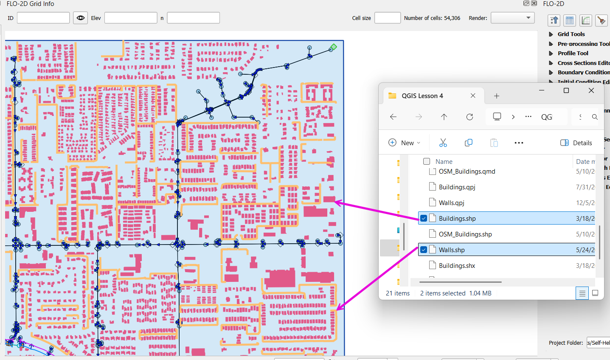
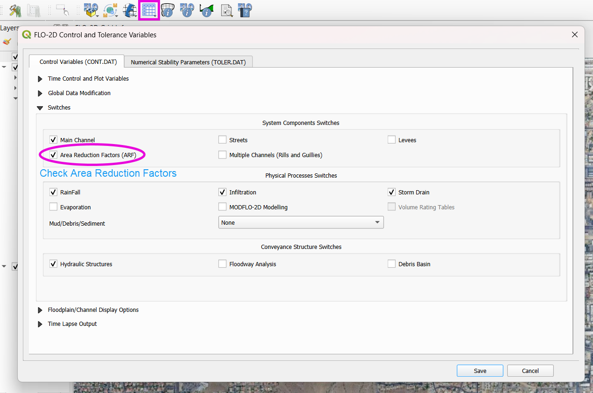

Buildings and Walls
========================

Setup up Buildings and Walls using Open Street Map Downloader, QGIS, and the FLO-2D Plugin.

.. Note:: It will be easier to view these videos on YouTube. The step by step instructions are faster to follow but the videos are more detailed.

   Set the video playback speed to 2x to complete the lessons faster.

   The videos are **more detailed** whereas the text gives the minimum steps needed
   to complete the project.

Load and Assign Data
-----------------------

.. raw:: html

   <iframe width="560" height="315" src="https://www.youtube.com/embed/lljO4niOWdQ?si=zBzN_ocXETMYlLGd"
   title="YouTube video player" frameborder="0" allow="accelerometer; autoplay; clipboard-write; encrypted-media;
   gyroscope; picture-in-picture; web-share" referrerpolicy="strict-origin-when-cross-origin" allowfullscreen></iframe>

This lesson explains how to import and assign buildings in your FLO-2D model, including visualization tips and parameter configurations.

Step 1: Import Building Data
~~~~~~~~~~~~~~~~~~~~~~~~~~~~~~~~~
- Locate the **buildings** shapefile from the **Lesson 4** folder.
- Drag and drop the shapefile onto the map canvas in QGIS.

Step 2: Check Building Attribute Table
~~~~~~~~~~~~~~~~~~~~~~~~~~~~~~~~~~~~~~~~~~
Open the attribute table to confirm the following required fields:

- ``collapse``: whether a building collapses during simulation (used in dam breach or large river simulations).
- ``ARF`` (Area Reduction Factor): adjusts flow for shallow overland flow.
- ``WRF`` (Width Reduction Factor): adjusts channel width for flow routing (rarely used).

.. note::
   For urban simulations, only ``ARF`` is typically required.

Step 3: Calculate Reduction Factors Using Grid Tools
~~~~~~~~~~~~~~~~~~~~~~~~~~~~~~~~~~~~~~~~~~~~~~~~~~~~~~~~~~
1. Open **Grid Tools**.
2. Click the **Calculate Reduction Factors** button.
3. Set the following parameters:

   - **Layer**: buildings
   - **Collapse Field**: ``collapse``
   - **Area Reduction Field**: ``ARF``
   - **Width Reduction Field**: ``WRF``
4. Click **OK** to apply.

This process will:

 - Create a blocked areas layer representing building footprints.
 - Update the **schematized data** to reflect buildings in the model.

Step 4: Building Rain Switch
~~~~~~~~~~~~~~~~~~~~~~~~~~~~~~~~~~
Ensure your rainfall setup includes the **Building Rain Switch**.
This makes rain that falls on blocked cells flow off the building and onto
surrounding grid elements.  The grid elevation will determine the flow direction.

- Turn on the **Building Switch** (ARF switch) in the FLO-2D Controls.
- Click **Save Components**.

.. important::
   If you forget to activate the building switch, buildings may act as sinks instead of obstructions.

.. note::Optional video "Advanced"
   - This video covers advanced building setup, including assigning buildings to the grid and adjusting parameters.

Download Building Polygons (Optional)
--------------------------------------

.. dropdown:: Download Building Polygons

    .. raw:: html

        <iframe width="560" height="315" src="https://www.youtube.com/embed/h-mN4m8rJnw?si=ieWhEVt5BZDst-AM"
        title="YouTube video player" frameborder="0" allow="accelerometer; autoplay; clipboard-write; encrypted-media;
        gyroscope; picture-in-picture; web-share" referrerpolicy="strict-origin-when-cross-origin" allowfullscreen></iframe>

    This tutorial covers how to obtain building data using OpenStreetMap (OSM) and prepare it for FLO-2D modeling. This process is useful when client-provided data is unavailable.

    .. raw:: html

        <h3> Step 1: Install the OSM Downloader Plugin </h3>

    - Go to **Plugins > Manage and Install Plugins**.
    - Search for **OSM Downloader**.
    - Click **Install**.

    .. image:: ../img/shg/6/Bshg03_006.png

    .. tip::
        The OSM Downloader button is nearly transparent. Toggle it on/off to locate it in your toolbar.

    .. raw:: html

        <h3> Step 2: Download Data </h3>

    - Activate the **OSM Downloader tool**.

    .. image:: ../img/shg/6/Bshg03_007.png

    - Draw a rectangle around your project area.

    .. image:: ../img/shg/6/Bshg03_008.png

    - Save the file with a clear name like ``osm_file.geojson``.
    - The data is downloaded in EPSG:4326 and will be reprojected later.

    .. image:: ../img/shg/6/Bshg03_009.png

    .. raw:: html

        <h3> Step 3: Export Polygons </h3>

    - Turn off unnecessary OSM sublayers (e.g., roads).
    - Right-click the **polygons** layer > **Export > Save Features As...**

    .. image:: ../img/shg/6/Bshg03_0010.png

    - Save as ``osm_buildings``.
    - Change the CRS to your project CRS (e.g., EPSG:2223).
    - Remove irrelevant fields before exporting.

    .. image:: ../img/shg/6/Bshg03_0011.png

    .. raw:: html

        <h3> Step 4: Filter for Buildings </h3>

    - Open the attribute table.
    - Sort by the ``building`` field.
    - Select rows where ``building`` is null or empty and delete them.
    - Save your edits.

    .. image:: ../img/shg/6/Bshg03_0012.png

    .. image:: ../img/shg/6/Bshg03_0013.png

    .. raw:: html

        <h3> Step 5: Crop to Project Boundary </h3>

    - Use **Select by Location**:

        - Select features from ``osm_buildings``.
        - Where the feature is **within** the computational domain layer.

    .. image:: ../img/shg/6/Bshg03_0014.png

    .. image:: ../img/shg/6/Bshg03_0015.png

    - Use **Invert Feature Selection** tool and the **Delete** button to
      delete unselected features (those outside the project area).

    .. image:: ../img/shg/6/Bshg03_0016.png

    .. raw:: html

        <h3> Step 6: Clean Building Types </h3>

    - Review building types.
    - Delete features such as ``carports``, ``gas islands``, etc., which don’t obstruct flow.

    .. image:: ../img/shg/6/Bshg03_0018.png

    .. image:: ../img/shg/6/Bshg03_0019.png

    .. dropdown:: Step 7: Fill in Missing Buildings (Optional)

        - Turn on a satellite basemap (e.g., Google Satellite).
        - Use the **Add Polygon tool** or **Shape Digitizing Toolbar** to:
        - Digitize missing buildings.
        - Use ``Rectangle from Extent`` for fast creation.
        - Use ``Digitize with Segment`` for complex shapes.

        .. image:: ../img/shg/6/Bshg03_0023.png

        .. tip:: Or you can try the **Add Polygon** tool to draw buildings manually.

        .. image:: ../img/shg/6/Bshg03_0024.png

    .. raw:: html

        <h3> Step 8: Add Required Fields </h3>

    - Add the following integer fields:

        - ``collapse``
        - ``ARF`` (Area Reduction Factor)
        - ``WRF`` (Width Reduction Factor)

    .. image:: ../img/shg/6/Bshg03_0020.png

    - Use the **Field Calculator** to:

        - Set ``collapse = 0``
        - Set ``ARF = 1``
        - Set ``WRF = 0``

    .. image:: ../img/shg/6/Bshg03_0021.png

    .. raw:: html

        <h3> Step 9: Evaluate reduction factors </h3>

    - Open the **Grid Tools** and use the **Calculate reduction factors (ARF and WRF)** tool to calculate ARF and WRF.
    - Set the parameters as shown below.

    .. image:: ../img/shg/6/Bshg03_0017.png

    .. raw:: html

        <h3> Step 10: Export the Final Building Layer </h3>

    - Save your edited buildings as a new layer if desired.
    - This layer can now be used with the **Grid Tools > Assign Buildings** tool.

    .. image:: ../img/shg/6/Bshg03_0025.png

    .. raw:: html

        <h3> Step 10: Review the `ARF.DAT` File </h3>

    - Exporting building reductions.

    .. image:: ../img/shg/6/Bshg03_0022.png

    - Open ``arf.dat`` in Notepad++. Key sections:

        - ``S`` line: global reduction factor (e.g., set to 0.5 to reduce all T lines to 50%).
        - ``T`` lines: fully blocked cells.
        - ``P`` lines: partial blocks with ARF values < 1.0.

    .. image:: ../img/shg/6/Bshg03_0027.png

    .. tip::
        The model will automatically convert cells with high ARF values (e.g., > 0.95) to fully blocked.

Review and Assign Walls
------------------------------

.. raw:: html

   <iframe width="560" height="315" src="https://www.youtube.com/embed/JA--spRi98c?si=j0ZawN6nZxP2L_Qt"
   title="YouTube video player" frameborder="0" allow="accelerometer; autoplay; clipboard-write; encrypted-media;
   gyroscope; picture-in-picture; web-share" referrerpolicy="strict-origin-when-cross-origin" allowfullscreen></iframe>

Wall Setup and Failure
=======================

This lesson explains how to assign walls, set failure properties, and export wall data for FLO-2D modeling.
Walls are common features in urban flood studies, especially in the southwestern United States. Unlike fences, these are usually concrete and can significantly change floodwater movement.

.. note::
   These steps are based on QGIS 3.40 and FLO-2D Gila Plugin 2.0.

Step 1: Review Wall Data
----------------------------
- Open the **walls** layer provided by the Flood Control District.
- Right-click the layer and select **Open Attribute Table**.

- Identify the following fields in your table:

   - Ignore: FID, crest elevation, correction, mixed elevation, mixed height, elevation, and fail elevation.
   - Use: Set **Wall height** for your wall data.
   - For collapse properties, use **fail depth** and set other failure rate fields to zero.

.. tip::
   Only keep hydraulically significant walls. Remove walls that do not affect flood routing, such as those inside large neighborhoods.

Step 2: Add Walls to User Levee Lines
---------------------------------------
- Open the **Levee and Wall Tool** from the FLO-2D toolbar.

- In the tool dialog:

  - Set **Crest Elevation** and **Name** to null.
  - Set **Correction Field** to **Wall height**.
  - Make sure all unused fields are set to zero or left blank as appropriate.
  - Set **Failure Depth** (e.g., 2 feet) in the correct field.
- Click **Add Walls**.

Step 3: Convert Levee Lines to Schematic Layers
----------------------------------------------------
- In the Levee tool, click **Create Schematic Layers from User Levee Layers**.

- Choose whether to add to existing layers or create new ones.
- If prompted about redundant levees, click **Yes** to remove them.

- This is what the Levees look like.

.. image:: ../img/shg/6/Bshg03_0034.png

Step 4: Prescribed Failure Setup
----------------------------------
- Open the **Levee Editor**.
- Enable **Prescribed Failure** for the wall lines.
- Export the levee data again.

- Check the export folder. The **lev.dat** file should now show prescribed failure (with a value of 1).

Buildings and Walls Summary
------------------------------------------------

.. raw:: html

   <iframe width="560" height="315" src="https://www.youtube.com/embed/EZGEPQZEs6A?si=RiECh45qLXuRhdHO"
   title="YouTube video player" frameborder="0" allow="accelerometer; autoplay; clipboard-write; encrypted-media;
   gyroscope; picture-in-picture; web-share" referrerpolicy="strict-origin-when-cross-origin" allowfullscreen></iframe>

This lesson summarizes the process of setting up buildings and walls in FLO-2D, including importing data, assigning parameters, and exporting for simulation. It'll just be a video.

Save Export and Run
------------------------

.. raw:: html

   <iframe width="560" height="315" src="https://www.youtube.com/embed/gdzmKSlocsE?si=uyVPzthJHeAiQ6iS"
   title="YouTube video player" frameborder="0" allow="accelerometer; autoplay; clipboard-write; encrypted-media;
   gyroscope; picture-in-picture; web-share" referrerpolicy="strict-origin-when-cross-origin" allowfullscreen></iframe>

This lesson walks through saving the FLO-2D project, exporting the required data, troubleshooting errors, and running the simulation.

