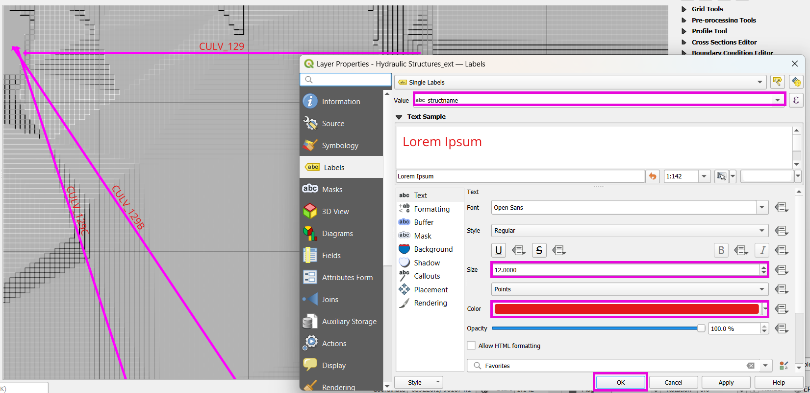
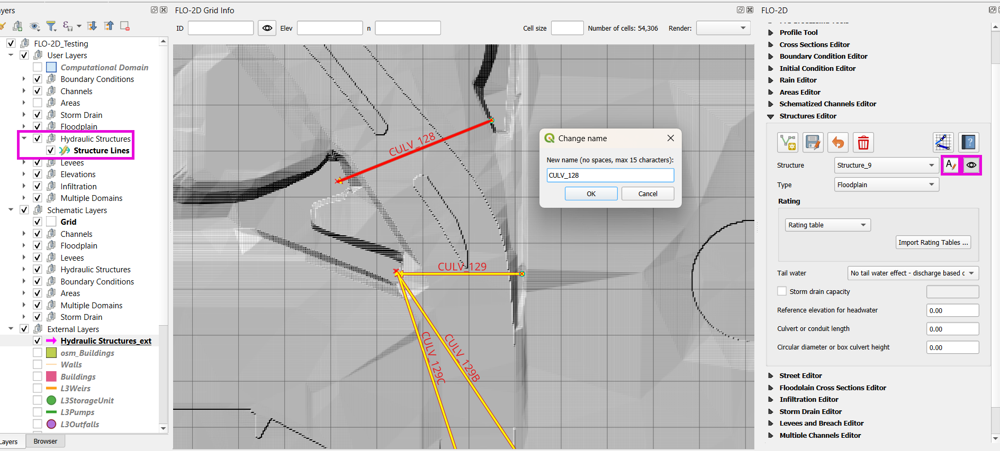
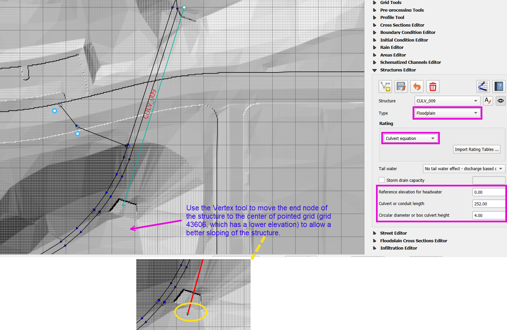
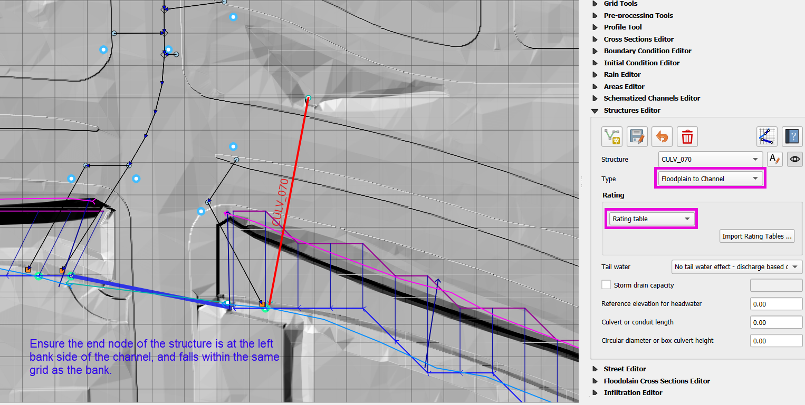
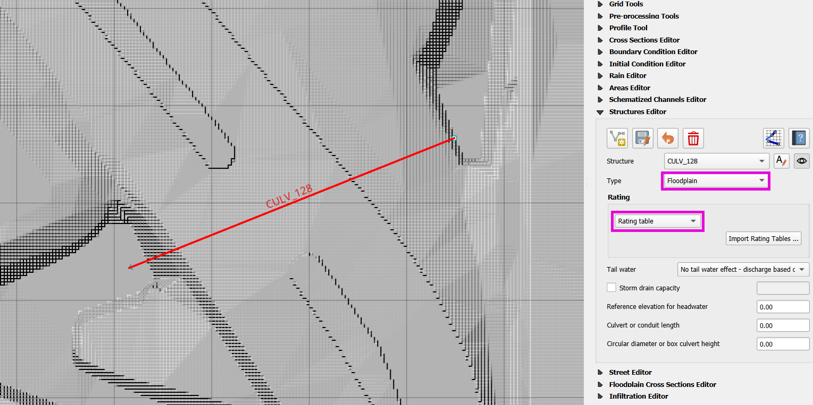
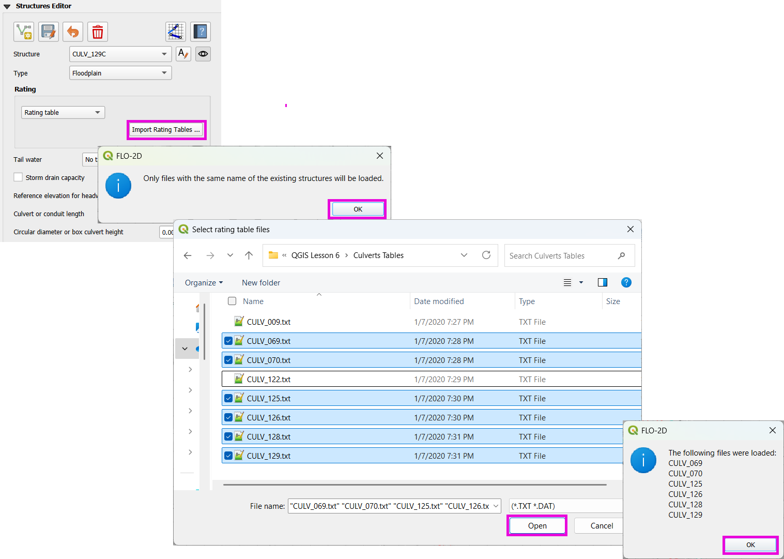
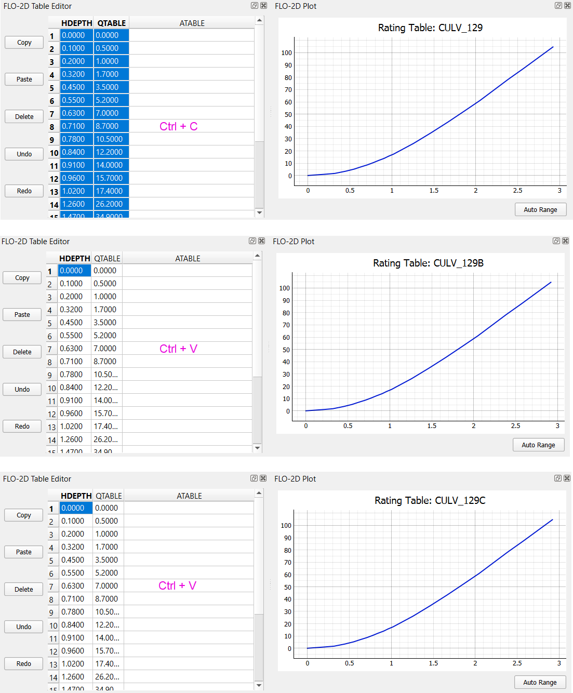
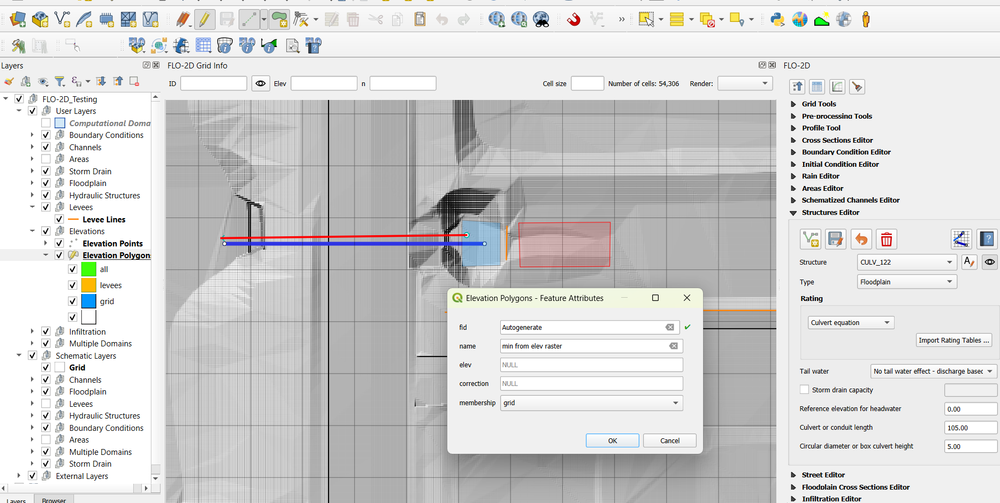
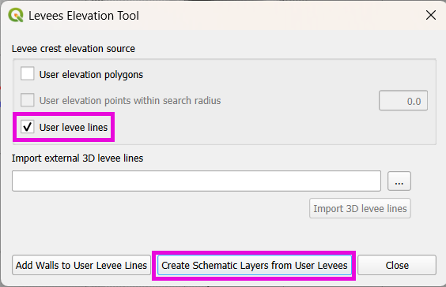
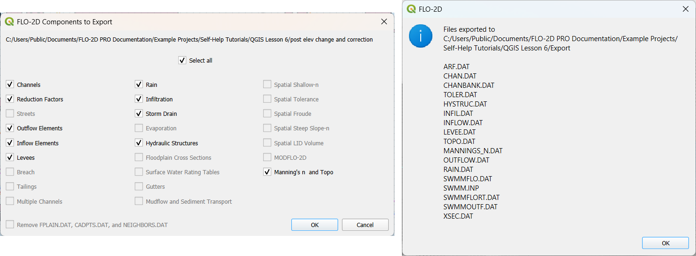

.. _structure_example:

Hydraulic Structures - Culverts
==================================

Set up culverts using Rating Tables and Culvert Equations using QGIS and the FLO-2D Plugin.

.. Note:: It will be easier to view these videos on YouTube.

   Set the video playback speed to 2x to complete the lessons faster.

   The videos are **more detailed** whereas the text gives the minimum steps needed
   to complete the project.

Import and Review Culvert Data
-------------------------------

.. raw:: html

   <iframe width="560" height="315" src="https://www.youtube.com/embed/ebIFoGUuQcI?si=XMiARpQIkzIPD5Es"
   title="YouTube video player" frameborder="0" allow="accelerometer; autoplay; clipboard-write; encrypted-media;
   gyroscope; picture-in-picture; web-share" referrerpolicy="strict-origin-when-cross-origin" allowfullscreen></iframe>


This video gives a review of the hydraulic structures lesson. Follow the steps below to complete the lesson.

Set-up Culvert Structures
-------------------------------

.. raw:: html

   <iframe width="560" height="315" src="https://www.youtube.com/embed/WKjd-FG0ZUM?si=VVumLcmUz5gq9NSg"
   title="YouTube video player" frameborder="0" allow="accelerometer; autoplay; clipboard-write; encrypted-media;
   gyroscope; picture-in-picture; web-share" referrerpolicy="strict-origin-when-cross-origin" allowfullscreen></iframe>


This part of the lesson shows how to import and configure hydraulic structures in your FLO-2D project using QGIS.

.. note::
   Covert (culvert) data rarely comes as pre-formatted GIS line features. Most often, site surveys or as-built drawings are needed.

Step 1: Import the Hydraulic Structure Template
~~~~~~~~~~~~~~~~~~~~~~~~~~~~~~~~~~~~~~~~~~~~~~~

- Open **QGIS Lesson 6** project.
- Drag and drop the ``hydraulic_structures.shp`` file from the lesson data folder onto the map.


- Change symbology:

  - Set to **Arrow symbol** to show flow direction.
  - Optionally brighten the line color.


.. tip::
   The arrowhead marks the **Outlet**, and the first vertex is the **Inlet**.

- Label hydraulic structures:

    - Open layer properties and go to Labels.
    - Choose the field structname to display.
    - Adjust font size and color for better visibility.



Step 2: Copy from Template Layer
~~~~~~~~~~~~~~~~~~~~~~~~~~~~~~~~~~~~

- Select features from the template layer:

  - Use **Select All Features** tool or ``Ctrl + A``.
  - Copy with ``Ctrl + C``.


- Activate the **Structure** layer from the **FLO-2D widget** editor:

  - Ensure editing mode is on.
  - Paste with ``Ctrl + V``.

- Save the edits.


Step 3: Name and Review Each Structure
~~~~~~~~~~~~~~~~~~~~~~~~~~~~~~~~~~~~~~~

- Use the **Center on structure** button to step through.
- Rename each one based on the provided naming convention (``CULV_*``).
- Set labels to ``structname`` field with 12pt font for visibility.



.. image:: ../img/shg/8/shg_hydaulic008b.png

Step 4: Assign Structure Type and Review Structures
~~~~~~~~~~~~~~~~~~~~~~~~~~~~~~~~~~~~~~~~~~~~~~~~~~~~~~~~

- Identify structure types as either one of the following:

    - **Floodplain to Floodplain**
    - **Floodplain to Channel** (must be on a **Left Bank node**)
    - **Channel to Channel** (usually already handled in the channel lesson)

- Where necessary, adjust hydraulic structure endpoints:

    - Use the **Vertex Tool** to move hydraulic structure endpoints to correct elevations or grid elements.










.. note::
   For grouped culverts (e.g., simple storm drain systems), assign a **storm drain capacity** in CFS.

Step 5: Rating Tables and Culvert Equations
~~~~~~~~~~~~~~~~~~~~~~~~~~~~~~~~~~~~~~~~~~~~

Step 5(i): Import Rating Tables
+++++++++++++++++++++++++++++++++

- From the ``Culverts Tables`` folder, select all files  and import except CULV_009.txt and CULV_122.txt.
- Only rating tables that match existing structure names will be applied.



Manually Modify a Rating Table
^^^^^^^^^^^^^^^^^^^^^^^^^^^^^^^^

- Example: reduce max headwater for ``129``, ``129B``, ``129C`` to approx. 3 feet.
- Delete rows from 3.0+ ft.


- Copy and paste modified table to the other two structures (``129B``, ``129C``).



.. note::
   Use ``Ctrl + C`` and ``Ctrl + V`` or **Copy/Paste** buttons.

   If need be, use "Auto Range" button to get a better plot.

Step 5(ii): Review the Generalized Culvert Equations
++++++++++++++++++++++++++++++++++++++++++++++++++++++
- For structures CULV_009 and CULV_122, use FLO-2D Data Input Manual and Hydraulic Design of Highway
  Culverts manual to fill the following properties:

    - TYPEC
    - TYPEEN
    - CULVERTIN
    - KE
    - CUBASE
    - MULTBARRELS


.. note:: Culvert or conduit length can be measure directly in QGIS using the **Measure Line** tool.

Schematic Correction and Recheck
~~~~~~~~~~~~~~~~~~~~~~~~~~~~~~~~~

- Save and click **Schematize** to update geometry.


- Check and re-validate structure assignments one more time.
- Use the Center button to cycle through and verify again.
- Ignore the below error:

    .. image:: ../img/shg/8/shg_hydaulic015.png

.. _correct_elevation:

Correct Elevation
------------------

.. raw:: html

   <iframe width="560" height="315" src="https://www.youtube.com/embed/u41PNLBt8mk?si=0f7P3iE_7gwMFfuu"
   title="YouTube video player" frameborder="0" allow="accelerometer; autoplay; clipboard-write; encrypted-media;
   gyroscope; picture-in-picture; web-share" referrerpolicy="strict-origin-when-cross-origin" allowfullscreen></iframe>


This lesson covers how to make elevation corrections for hydraulic structures, set up minimum elevations, apply levees, and prepare the model for export and run.

Step 1: Create Elevation Polygons
~~~~~~~~~~~~~~~~~~~~~~~~~~~~~~~~~~
- Go to the **Elevation Polygons** layer.
- Start editing and click **Add Polygon**.
- Set the name to ``min from elev raster`` or similar.
- Set method to ``grid``; leave other values ``null``.

    - For simple corrections, draw a polygon around the **centroid** of the grid element you want to modify.

    .. image:: ../img/shg/8/shg_hydaulic016a.png

    .. image:: ../img/shg/8/shg_hydaulic016b.png

    - For complex corrections, select multiple grid cells and draw a polygon.

    .. image:: ../img/shg/8/shg_hydaulic017a.png

    .. image:: ../img/shg/8/shg_hydaulic017b.png

    .. image:: ../img/shg/8/shg_hydaulic017c.png

- The attributes table of ```Elevation Polygons``` should now be looking as the one shown below:

    .. image:: ../img/shg/8/shg_hydaulic018.png

Step 2: Apply a Levee
~~~~~~~~~~~~~~~~~~~~~~
- Use the **Levee Line** tool to draw a line where flow should be restricted.
- Assign the crest elevation based on sampled raster value (e.g., 1396.5).




- Reprocess the levees using:
  ``Plugins > FLO-2D > Create Schematic Layers from User Layers`` with ``Levee Lines`` checked only.




Step 3: Apply Grid Element Corrections
~~~~~~~~~~~~~~~~~~~~~~~~~~~~~~~~~~~~~~~
- Use **External Layer Mode**
- Set layer: ``Elevation Polygons``
- Check: ``Centroids within polygons``
- Select: ``Statistics from raster``
- Choose ``Minimum elevation``
- Check: ``Statistics per grid element``.


Step 4: Export and Run
~~~~~~~~~~~~~~~~~~~~~~~~~~~~~~~~~~~~~~~~~~~
- Export DAT files to a folder with a name like: ``post elev change and correction``


- Run the model.



.. note::
   These steps ensure correct invert elevations, allow headwalls to collect water properly, and ensure flow can pass over levees or into hydraulic structures.

.. tip::
   After corrections, verify grid elevations with the Identify tool to confirm changes.


Save Export and Run Pre Elevation Change
-----------------------------------------

.. raw:: html

   <iframe width="560" height="315" src="https://www.youtube.com/embed/oPha4GTRnQ0?si=e3hM3dhDYahu69bN"
   title="YouTube video player" frameborder="0" allow="accelerometer; autoplay; clipboard-write; encrypted-media;
   gyroscope; picture-in-picture; web-share" referrerpolicy="strict-origin-when-cross-origin" allowfullscreen></iframe>


This short lesson walks through saving hydraulic structures, exporting the data, and running the model. It is part of the final steps for preparing your model.

Step 1: Save the Project
~~~~~~~~~~~~~~~~~~~~~~~~~~~~~~~~~~~
Click the QGIS **Save** button to commit your hydraulic structures to the layer in the GeoPackage.

.. image:: ../img/shg/8/shg_hydaulic026.png

.. note::
   You do not need to turn on the export switch again if it was already activated when setting up channel hydraulic structures.

Step 2: Export Data Files
~~~~~~~~~~~~~~~~~~~~~~~~~~~~~~~~~~~
- Go to the **Import/Export** button.
- Select **Option 3** to export data files.
- Create a new folder inside your ``lesson6`` directory called: ``pre elevation change``

  This helps distinguish the export prior to making elevation corrections.

- First, the DAT-series data files are exported.
- Then, the Storm Drain files are exported.
- You should now see a complete set of exported files inside the folder.

Step 3: Run the Model
~~~~~~~~~~~~~~~~~~~~~~~~~~~~~~~~~~~
- Click **Run FLO-2D** to initiate the simulation.

.. note::
   If there is **no error.check** file generated, it means your data was set up correctly.

.. warning::
   Although the model runs, the results may still be inaccurate due to elevation issues. These will be addressed in the next lesson.

What's Next?
----------------------------
Now that we have run the model using the current elevations, we will compare it to a corrected version. Proceed to the next video to apply **elevation corrections** and re-run the model.


Create Culverts with Culvert Equations
----------------------------------------

.. raw:: html

   <iframe width="560" height="315" src="https://www.youtube.com/embed/rACaKUlcFKU?si=yJCouGxFaV-GE5CI"
   title="YouTube video player" frameborder="0" allow="accelerometer; autoplay; clipboard-write; encrypted-media;
   gyroscope; picture-in-picture; web-share" referrerpolicy="strict-origin-when-cross-origin" allowfullscreen></iframe>


This lesson walks through how to convert culverts from rating tables to generalized culvert equations (GCE) in FLO-2D, and then run the model to compare the results.

Convert a Culvert to GCE
------------------------

We are updating culvert **CL-009** from a rating table to a generalized culvert equation.

1. **Change the Structure Type**:
   - Open the structure editor.
   - Set type to `Culvert Equation`.

2. **Set GCE Parameters**:
   - Diameter: 48 in (convert to 4 ft).
   - Barrels: 3
   - Conduit Length: Measured to be 250 ft (headwall to headwall).
   - Entrance Type: 1 (square edge with headwall)
   - Culvert Type (CType): 2 (circular)
   - Manning's n: 0.018
   - Entrance Loss Coefficient (K): 0.5
   - Base: 0

.. note::
   These values are based on as-built drawings and Table C2 from HDS-5, 3rd Edition.

Convert Another Culvert to GCE
------------------------------

Now convert **CL-122**:

1. **Update Parameters**:
   - Set to `Culvert Equation`
   - Height: 5 ft (Box Culvert)
   - Length: 100–110 ft
   - Entrance Type: 1 (wing wall 30°–75°)
   - Culvert Type: 1 (box)
   - Barrels: 1
   - Base: 8 ft
   - Manning's n: 0.018
   - Entrance Loss Coefficient (K): 0.4

2. **Justification**:
   - From highway design manuals and HY-8 documentation
   - Image review confirms structure shape and inlet type

Apply and Export
----------------

- Click **Schematize** to update the structure layer.
- Verify values are correctly saved.
- Save and close prior runs if necessary.

3. **Export Files**:
   - Go to **Import/Export > Export .DAT files**
   - Create new folder
   - Create new folder named ``Generalized CT with Elevation Correction``


Run the Model
-------------

- Click **Run FLO-2D**
- Ensure no errors are reported.
- Compare results with earlier model using rating tables.

.. tip::
   Always back up your project after making changes.

Next Steps
----------

Proceed to the **Summary** lesson, where the differences between rating tables and generalized culvert equation results will be reviewed.

Summary and Review Project
-------------------------------

.. raw:: html

   <iframe width="560" height="315" src="https://www.youtube.com/embed/Guo0N85qZlk?si=oQcqSHB5RVxrgQm5"
   title="YouTube video player" frameborder="0" allow="accelerometer; autoplay; clipboard-write; encrypted-media;
   gyroscope; picture-in-picture; web-share" referrerpolicy="strict-origin-when-cross-origin" allowfullscreen></iframe>


This lesson walks through how to convert culverts from rating tables to generalized culvert equations (GCE) in FLO-2D, and then run the model to compare the results.

Convert a Culvert to GCE
------------------------

We are updating culvert **CL-009** from a rating table to a generalized culvert equation.

1. **Change the Structure Type**:
   - Open the structure editor.
   - Set type to `Culvert Equation`.

2. **Set GCE Parameters**:
   - Diameter: 48 in (convert to 4 ft).
   - Barrels: 3
   - Conduit Length: Measured to be 250 ft (headwall to headwall).
   - Entrance Type: 1 (square edge with headwall)
   - Culvert Type (CType): 2 (circular)
   - Manning's n: 0.018
   - Entrance Loss Coefficient (K): 0.5
   - Base: 0

.. note::
   These values are based on as-built drawings and Table C2 from HDS-5, 3rd Edition.

Convert Another Culvert to GCE
------------------------------

Now convert **CL-122**:

1. **Update Parameters**:
   - Set to `Culvert Equation`
   - Height: 5 ft (Box Culvert)
   - Length: 100–110 ft
   - Entrance Type: 1 (wing wall 30°–75°)
   - Culvert Type: 1 (box)
   - Barrels: 1
   - Base: 8 ft
   - Manning's n: 0.018
   - Entrance Loss Coefficient (K): 0.4

2. **Justification**:
   - From highway design manuals and HY-8 documentation
   - Image review confirms structure shape and inlet type

Apply and Export
----------------

- Click **Schematize** to update the structure layer.
- Verify values are correctly saved.
- Save and close prior runs if necessary.

3. **Export Files**:

   - Go to **Import/Export > Export .DAT files**

   - Create new folder:  
     ``Generalized CT with Elevation Correction``

   - Export project and storm drain layers


Run the Model
-------------

- Click **Run FLO-2D**
- Ensure no errors are reported.
- Compare results with earlier model using rating tables.

.. tip::
   Always back up your project after making changes.

Next Steps
----------

Proceed to the **Summary** lesson, where the differences between rating tables and generalized culvert equation results will be reviewed.