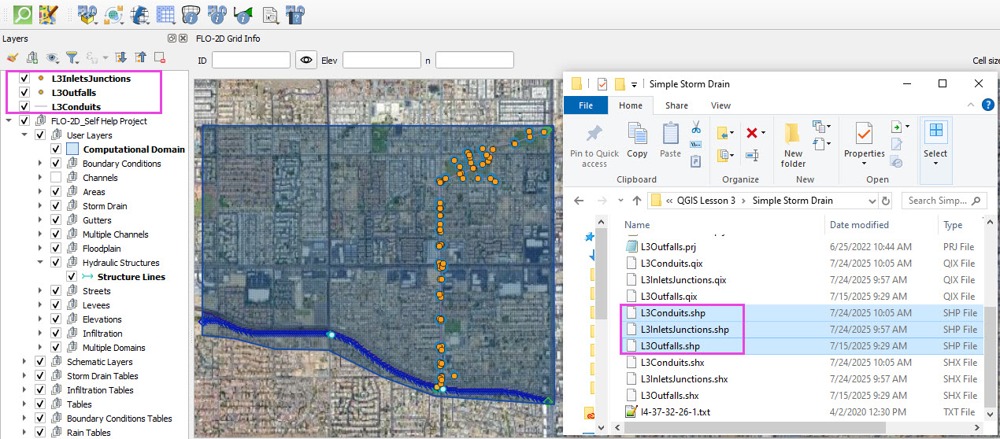
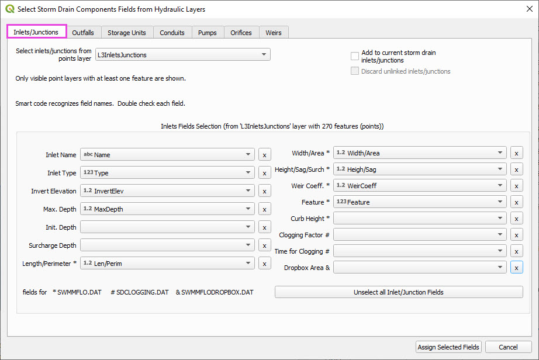
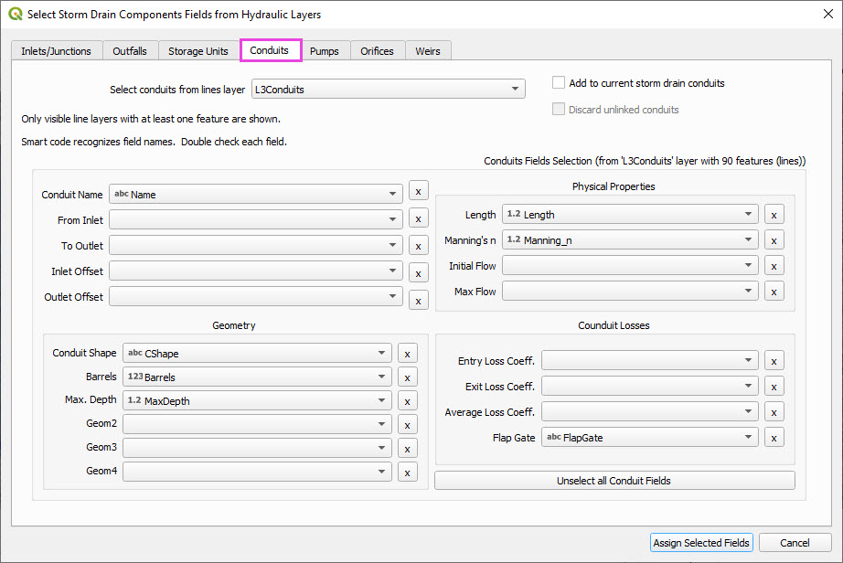
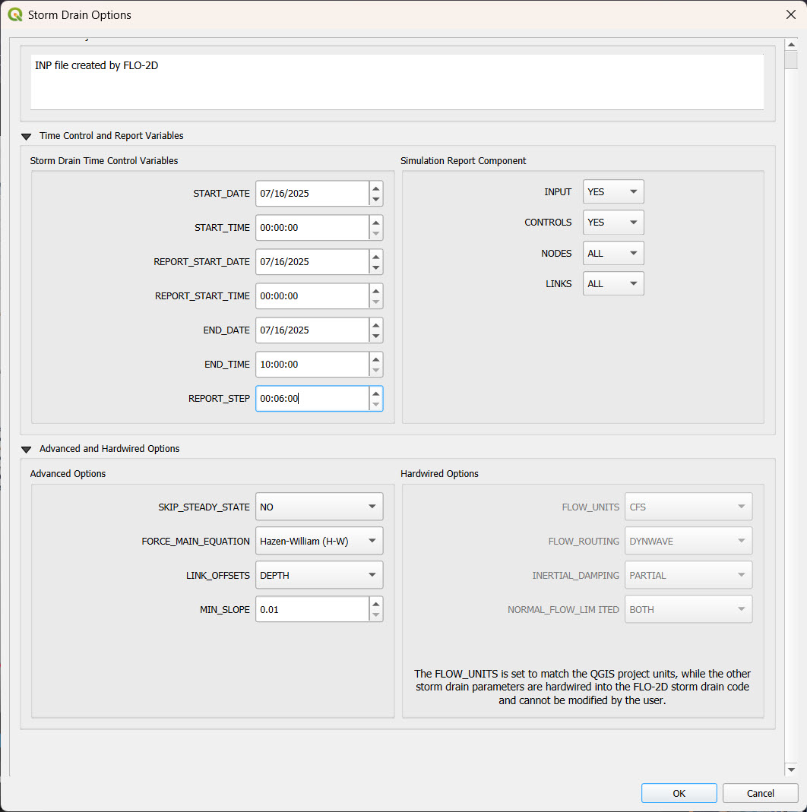

Simple Storm Drain
========================

This simple lesson shows how to create a simple storm drain from Shapefiles.

.. Note:: It will be easier to view these videos on YouTube.

   Set the video playback speed to 2x to complete the lessons faster.

   The videos are more detailed whereas the text gives the minimum steps needed
   to complete the project.

Create a Storm Drain from Shapefiles
------------------------------------

.. raw:: html

   <iframe width="560" height="315" src="https://www.youtube.com/embed/DNxhqBgOfuY?si=D67eo3YLWYpqs0x4"
   title="YouTube video player" frameborder="0" allow="accelerometer; autoplay; clipboard-write; encrypted-media;
   gyroscope; picture-in-picture; web-share" referrerpolicy="strict-origin-when-cross-origin" allowfullscreen></iframe>

This lesson walks through building a simple storm drain system from shapefiles.

Step 1: Load Shapefiles
~~~~~~~~~~~~~~~~~~~~~~~~~~
- Open the **Simple Storm Drain Layers** folder.
- Drag and drop the appropriate shapefiles into QGIS.

- Do **not** add them to the GeoPackage. Keep them in the User Layers.
- Save when prompted and select **Yes** to embed data into the GeoPackage for portability.

Step 2: Assign Shapefile Fields
~~~~~~~~~~~~~~~~~~~~~~~~~~~~~~~~~~~~~
Open the **Storm Drain Editor** and click **Select Components from Shapefile**.

- Point layers like inlets and outfalls will show up in the dropdown.
- Assign each required field from the shapefile attributes:

  - Example: `Inlet Name` → `name`, `Type` → `type`, etc.

- Turn off unused or null-value fields to avoid unnecessary entries.

Click **Assign Selected Fields**, then click **OK** for the warning that follows.

Step 3: Assign Nodes to Links
~~~~~~~~~~~~~~~~~~~~~~~~~~~~~~~~~
Click the **Auto-Assign Links and Nodes** button.

- This assigns start and end nodes to each conduit.
- Uses the closest node within a 3-ft radius from the first and last vertex of a conduit.

.. warning::
   - Make sure conduit directions are correct using the **Reverse Line Tool** in the **Advanced Digitizing Toolbar**.
   - Use the **Snapping Tool** to ensure precise vertex-node connections.

Check the **Simulate Storm Drain** box to turn it on.

.. image:: ../img/shg/5a/shg_sstorm008.jpg

Step 4: Add Type 4 Rating Tables and Culverts
~~~~~~~~~~~~~~~~~~~~~~~~~~~~~~~~~~~~~~~~~~~~~~~~~~~~

- Go to the **Type 4 Table Editor**.

.. image:: ../img/shg/5a/shg_sstorm009.jpg

- Import rating tables for one type 4 inlet.

- File names must match inlet names (e.g., ``41.txt`` for inlet 41).
- Format for rating tables: Depth on the left, Discharge on the right.

Step 5: Set Storm Drain Control Parameters
~~~~~~~~~~~~~~~~~~~~~~~~~~~~~~~~~~~~~~~~~~~~~~~~~~~~
- Set the **start and end time** of your simulation (e.g., 10 hours).
- Ensure it matches any time series used.
- Adjust the **report step**, **flow units** (CFS/CMS), and **routing method**.
- Leave advanced defaults unless needed.

Step 6: Schematize and Run
~~~~~~~~~~~~~~~~~~~~~~~~~~~~~~
- Click **Schematize Storm Drain** to export ``SWMM.OUTF``, ``SWMM.FLOW``, ``DROPBOX.DAT``, etc.

- Click **Quick Run** to simulate.
- Output files will populate your designated folder.

.. image:: ../img/shg/5a/shg_sstorm014.jpg

.. tip::
   If errors occur, check your shapefile connections, field assignments, or go to a **FLO-2D Troubleshooting** video in the series.

