.. vim: syntax=rst

Hydrograph Breach Method
=========================

**Overview**

In this tutorial, the tailings dam tool is used to create a tailings dam hydrograph
and simulate a tailings dam failure. The Tailings Dam Tool estimates the tailings
release volume. The tool was developed based on site and historical information.
It predicts the potential for tailings dam failure occurrence and allows the user
to select a discharge and mudflow concentration hydrograph.

**Required data**

This step makes use of the Tailings Dam Tool.
The required data is available here:

C:\\Users\\Public\\Documents\\FLO-2D PRO Documentation\\Example Projects\\ Tailings Dam Breach Workshop\\

+----------------------------+--------------------+----------------------------------+
| **File**                   | **Content**        | **Location**                     |
+============================+====================+==================================+
| Tailings Dam Breach.exe    | Tailings Dam Tool  | Program Files (x86)/FLO-2D Pro   |
+----------------------------+--------------------+----------------------------------+
| Tailings Dam Breach.exe    | Tailings Dam Tool  |..\\Demo Engine                   |
+----------------------------+--------------------+----------------------------------+

Step 1: Loading the geopackage
------------------------------

1. Open QGIS and start a new empty project.

.. image:: ../img/TDT/Tailin029.png

2. Click on the FLO-2D Project Icon and then click Open FLO-2D project.

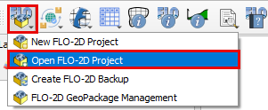

3. Navigate to the TDT folder, select Tailings Dam.gpkg, and click Open to load the geopackage.

.. image:: ../img/TDT/Tailin031.png

Step 2: Select the inflow node
------------------------------

1. Zoom into the Tailings Dam area and select the Grid Element where the inflow will be added.
   The pre-failure aerial shows the dam intact.

2. This image was screen captured from Google Earth Historical view and aligned to the map using a plugin called Freehand raster georeferencer.

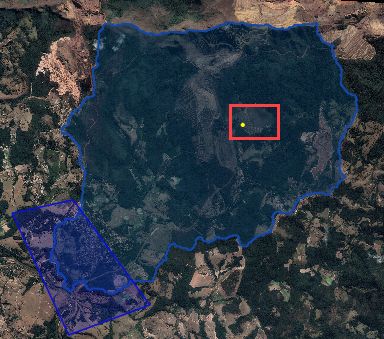

3. Use the Grid Info Tool to find the Grid Element ID.

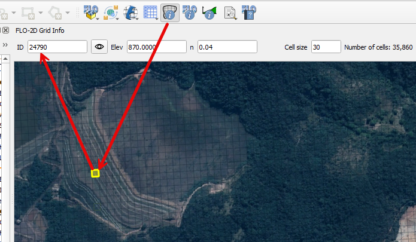

This Grid Element will be used as the inflow point from the output of the Tailings Dam Tool.
It is recommended to select a Grid Element located where the Dam Breach is most likely to happen.

4. Write down the Grid Element ID because it will be required in the following steps.

Step 3: Run the Tailings Dam Tool
---------------------------------

1. Open the Tailings Dam Tool by clicking on the dropdown menu and clicking on Tailings Dam Tool.

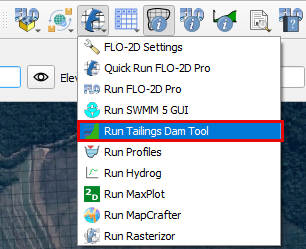

2. If you encounter the warning that "Program Tailings Dam Breach.exe is not in directory"

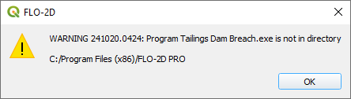

3. Be sure to set the correct path to the Tailings Dam Breach.exe

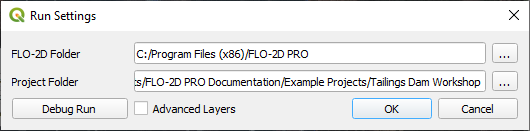

4. Or set the path to Demo folder if you are working with the Demo model

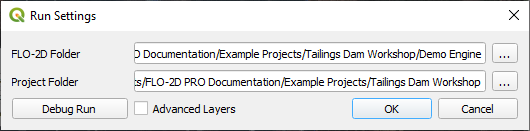

5. You can also copy the "Tailings Dam Breach.exe" file from the Demo folder
   and paste it in the Program Files (x86)/FLO-2D Pro path.

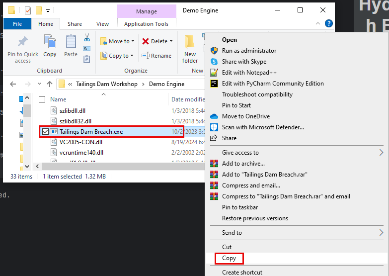

6. Once the model opens successfully, it should look as follows.

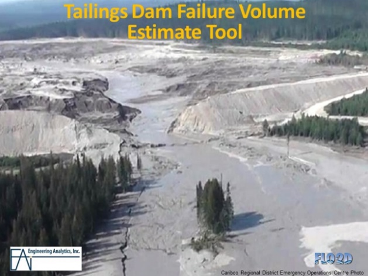

7. Start with selecting the Metric system on Options.

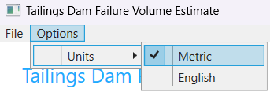

8. Fill out the Tailings Dam parameters as follows:

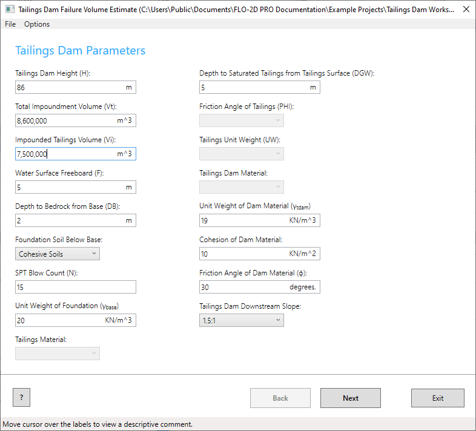

9. Move the cursor over then dialog boxes the view a descriptive comment and/or click on the question mark on bottom left to visualize the physical
   meaning of each parameter.

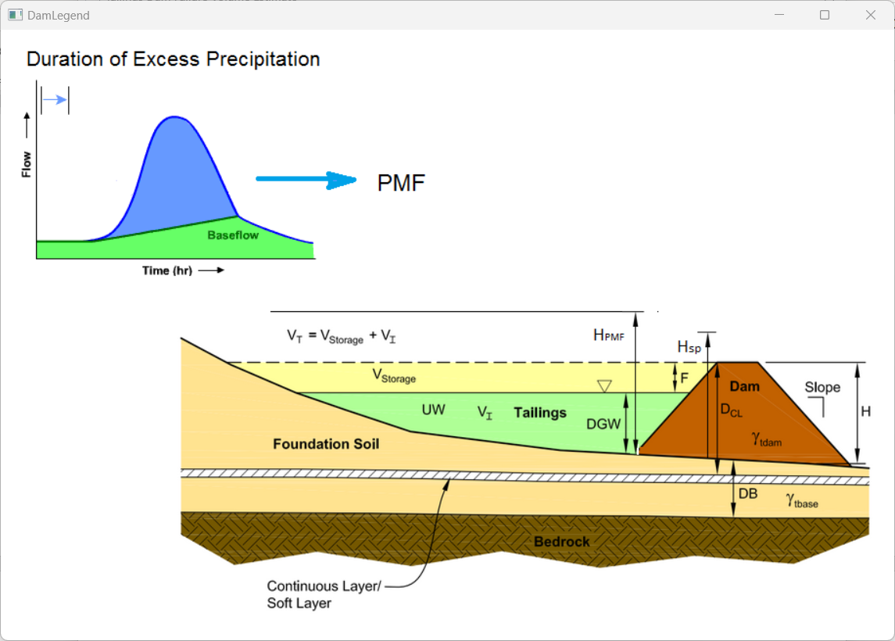

10. On the next page, choose the Static Mode, set the Reservoir Level to Medium, and the Pore Pressure to high.
    Click on Create INFLOW.DAT.

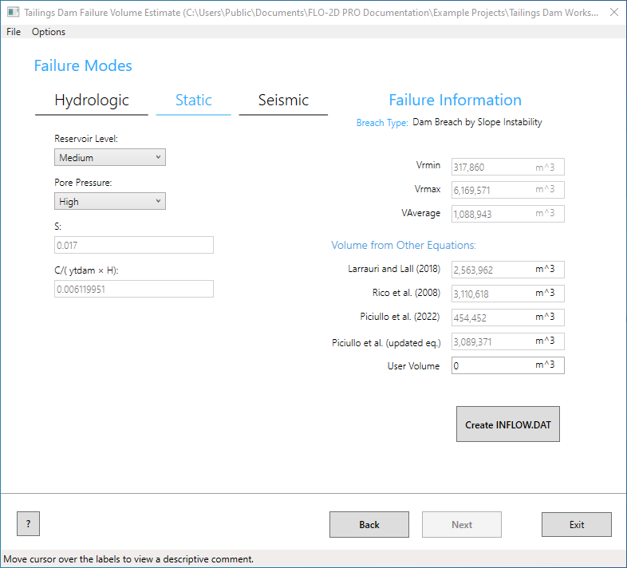

These equations result in volumes (Vr) that represent a percentage of the storage volume (Vi).

- Vi = 7,500,000 m\ :sup:`3`

- Vrmin = 4.2% Vi

- Vrmax = 82% Vi

- Vraverage = 14.5% Vi

- Larrauri and Lall = 34% Vi

- Rico = 41% Vi

- Piciullo updated eq = 41% Vi

- Actual failed Feijao release = 71% Vi

Refer to the PowerPoint presentation to see the source of the equations.

"C:\\Users\\Public\\Documents\\FLO-2D PRO Documentation\flo_help\\PowerPoint Presentations\\12 Tailings Dam Tool to Estimate Breach Volume.pptx"

11. On the save INFLOW.DAT window, select the Vrmax.
    Change the event time to 0.20 hours.
    This variable is highly sensitive to the early hazard zone.
    The report states that in 10 min 75% of the reservoir was drained.
    Set the Grid Cell as the Grid Element ID found in the previous steps.
    Select the graph shown in the picture below.

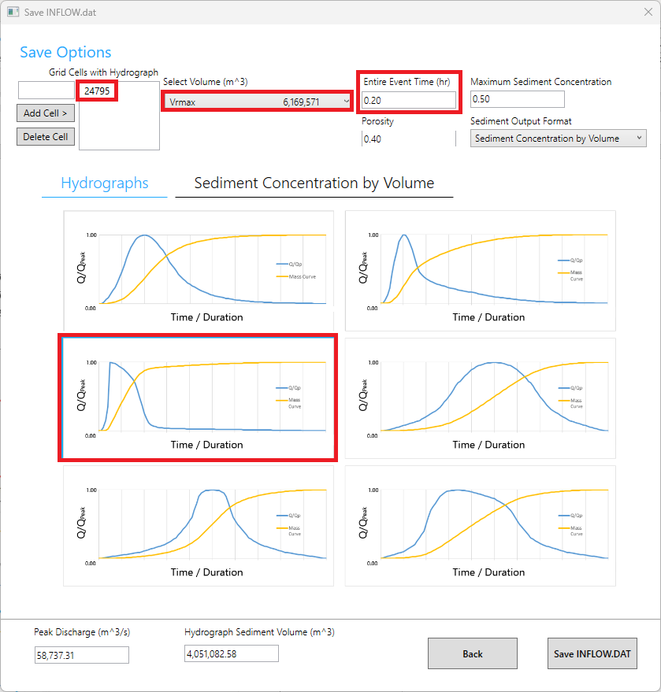

12. Click on the Sediment Concentration by Volume tab.
    Select the graph shown in the picture below.

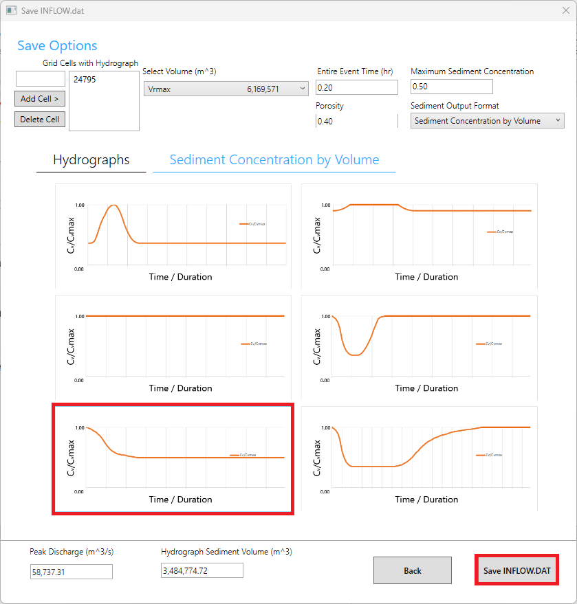

13. Double check if the Peak Discharge and Hydrograph Sediment Volume are within the expected ranges.

14. Click on Save INFLOW.DAT and set the export folder to Export Tailings Dam Tool.

15. Click on Back to close the Save INFLOW.DAT window.

16. Save the Tailings Breach.xml file to the data file in the Tailings Dam Tool folder and Exit the Tailings Dam Tool

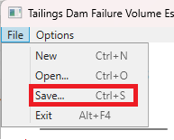

Step 4: Mudflow parameters
--------------------------

1. Open the mudflow tool.

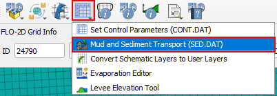

2. Select the Mudflow Tab and fill the form and save the parameters.

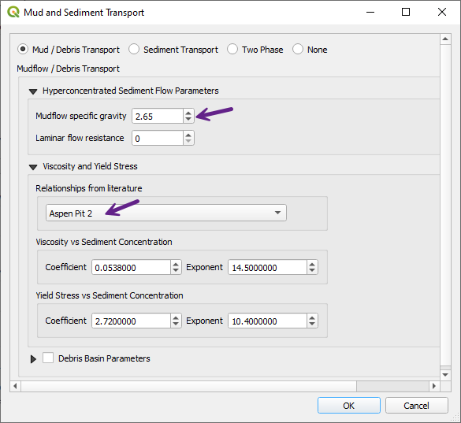

For more information on mudflow modeling, see the Mudflow Modeling Guidelines:

"C:\\Users\\Public\\Documents\\FLO-2D PRO
Documentation\\flo_help\\Manuals\\Simulating Mudflow Guidelines.pdf"

Step 5: Review the control variables
------------------------------------

1. On QGIS, open the control variables, adjust the time Control and Plot Variables.

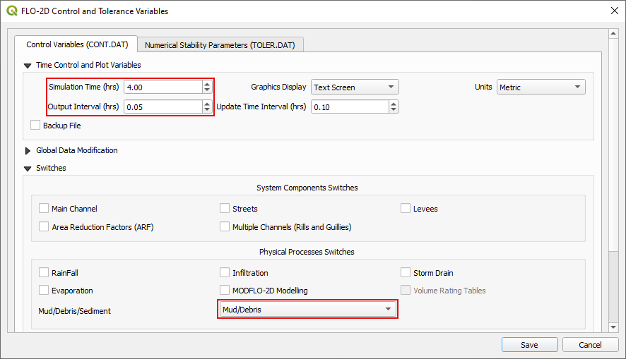
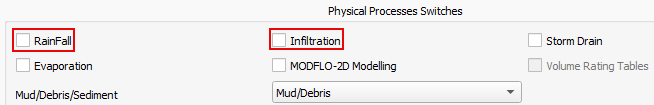

2. Uncheck the Rainfall and Infiltration Physical Processes Switches.

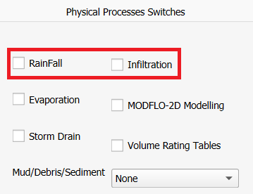

In this and on the forthcoming lessons, the Rainfall and Infiltration processes will not be activated as this is a sunny day failure.

3. Save the Control Variables and the Project.

.. image:: ../img/TDT/Tailin018.png

4. Click the FLO-2D Data Export icon, select the Export Tailings Dam Tool folder.

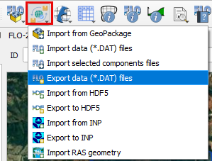

5. Uncheck the Rain and Infiltration and click OK.

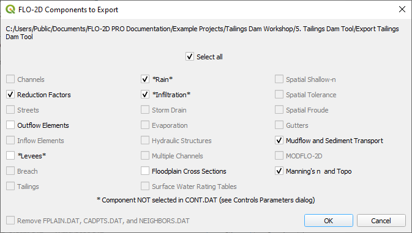

.. important:: The INFLOW.DAT file is already on the export folder because it was created using the Tailings Dam Tool.
   That’s why there is no Inflow Elements switch on the FLO-2D Data Export.

Step 6: Run the simulation
--------------------------

1. Click on the Run FLO-2D icon to run the simulation.

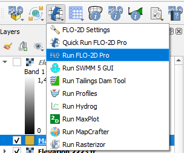

2. Close the warning.

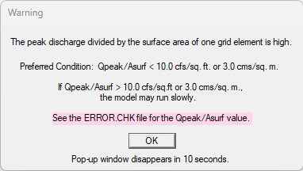

.. note:: This warning shows that the peak discharge is high, leading to a probable slow simulation.
   This happens because there is a high inflow into a single Grid Element.
   It is a good practice to split the inflow hydrograph into several grid element.

3. Check the simulation output information.

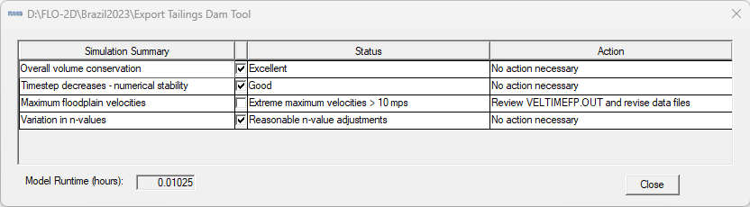

Step 7: Load new results
------------------------

1. Open the FLO-2D Rasterizor plugin.

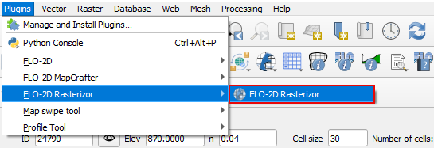

2. Select the FINALDEP.OUT file in the Export Tailings Dam folder.
   Set the Name the layer Final Depth TDT, select the Output Directory as the Export Tailings Dam folder and select Depth as style.

3. Run FLO-2D Rasterizor and close.
   Check the results.

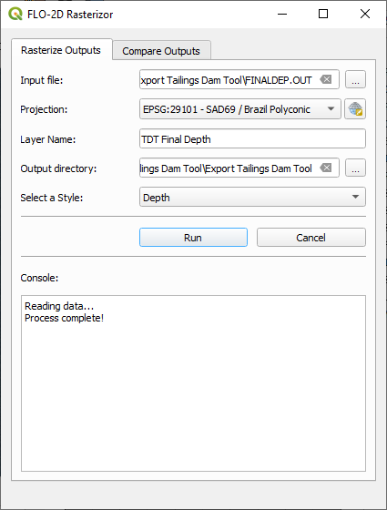
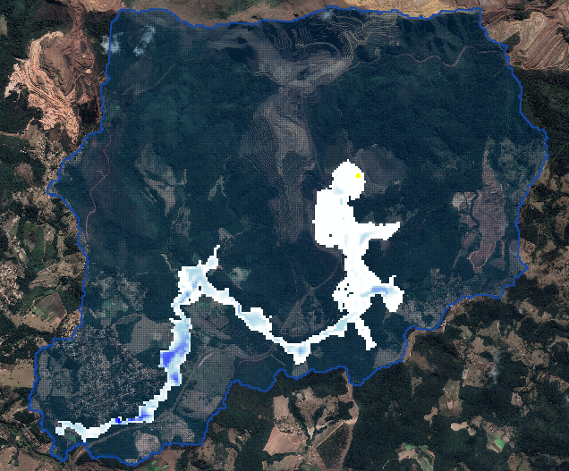

4. Check the volume in Summary.out

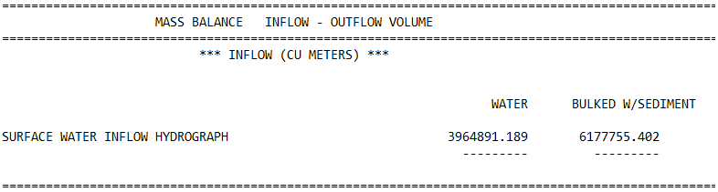

Step 8: Organize the map layers
-------------------------------

1. Group the external data, results, elevation, and aerials so that data is not lost when performing imports.

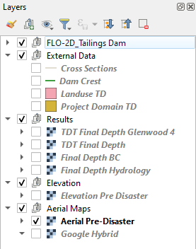

