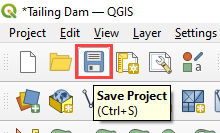

Boundary Conditions and Buildings
==================================

**Overview**

The last lesson demonstrated how to set up a hydrological project.
However, the water was accumulating at the downstream region of the
watershed. This lesson will outline how to add a floodplain outflow
boundary condition.

**Required Files**

This lesson does not require any external data.

.. important:: The lesson is missing Building application but the video shows the process.

.. raw:: html

   <iframe width="560" height="315" src="https://www.youtube.com/embed/1zLon_Z52nE?si=Gd_s3OC5aVvkqrCl"
   title="YouTube video player" frameborder="0" allow="accelerometer; autoplay; clipboard-write; encrypted-media;
   gyroscope; picture-in-picture; web-share" referrerpolicy="strict-origin-when-cross-origin" allowfullscreen></iframe>

Step 1: Outflow boundary
------------------------

1. Locate the downstream end of the watershed.

2. Expand the Boundary Condition Editor, select the BC type as outflow
   and click on Add Polygon BC.

3. Draw a polygon at the downstream end of the watershed. This polygon
   will add boundary conditions only to the cells at the limit of the
   watershed.

4. Right click anywhere on the map to finish editing this polygon.
   Select the type as Outflow.

5. To save, click on Add polygon outflow condition boundary button under Boundary Condition Editor.

6. Select the Outflow type as 1. Floodplain outflow (no hydrograph) and
   click on Schematize Boundary Conditions.

Step 2: Add Buildings
---------------------

1. Open the 3. Boundary/data folder and drag the file Buildings.shp onto
   the map space.

2. These buildings were extracted from a plugin called OSM downloader.
   OSM downloader will download all polygons from Open Street Map. The
   MultiPolyons from OSM downloader must be extracted to a Buildings
   shapefile and saved with the correct Project CRS.

3. The new layer has all landuse polygons. The buildings are separated,
   and any non-building polygons must be deleted.

4. If a building is missing from the map, it can be added using the
   Shape Digitizing tool.

5. Edit the Buildings layer and add a Rectangular polygon to cover the
   buildings in the Aerial images.

6. Open the attributes table of the buildings layer and click the edit button.
   Select all the added buildings, then set the values for Collapse, ARF, and WRF
   as 0, 1, and 1 respectively.

7. Click the collapse button and then expand Grid Tools. Click the
   calculate ARF WRF button to add buildings to the grid.

8. Set the Collapse, ARF, and WRF buttons and click OK.
   (Note: The Collapse switch allows the building to collapse if the
   flooding exceeds a certain depth on the building cell,
   ARF applies the volume displacement for the building on the grid element,
   and WRF applies the flow redirectionaround the grid element if a building
   is on the edge of a grid element).

9. Turn on the ARF switch.

Step 3: Export and run
----------------------

1. Click the main Save icon on the QGIS toolbar and click **Yes** and **OK**
   respectively for the prompts that follows.

2. Click the FLO-2D Data Export icon.

.. image:: ../img/Tailings/tdbound/tdboundary015.png

3. Make sure that the Outflow Elements is checked.

4. Set the export folder to Export Boundary Conditions. The Project
   Folder on the Run Settings is automatically updated to the new Export
   Boundary Conditions folder and it does not need to be updated.

5. Click on the Run FLO-2D icon to run the simulation.

6. Check the simulation summary for any errors.

Step 4: Load new results
------------------------

1. Create the new final depth map with Rasterizor.

.. image:: ../img/Tailings/tdbound/tdboundary019.png

2. Select the FINALDEP.OUT file in the Export Boundary Conditions
   folder. Name the layer Final Depth BC, select the Output Directory as
   the Export Boundary Conditions folder and select Depth as style.

3. Copy the style from Final Depth Hydrology layer and paste it in the
   Final Depth BC layer.

4. The Final Depth BC layer should now look as below.

5. Switch to the Compare Outputs tab and calculate the Final Depth Hydrology – Final Depth BC
   to calculate the difference between the rasters. Save the layer name as Diff_Hydrology_BC.
   Click **Run** then close the Rasterizor.

Step 5: Compare results
-----------------------

1. Compare the downstream results.

2. The water accumulates at the downstream end of the watershed when no
   outflow boundary condition is set. This is possible to visualize in
   the darker blue values on the left screenshot. When the outflow
   boundary condition is set, the water flows out the computational
   domain, showing whiter values. The boundary condition is normal
   depth.

Step 6: Organize the map layers
-------------------------------

1. Group the External Data and the Results and move the Aerials and
   Elevation maps to the bottom of the map.

2. Save and close QGIS because the next lesson uses a different project.

