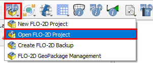
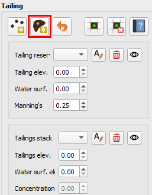

.. vim: syntax=rst

Stack Failure Method
=====================

**Overview**

In this tutorial, we simulate an instantaneous failure of a stacked tailings facility with water impounded above the
tailings surface. The scenario assumes that water is stored on top of stationary tailings. When the failure occurs,
the entire face of the stack collapses, releasing water that rapidly scours the tailings at the breach. This marks
the beginning of Phase One which is a low-concentration water and sediment mixture that continues to erode the
tailings as it flows downslope. As the tailings mobilize and liquefy, the flow transitions into Phase Two, which is
the tailings material characterized by a high-concentration mudflow. The fluid phase continues to advance ahead of the
denser material, scouring the downstream bed until sediment concentrations reach levels typical of hyperconcentrated flow.

**Required Files**

The step makes use of Tailings Area.
The required data is available at C:\\Users\\Public\\Documents\\FLO-2D PRO Documentation\\Example Projects\\Tailings Dam Workshop\\

+-----------------+----------------+------------------------------------------+
| **File**        | **Content**    | **Location**                             |
+=================+==========+=====+==========================================+
| tailingsarea.shp| Tailings Area  | ..\\8. Two Phase\\data                   |
+-----------------+----------------+------------------------------------------+

Step 1: Loading the geopackage
------------------------------

1. Open QGIS and start a new empty project.

2. Click on the FLO-2D Project Icon and then click Open FLO-2D project.

3. Navigate to the Two-Phase-Dam-Breach folder, select Tailings Dam.gpkg, and click Open to load the geopackage.

Step 2: Set-up the stacks initial condition
-------------------------------------------

A collapse of the tailing's facility can be simulated without using the prescribed breach failure data in the LEVEE.DAT file.
This is accomplished by assigning tailings depths to the grid elements within tailings facility.
When the FLO-2D model is run with the levee dam cells removed, the storage tailings begin to move immediately.

1. Drag the Tailings Area onto map space.

The tailings area is set to approximately 1/3 of the Dam height to match the volume released.

2. Open the Mad and Sediment Transport tool

3. Turn on the Two Phase switch.

4. Under the Initial Condition Editor Tailings, click the Add tailing button

5. Digitize as close as possible along the vertices of the Tailings Area shapefile.
   Set the tailings elevation to 936 and the Water Surface elevation to 940

6. Click the Add tailing button again to save.

7. The tailings stack section should now look as below

8. On the Export Two-Phase folder, a file named TAILINGS_STACK_DEPTH.DAT is created.
   This file contains all the grid elements, water depth on the surface of the tailings and tailings depth.
   This file is required for creating an instantaneous static or seismic failure.

Step 3: Review two-phase properties
-----------------------------------

Each variable is discussed in the Data Input Manual SED.DAT.
This data may be available from the original dam construction manual or from periodical safety reports.
Data for this tutorial was found in reports for the tailing dam failure.
Check with the dam owner, or dam safety agency for data.

1. Click Mud and Sediment Transport icon in the toolbar.

2. Select the radio button for Two Phase Modeling.
   Enter Mud /Debris Transport Parameters as 2.65, 0, and Aspen Pit 2
   for the parameters Mudflow Specific Gravity, Laminar Flow Resistance,
   and Viscosity & Yield Stress Relationship respectively.

3. Enter the Sediment Transport Parameters

.. list-table::
   :widths: 50 50
   :header-rows: 0

   * - **Value**
     - **Description**

   * - Yang
     - Sediment Transport Equation

   * - 2.65
     - Sediment specific gravity

   * - 0.12
     - Sediment size (D50) in mm

   * - 0.0778
     - Global fine sediment volumetric concentration

   * - 14700
     - Dry specific weight sediment

   * - 3.71
     - Gradation coefficient

   * - 3
     - Max allowable scour depth

4. Scroll to the bottom and click **OK** to save the data.

Step 4: Run the two-phase simulation
------------------------------------

1. Open the Control Variables.
   Increase the Bulking Concentration to 0.5.
   Uncheck the Levee from the System Components Switches.
   Select the Two-Phase as the Mud/Debris/Sediments physical process.
   Click save.

2. Click the main Save icon on the QGIS toolbar.

.. image:: ../img/Two-Phase-Dam-Breach/Two015.png

3. The click **Yes** and **OK** for the subsequent windows.

4. Click the FLO-2D Data Export icon, select the previously created Export Two-Phase folder and select it.

The two-phase guidelines are installed with FLO-2D Software.
"C:\\Users\\Public\\Documents\\FLO-2D PRO Documentation\\flo_help\\Manuals\\Two Phase Flood Routing Guidelines 2022.pdf"

5. Make sure to uncheck Levees, Rain, and Infiltration.

6. Click on the Run FLO-2D Pro to run the simulation.

7. Check the simulation summary for any potential errors.

Step 5: Check the results
-------------------------

1. Use FLO-2D-Rasterizor or MaxPlot to check the results.

2. **Rasterizor:** Select the DEPTHMAX_2PHASE_COMBINED.OUT input file to visualize the combined two-phase results.

.. image:: ../img/Two-Phase-Dam-Breach/Two020.png

3. **Rasterizor:** Select the DEPTH.OUT input file to visualize the fluid phase results.

4. **Rasterizor:** Select the DEPFPMAX_MUD.OUT input file to visualize the mudflow phase results.

